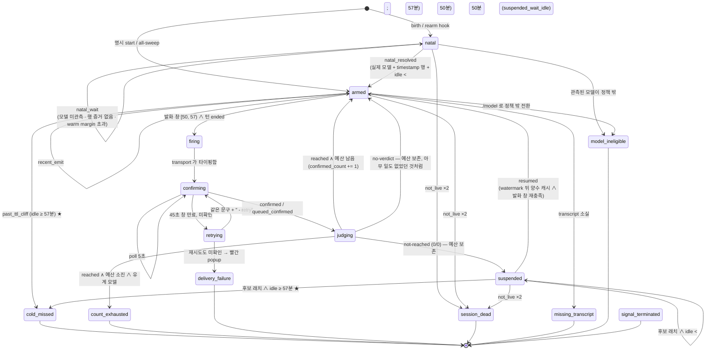

# Claude Code 프롬프트 캐시 keep-warm — 측정부터 자동화까지 (재현 가이드)

Claude Code 대화 세션의 prompt cache 는 마지막 요청 뒤 약 1시간이 지나면 죽는다. 죽은 뒤
첫 요청은 세션 컨텍스트 전체(수십만 토큰)를 캐시에 다시 쓰고, 그 비용은 구독 한도에 그대로
잡힌다. 이 문서는 우리가 그 비용을 실측하고, 세션이 idle 50분이 되면 자동으로 짧은 턴을
주입해 캐시를 살려 두는 keep-warm 인프라를 만든 과정을 제3자가 그대로 따라 만들 수 있게
적은 것이다.

순서는 우리가 실제로 밟은 순서다. 먼저 transcript 에서 캐시 히트/미히트를 읽는 코드를 만들어
비용과 TTL 을 확인했고(§2), 그 측정 술어를 그대로 daemon 의 시계로 옮겨 자동화했다(§3~§4).
"hook 만으로 되지 않나" 라는 질문에는 §5 가 답한다 — 설계 당시(2026-07)의 답과, 이 문서를 쓰며
실험으로 다시 확인한 2026-09 의 답이 다르다.

## 0. 작성·검증 기준

| 항목 | 이 문서의 실측 기준 |
| --- | --- |
| 갱신일 | 2026-09-15, Asia/Seoul |
| Claude Code | `2.1.257` |
| OS | WSL2, Debian GNU/Linux 13 (kernel 6.6.87.2-microsoft-standard-WSL2) |
| VS Code | `1.135.0` (주입 relay 확장) |
| Node.js | `20.18.0` (VS Code 확장 relay) |
| Python | `3.10.11` (참조 구현·조사 스크립트, stdlib 만 사용) |
| 구독 형태 | Claude 구독(Max) 계정의 Claude Code CLI. API key 과금이 아니다 |
| 공개 저장소 | [poketball1/public](https://github.com/poketball1/public) `keepwarm/` |

이 값은 재현한 시점의 snapshot 이다. 특히 캐시 TTL·한도 산정 방식은 공급자 정책이라 바뀔 수
있다. 이 문서의 숫자는 전부 우리 transcript 를 §2 의 코드로 읽어 얻은 것이고, 같은 코드를
독자의 transcript 에 돌리면 독자 환경의 숫자가 나온다. 숫자보다 **측정 방법과 술어**가 이
문서의 본체다.

## 1. 배경 — 왜 keep-warm 인가

### 1.1 캐시 경제학 세 줄

1. Claude Code 는 매 요청에 시스템 프롬프트·도구 정의·대화 전체를 보내고, 서버는 그 prefix 를
   prompt cache 로 저장한다. 다음 요청이 같은 prefix 로 오면 `cache_read` 로 읽고, 아니면
   `cache_creation` 으로 다시 쓴다.
2. 구독 한도 산정에서 `cache_read` 는 사실상 0 배수이고 `cache_creation` 은 온전히 잡힌다
   (우리 calibration, §2.7). 그래서 캐시가 살아 있는 세션은 거의 공짜로 이어지고, 죽은 세션의
   첫 턴은 컨텍스트 크기만큼 한도를 태운다.
3. 대화 세션(main thread)의 캐시 TTL 은 1시간 sliding 이고, 우리 실측으로 실효 절벽은 약 55.8분에
   있다. sub-agent(sidechain) 스레드는 5분이다. 이 둘은 모델이 아니라 **스레드 종류**가 100%
   결정한다 (§2.7).

### 1.2 요구 한 문장

> 사용자가 자리를 비운 세션의 캐시를, 절벽(≈56분) 전에 짧은 턴 하나로 갱신해서, 돌아왔을 때
> 전량 재작성 비용을 내지 않게 한다. 단 이미 식은 세션은 절대 다시 데우지 않는다.

뒷 문장이 앞 문장만큼 중요하다. 식은 세션에 턴을 넣으면 그 턴이 전량 재작성 비용을 내고, 아무도
쓰지 않는 세션에서 그 비용을 반복하게 된다. 우리 설계에서 "cold 재가열 금지"는 처음부터
불변식이었고, 뒤에 나오는 정직한 캐시 시계(§3.2 결정 14)는 그 불변식을 지키기 위해 생겼다.

### 1.3 이 문서에서 얻는 것

- §2: transcript JSONL 에서 캐시 히트/미히트를 읽는 스크립트 4개와 그 술어. 독자 환경의 TTL
  절벽·재작성 비용·스레드별 TTL 을 스스로 잰다.
- §3: keep-warm 설계 결정 목록과 상태 기계, 숫자표, 원장 스키마.
- §4: 따라 만들 수 있는 참조 구현(daemon·주입 transport·hooks·CLI·statusline·테스트).
- §5: hook·cron 류 harness 기본 기능만으로 안 되던 이유와, 2026-09 의 `asyncRewake` 실험으로 바뀐 답
  (hook 만으로 만드는 keep-warm 참조 스크립트 포함).
- §6~§7: 도입 효과를 측정하는 법, 흔한 고장, 우리가 겪은 사고와 그때 바뀐 설계.

---

## 2. 캐시 히트/미히트 조사

이 장의 목표는 하나다 — **"내 세션의 프롬프트 캐시가 지금 살아 있나, 죽었나, 언제 죽나"를 로그만 보고 판정하는 것**. 추측이나 체감이 아니라 파일에 찍힌 숫자로 판정한다. 그래야 Part B 의 keep-warm 자동화가 "찍었는데 실제로 캐시가 갱신됐는지"를 스스로 검증할 수 있다.

조사 대상 원자료는 Claude Code 가 로컬에 남기는 transcript JSONL 이다. 별도 텔레메트리도, API 키도, 외부 서비스도 필요 없다. 이 장의 스크립트 네 개는 전부 Python 3.10+ 표준 라이브러리만 쓰고, 이 문서에서 그대로 복사해 쓸 수 있다.

측정 수치를 인용할 때는 **우리 실측 (날짜, 표본 크기)** 를 붙였다. 남의 환경에서 같은 숫자가 나온다는 보장은 없다 — 나오는지 확인하는 방법이 이 장의 내용이다.

---

### 2.1 원자료 — transcript JSONL 은 어디에 있고 어떤 모양인가

#### 위치

```
~/.claude/projects/<munged-cwd>/<session-id>.jsonl                      # 메인 스레드
~/.claude/projects/<munged-cwd>/<session-id>/subagents/agent-<agent-id>.jsonl   # 서브에이전트 스레드
```

- `<munged-cwd>` == 세션을 시작한 작업 디렉토리의 절대 경로에서 `/` 와 `.` 를 전부 `-` 로 치환한 문자열이다. `/home/me/work` 라면 `-home-me-work`, `/home/me/work/.worktrees/x` 라면 `-home-me-work--worktrees-x` 가 된다. 선행 `/` 도 `-` 가 되므로 디렉토리 이름이 `-` 로 시작한다 — `ls` 나 glob 에서 옵션으로 오인되기 쉬우니 `./-home-me-work` 처럼 쓰거나 `pathlib` 를 쓴다.
- 치환이 **단사(injective)가 아니다**. `/home/me/a.b` 와 `/home/me/a-b` 는 같은 디렉토리 이름으로 뭉개진다. 실무에서 충돌할 일은 거의 없지만, "프로젝트 디렉토리 이름 → 원래 cwd" 역변환을 하려 들면 안 된다. 원래 cwd 는 각 행의 `cwd` 필드에 그대로 들어 있다.
- 서브에이전트 스레드는 **부모 세션 id 로 만든 하위 디렉토리** 밑에 따로 쌓인다. 예전 하네스는 서브에이전트 행을 부모 파일 안에 인라인으로 섞어 넣었다 (`isSidechain: true` 로 구분). 두 배치가 다 존재할 수 있으니 판별은 **경로가 아니라 `isSidechain` 필드**로 한다 (§2.2).

#### 파일 모양

아래 예시 행들은 전부 이 머신의 실제 transcript 에서 가져왔고, **id 계열 값(세션·행 uuid, `message.id`, `requestId`, agent id)만 자리표시자로 치환**했다. 필드 이름·구조·숫자는 원본 그대로다.

한 줄에 JSON 객체 하나, append-only. 세션이 살아 있는 동안 계속 늘어나고, 마지막 줄은 쓰다 만 조각일 수 있다 (tail 을 읽을 때 중요 — §2.6).

우리 환경 규모 (2026-09-15 기준): 한 프로젝트 디렉토리에 메인 transcript 463개 + 서브에이전트 transcript 약 3,000개, 합계 5.4 GB. 최근 30일 창만 잡아도 **파일 3,456개 / 114만 줄**이다. 그래서 이 장의 스크립트는 전부 **줄 단위 스트리밍**으로 읽고 파일을 통째로 메모리에 올리지 않는다.

#### 최상위 `type` 분포

최근 40개 메인 transcript (78,237줄) 에서 관측한 `type` 값:

```
attachment                   23,414     # system-reminder·환경 스냅샷 부착물
assistant                    16,096     # ★ 모델 응답 (usage 가 여기 있다)
user                          9,647     # 사용자 입력 + tool_result
system                        4,712     # 훅 요약, compact 경계, turn_duration 등
last-prompt                   3,109     # UI 상태 행 (모델 호출 아님)
bridge-session                3,104
atis-latch                    3,076
mode                          3,064
permission-mode               2,919
queue-operation               2,770
ai-title                      2,487
file-history-snapshot         1,819
custom-title                    728
agent-name                      722
history-suppression             268
file-history-delta              218
cost-state                       84
```

핵심: **캐시 판정에 쓰는 행은 `type == "assistant"` 하나뿐이다.** 나머지 16종은 전부 하네스가 UI·훅·히스토리 관리를 위해 쓰는 행이고, 파일 mtime 을 갱신하면서도 모델 호출이 아니다. 이 사실이 §2.3 의 함정 "mtime 은 캐시 시계가 아니다" 의 뿌리다.

#### 실제 행 — 캐시 히트 (메인 스레드)

```json
{
  "parentUuid": "sid-0001",
  "isSidechain": false,
  "message": {
    "model": "claude-fable-5-1",
    "id": "msg-0001",
    "type": "message",
    "role": "assistant",
    "content": "[... 본문 생략 ...]",
    "container": null,
    "stop_reason": "tool_use",
    "stop_sequence": null,
    "stop_details": null,
    "usage": {
      "input_tokens": 101,
      "cache_creation_input_tokens": 4713,
      "cache_read_input_tokens": 134675,
      "output_tokens": 7361,
      "output_tokens_details": {
        "thinking_tokens": 3654
      },
      "server_tool_use": {
        "web_search_requests": 0,
        "web_fetch_requests": 0
      },
      "service_tier": "standard",
      "cache_creation": {
        "ephemeral_1h_input_tokens": 4713,
        "ephemeral_5m_input_tokens": 0
      },
      "inference_geo": "not_available",
      "iterations": [
        {
          "input_tokens": 101,
          "output_tokens": 7361,
          "cache_read_input_tokens": 134675,
          "cache_creation_input_tokens": 4713,
          "cache_creation": {
            "ephemeral_5m_input_tokens": 0,
            "ephemeral_1h_input_tokens": 4713
          },
          "type": "message",
          "model": null
        }
      ],
      "speed": "standard"
    },
    "diagnostics": null,
    "context_management": null
  },
  "apiBlockIndex": 0,
  "requestId": "req-0001",
  "type": "assistant",
  "uuid": "sid-0002",
  "timestamp": "2026-09-14T02:50:46.978Z",
  "effort": "xhigh",
  "session_id": "sid-0003",
  "userType": "external",
  "entrypoint": "cli",
  "cwd": "/home/me/work",
  "sessionId": "sid-0003",
  "version": "2.1.257",
  "gitBranch": "main"
}
```

읽는 법:
- `message.usage.cache_read_input_tokens` 가 크고 `cache_creation_input_tokens` 가 작다 → 프롬프트 프리픽스 대부분을 캐시에서 읽었다 == **히트**.
- `message.usage.input_tokens` 는 **이미 캐시를 뺀 나머지**다. `input + read + creation` 를 더해야 그 호출의 전체 프롬프트 크기가 되고, `input` 에 캐시 토큰을 또 더하면 안 된다.
- `message.usage.cache_creation.ephemeral_1h_input_tokens` 가 양수 == 이 호출의 캐시 쓰기가 1시간 TTL 로 걸렸다는 뜻.
- `usage.iterations[]` 는 최상위 카운터를 그대로 미러링한다. 항목이 2개 이상인 경우에도 합계가 최상위와 같았으므로, **최상위 카운터 하나만 읽으면 된다**.
- `apiBlockIndex` 가 있다 — 이 행이 한 응답의 몇 번째 content block 인지. 같은 응답이 여러 줄로 쪼개져 기록되는 근거이고, §2.3 첫 번째 함정의 출처다.

#### 실제 행 — 재작성 (rewrite) + 미스 사유

```json
{
  "parentUuid": "sid-0004",
  "isSidechain": false,
  "message": {
    "model": "claude-fable-5-1",
    "id": "msg-0002",
    "type": "message",
    "role": "assistant",
    "content": "[... 본문 생략 ...]",
    "container": null,
    "stop_reason": "end_turn",
    "stop_sequence": null,
    "stop_details": null,
    "usage": {
      "input_tokens": 2,
      "cache_creation_input_tokens": 494369,
      "cache_read_input_tokens": 26447,
      "output_tokens": 19,
      "output_tokens_details": {
        "thinking_tokens": 0
      },
      "server_tool_use": {
        "web_search_requests": 0,
        "web_fetch_requests": 0
      },
      "service_tier": "standard",
      "cache_creation": {
        "ephemeral_1h_input_tokens": 494369,
        "ephemeral_5m_input_tokens": 0
      },
      "inference_geo": "not_available",
      "iterations": [
        {
          "input_tokens": 2,
          "output_tokens": 19,
          "cache_read_input_tokens": 26447,
          "cache_creation_input_tokens": 494369,
          "cache_creation": {
            "ephemeral_5m_input_tokens": 0,
            "ephemeral_1h_input_tokens": 494369
          },
          "type": "message"
        }
      ],
      "speed": "standard"
    },
    "diagnostics": {
      "cache_miss_reason": {
        "type": "tools_changed",
        "cache_missed_input_tokens": 407103
      }
    },
    "context_management": null
  },
  "apiBlockIndex": 0,
  "requestId": "req-0002",
  "type": "assistant",
  "uuid": "sid-0005",
  "timestamp": "2026-09-10T14:58:52.998Z",
  "effort": "xhigh",
  "session_id": "sid-0006",
  "userType": "external",
  "entrypoint": "cli",
  "cwd": "/home/me/work",
  "sessionId": "sid-0007",
  "version": "2.1.257",
  "gitBranch": "main",
  "slug": "resilient-plotting-ocean"
}
```

`cache_creation` 가 `cache_read` 보다 크다 → 대화 본문을 다시 썼다 == **rewrite**. 그리고 이 행에는 보너스가 있다 — `message.diagnostics.cache_miss_reason` 이 **왜 미스가 났는지**를 하네스가 직접 적어 준다 (`tools_changed` == 도구 목록이 바뀌었다, 즉 MCP 연결/해제). 이 필드는 §2.2 표와 §2.7 에서 다시 다룬다.

#### 실제 행 — synthetic (API 에러)

```json
{
  "parentUuid": "sid-0008",
  "isSidechain": false,
  "type": "assistant",
  "uuid": "sid-0009",
  "timestamp": "2026-09-03T14:01:41.201Z",
  "message": {
    "diagnostics": null,
    "id": "sid-0010",
    "container": null,
    "model": "<synthetic>",
    "role": "assistant",
    "stop_details": null,
    "stop_reason": "stop_sequence",
    "stop_sequence": "",
    "type": "message",
    "usage": {
      "output_tokens_details": null,
      "input_tokens": 0,
      "output_tokens": 0,
      "cache_creation_input_tokens": 0,
      "cache_read_input_tokens": 0,
      "server_tool_use": {
        "web_search_requests": 0,
        "web_fetch_requests": 0
      },
      "service_tier": null,
      "cache_creation": {
        "ephemeral_1h_input_tokens": 0,
        "ephemeral_5m_input_tokens": 0
      },
      "inference_geo": null,
      "iterations": null,
      "speed": null
    },
    "content": "[... 본문 생략 ...]",
    "context_management": null
  },
  "requestId": "req-0003",
  "error": "server_error",
  "isApiErrorMessage": true,
  "apiErrorStatus": 529,
  "session_id": "sid-0011",
  "userType": "external",
  "entrypoint": "cli",
  "cwd": "/home/me/work",
  "sessionId": "sid-0012",
  "version": "2.1.257",
  "gitBranch": "main"
}
```

API 가 429(한도) 또는 529(과부하)로 거절하면 하네스가 **가짜 assistant 행**을 만들어 기록한다. 서명이 명확하다:
- `message.model == "<synthetic>"`
- `message.usage` 의 네 카운터가 전부 0
- `isApiErrorMessage == true`, `apiErrorStatus == 429`(또는 529), `error == "rate_limit"`
- 429 면 `quotaLimits` 블록이 붙어 리셋 시각(`resetsAt`, epoch 초)과 창 종류(`rateLimitType`)까지 알려준다.

이 행은 **모델이 토큰을 처리하지 않았다는 증거**다. 캐시는 갱신되지 않았다. 그런데 이 행 앞에는 정상적인 `user` 행이 있다 — 이 비대칭이 §2.3 에서 다루는 가장 비싼 함정이다.

#### 실제 행 — 서브에이전트

```json
{
  "parentUuid": "sid-0013",
  "isSidechain": true,
  "agentId": "hex-0001",
  "message": {
    "model": "claude-opus-5",
    "id": "msg-0003",
    "type": "message",
    "role": "assistant",
    "content": "[... 본문 생략 ...]",
    "container": null,
    "stop_reason": null,
    "stop_sequence": null,
    "stop_details": null,
    "usage": {
      "input_tokens": 2,
      "cache_creation_input_tokens": 99523,
      "cache_read_input_tokens": 19021,
      "cache_creation": {
        "ephemeral_5m_input_tokens": 99523,
        "ephemeral_1h_input_tokens": 0
      },
      "output_tokens": 1,
      "service_tier": "standard",
      "inference_geo": "not_available"
    },
    "diagnostics": null,
    "context_management": null
  },
  "apiBlockIndex": 0,
  "requestId": "req-0004",
  "attributionAgent": "general-purpose",
  "type": "assistant",
  "uuid": "sid-0014",
  "timestamp": "2026-09-15T07:30:53.879Z",
  "effort": "xhigh",
  "userType": "external",
  "entrypoint": "cli",
  "cwd": "/home/me/work",
  "sessionId": "sid-0015",
  "version": "2.1.257",
  "gitBranch": "main"
}
```

`isSidechain == true`, `agentId` 가 붙고, **`cache_creation` 이 `ephemeral_5m_input_tokens` 쪽에 잡힌다**. 같은 모델이라도 그렇다 — TTL 을 정하는 것은 모델이 아니라 스레드 종류다 (§2.7 에 25만 호출 전수 확인).

#### 실제 행 — user, compaction 경계

```json
{
  "parentUuid": null,
  "isSidechain": false,
  "type": "user",
  "message": {
    "role": "user",
    "content": "[... 본문 생략 ...]"
  },
  "uuid": "sid-0016",
  "timestamp": "2026-09-14T02:49:04.791Z",
  "userType": "external",
  "cwd": "/home/me/work",
  "sessionId": "sid-0003",
  "version": "2.1.257",
  "gitBranch": "main"
}
```

```json
{
  "type": "system",
  "subtype": "compact_boundary",
  "isSidechain": false,
  "logicalParentUuid": "sid-0017",
  "timestamp": "2026-09-15T04:18:50.513Z",
  "compactMetadata": {
    "trigger": "manual",
    "preTokens": 621962,
    "postTokens": 20224,
    "cumulativeDroppedTokens": 601738,
    "durationMs": 146385
  }
}
```

compaction 은 별도 usage 행을 남기지 않는다. 비용은 `compactMetadata.preTokens` / `postTokens` / `durationMs` 로만 잡히고, `trigger` 로 수동/자동을 가른다. 이 행이 두 호출 사이에 끼어 있으면 그 다음 호출은 **TTL 과 무관하게** 프리픽스를 새로 쓴다 — 갭 곡선에서 반드시 제외해야 할 교란이다 (§2.5).

---

### 2.2 판정에 쓰는 필드와 술어 (표)

#### 필드

| 경로 | 타입 | 뜻 | 판정에서의 역할 |
|---|---|---|---|
| `type` | str | 행 종류 | `"assistant"` 만 캐시 판정 대상 |
| `isSidechain` | bool | 서브에이전트 스레드 여부 | **TTL 을 100% 결정한다** — false → 1h, true → 5m. 캐시 시계는 false 행만 인정 |
| `timestamp` | str | **UTC** ISO-8601, 끝에 `Z` | 갭 계산·창 필터. 로컬 시각 아님 |
| `uuid` / `parentUuid` | str | 행 id / 부모 행 id | 턴 귀속 추적 (캐시 판정 자체엔 불필요) |
| `sessionId` | str | **대화 id — 항상 파일명과 같다** | ★ 집계 키로 쓸 것 |
| `session_id` | str | 같은 행에 있는 **다른** id | `sessionId` 와 다를 수 있다 (아래 주의) |
| `cwd` | str | 세션의 작업 디렉토리 원문 | munging 역변환 대신 이걸 읽는다 |
| `version` | str | 하네스 버전 | 버전이 바뀌면 시스템 프롬프트가 바뀐다 → 갭 곡선 교란 제외 축 |
| `requestId` | str | API 요청 id | `message.id` 와 1:1 — dedup 키로는 둘 중 아무거나 (unique 수 동일) |
| `apiBlockIndex` | int? | 응답 안에서 이 행이 몇 번째 content block 인지 | 한 응답이 여러 줄로 쓰이는 이유. 메인 파일엔 있고 서브에이전트 파일엔 `null` |
| `message.id` | str | **API 응답 id** (`msg_…`) | ★ dedup 키. 같은 값 == 같은 API 호출 |
| `message.model` | str | 모델 이름, 또는 `"<synthetic>"` | 모델 flip 판정 / synthetic 판별 |
| `message.stop_reason` | str? | 응답 종료 사유 | 이 값이 있는 행이 output 카운터가 확정된 행 |
| `message.usage.input_tokens` | int | **캐시를 뺀** 순수 입력 | 여기에 캐시 토큰을 더하지 않는다 |
| `message.usage.cache_read_input_tokens` | int | 캐시에서 읽은 토큰 | ★ 히트 판정의 한 축 |
| `message.usage.cache_creation_input_tokens` | int | 캐시에 새로 쓴 토큰 | ★ 히트 판정의 다른 축. 구독 한도의 실질 driver |
| `message.usage.cache_creation.ephemeral_1h_input_tokens` | int | 1시간 TTL 로 쓴 몫 | TTL 모드 판정 |
| `message.usage.cache_creation.ephemeral_5m_input_tokens` | int | 5분 TTL 로 쓴 몫 | TTL 모드 판정 |
| `message.usage.output_tokens` | int | 출력 토큰 | 스트리밍 중엔 부분값 → 그룹 최댓값을 취한다 |
| `message.usage.output_tokens_details.thinking_tokens` | int | 그중 사고 토큰 | 참고 축 |
| `message.diagnostics.cache_miss_reason.type` | str? | 미스 사유 | `messages_changed` / `tools_changed` / `system_changed` / `model_changed` / `previous_message_not_found` / `unavailable` |
| `message.diagnostics.cache_miss_reason.cache_missed_input_tokens` | int? | 그 미스로 날아간 토큰 | 사유별 비용 |
| `isApiErrorMessage` / `apiErrorStatus` / `error` | bool / int / str | API 에러 서명 | synthetic 행 분류 |
| `quotaLimits` | obj? | 429 일 때의 한도 상태 | `resetsAt`(epoch 초) · `rateLimitType` |
| `isMeta` | bool? | 하네스가 넣은 메타 user 행 | 슬래시 커맨드 결과·turn companion. 사용자 입력이 아니다 |
| `compactMetadata` | obj | `type:"system", subtype:"compact_boundary"` 행에만 | `trigger` / `preTokens` / `postTokens` / `durationMs` |

> **주의 — `sessionId` 와 `session_id` 는 같은 값이 아니다.**
> 최근 30개 transcript 35,154행 관측: `sessionId` 는 **전 행이 파일명과 일치**했지만,
> `session_id` 는 **6,588행(18.7%)에서 달랐다**. 한 파일 안에 `session_id` 값이 여러 개
> 나타나고(우리가 본 한 파일에는 6개), 그중 일부는 다른 transcript 파일로도 존재한다.
> resume/재시작마다 바뀌는 **실행(run) 단위 id** 로 보이지만 우리는 확정하지 못했다.
> 확실한 것 하나 — **집계 키로는 `sessionId` 또는 파일명을 쓴다.** `session_id` 로 묶으면
> 한 대화가 여러 조각으로 쪼개진다.

#### 술어

**① 호출 단위 정규화 — `message.id` dedup**

```
한 API 응답  ==  message.id 가 같은 모든 assistant 행
  cache/input 카운터 : 그룹 안에서 값이 동일 → 첫 행 값을 그대로 쓴다
  output/thinking    : 스트리밍 중 부분값이 섞임 → 그룹 최댓값을 쓴다
```

**② `cache_outcome` — 히트/재작성 판정**

```
read   == usage.cache_read_input_tokens
create == usage.cache_creation_input_tokens

read == 0 and create == 0  ->  "none"      모델이 캐시를 아예 안 만졌다 (synthetic/에러)
read >= create             ->  "hit"       대화 본문이 살아남았다
create >  read             ->  "rewrite"   본문을 다시 지불했다
```

**`read > 0` 하나만으로 히트라고 부르면 안 된다.** 워크스페이스가 공유하는 system+tools 프리픽스(우리 환경에서 정확히 27,996 토큰, 일반적으로 20~30k)는 같은 워크스페이스의 다른 세션들이 계속 갱신해 주기 때문에 **상시 warm** 이다. 본문이 통째로 죽은 호출도 그 프리픽스는 읽으므로 `read` 가 2만 넘게 나온다. 이 기준으로 세면 "60분 넘겼는데 히트" 같은 가짜 신호가 무더기로 나온다 (우리 실측 2026-08-15: 가짜 히트 53건).

**③ 본문 생존비 (body survival ratio)**

```
survival == read / (read + create)
```

`cache_outcome` 이 이진 라벨이라면 이건 연속값이다. 중요한 성질 — **이 분포는 쌍봉이다**. 우리 실측 (2026-08-15, 교란 제외 후 8,325건): 약 1.0 에 7,444건, 약 0.0 에 828건, 그 사이 7건. 캐시 엔트리는 살아 있거나 통째로 없거나 둘 중 하나이고, 중간이 없다. 따라서 **임계값을 어디에 두든 분류가 거의 같고(둔감), 평균은 아무 호출도 가지지 않은 숫자다.** 곡선을 읽을 때 median 이 아니라 warm%/cold% 를 보는 이유가 이것이다.

**④ cold-rewrite 서명**

```
create > 150_000  and  read < 1_000
```

컨텍스트를 통째로 다시 쓴 호출. 계정/자격증명 교체, TTL 초과 wake, 5시간 한도 리셋 직후 재개가 이 서명으로 나타난다. 임계값은 우리 환경 실측에서 고른 값이라 컨텍스트가 작은 환경에서는 낮춰야 한다.

**⑤ idle 시계 3종 (라이브 판정용)**

```
idle_cache  == now - (마지막 non-sidechain assistant 행 중 read > 0 or create > 0 인 행의 timestamp)
idle_row    == now - (마지막 non-sidechain "진짜" 행: user 행 또는 model != "<synthetic>" 인 assistant 행)
idle_mtime  == now - 파일 mtime
effective   == idle_cache ?? idle_row ?? idle_mtime        (앞의 것이 null 일 때만 다음으로)
```

정직한 시계는 `idle_cache` 하나다. 이유는 §2.3 함정 3 에서 설명한다.

**⑥ 구독 한도 환산 (quota units)**

```
quota_units == input*1 + cache_creation*1 + output*1 + cache_read*0
```

`cache_read` 가 구독 한도에 0배로 잡힌다는 것이 우리 실측 결론이다 (2026-07-22 calibration). 근거: 계정 교체로 캐시가 통째로 깨졌을 때 약 1.1~2.25M 토큰이 재작성되면서 주간 한도의 5% 가 소진됐다 → 주간 한도 ≈ 2,200만~4,500만 토큰. 같은 창의 측정 `cache_read` 는 계정당 약 1.31B 이었다. 이걸 0.1배로만 세도 한도를 3~6배 초과해 애초에 운영이 불가능하다. 따라서 0배이고, 실질 driver 는 `cache_creation` 이다.

이 가중치는 **구독 한도용**이고 **API 달러 요금과 다르다**. API 요금은 read 0.1배 / 1h write 2배 / 5m write 1.25배다. 스크립트는 `--weights api` 로 같은 행을 API 방식으로도 환산해 준다 — 둘을 섞어 쓰지 않기 위해 두 모드를 명시적으로 분리했다.

---

### 2.3 함정 목록 — 이걸 모르면 집계가 전부 틀린다

아래 12개는 전부 **우리가 실제로 틀렸던** 지점이다. 각 항목에 "무엇이 틀리는가"와 "어떻게 막는가"를 붙였다.

#### 함정 1 — `message.id` dedup 없는 토큰 집계는 전부 무효다

한 API 응답의 content block 이 여러 개면(텍스트 + 도구호출 두 개 …), 하네스는 **블록 수만큼 `assistant` 행을 쓴다**. 이 행들은 같은 `message.id`, 같은 `requestId` 를 갖고 `apiBlockIndex` 만 0,1,2… 로 증가한다. 그리고 **cache/input 카운터를 매 행 똑같이 반복해 적는다**.

- 줄을 그냥 더하면 우리 30일 창에서 **2.04배 부풀었다** (514,551 usage 행 → 252,717 고유 호출).
- 더 나쁜 건 **배율이 일정하지 않다**는 것이다. 도구 호출 밀도에 따라 날마다 1.9~2.4배로 출렁여서, dedup 안 한 일별 집계는 **있지도 않은 추세를 만들어낸다**. "이번 주 캐시 쓰기가 늘었다" 가 사실은 "이번 주에 도구를 더 많이 썼다" 인 경우.

막는 법: `message.id` 로 그룹핑. 단 그룹 안에서 **단순 중복이 아니다** — `output_tokens` 는 스트리밍 중 부분값(1~10)이 먼저 찍히고 나중 행에서 확정되므로 **최댓값**을 취한다. cache/input 은 그룹 안에서 값이 변한 적이 없었다(우리 확인: 6,952 그룹, 분산 0).

`requestId` 로 dedup 해도 결과가 같다 — unique 개수가 동일하다. 둘 중 아무거나 쓰면 된다.

#### 함정 2 — `isSidechain` 과 1h/5m TTL 분리

서브에이전트(sidechain) 스레드의 캐시 TTL 은 메인과 다르다. 우리 실측 (30일, 252,717 고유 호출):

```
main      (isSidechain == false)   ephemeral_1h 49,214건   ephemeral_5m      0건
sidechain (isSidechain == true )   ephemeral_1h      0건   ephemeral_5m 202,725건
```

**예외 0건.** 그리고 한 호출 안에서 1h 와 5m 가 동시에 양수인 경우도 0건이다 — TTL 은 요청 단위 단일 모드이고, 하네스가 "프리픽스는 1h, 꼬리는 5m" 식으로 쪼개지 않는다.

여기서 나오는 실수 두 가지:
- **모델별로 TTL 이 다르다고 읽는 것.** 우리도 1차 집계에서 "모델 A 는 93% 가 5m, 모델 B 는 79% 가 1h" 라는 표를 만들었는데, 그건 단지 그 모델을 주로 서브에이전트로 썼기 때문이다. 교란이다. 판별축은 `isSidechain` 하나다.
- **메인 세션 하나만 보고 전체를 추정하는 것.** 우리 30일 창에서 호출 수의 80%, 구독 한도 환산의 **80.7%** 가 서브에이전트 쪽이었다. 메인만 세면 비용의 5분의 1만 보는 셈이다.

#### 함정 3 — synthetic 429/529 행과, user 행이 시계를 전진시키면 안 되는 이유

**이게 이 장에서 제일 비싼 함정이다.** 우리는 이걸로 하루 2.6M 토큰을 조용히 태웠다.

시나리오: keep-warm 데몬이 idle 55분에 턴을 주입한다 → API 가 429 또는 529 로 거절 → 하네스가 `<synthetic>` assistant 행(usage 0/0)을 남긴다. **캐시는 갱신되지 않았다.** 그런데 주입된 `user` 행은 멀쩡한 진짜 행이다. "마지막 행 timestamp" 로 idle 을 재는 시계는 여기서 0으로 리셋된다.

결과: 데몬은 세션 나이를 영원히 55분으로 보고, cold 절벽 가드가 절대 발동하지 않는다. 실제 캐시 나이는 110분, 165분… 으로 계속 자란다. 그리고 55분마다 주입할 때마다 **전체 컨텍스트를 재작성**한다.

우리 실측 (2026-08-13 하루):
- API overload 12건, **전부 주입 턴에서 발생** (사람이 친 턴 0건). 429 × 6 / 529 × 6.
- 측정 가능한 7건 **전부** 다음 assistant 턴이 `cache_read == 0`, `cache_creation` 217k~554k.
- 합계 **2,623,431 토큰 재작성** — 그동안 원장에는 "전달 성공" 으로 찍혔다.

고치는 방법은 술어 한 줄이다: **모델이 토큰을 처리했다는 증거가 있는 행만 시계를 전진시킨다.** 그 증거 == assistant 행의 양수 캐시 usage. user 행은 증거가 아니다. synthetic 행은 usage 가 0/0 이라 **모델 이름 블랙리스트 없이도 자연히 탈락**한다.

실제로 이 비대칭이 파일에 어떻게 남는지, 우리 코퍼스에서 뽑은 행 나열:

```
2026-08-27T13:38:57.941Z assistant claude-fable-5   msg-0004 read=25882   creation=115289  err=-
2026-08-27T13:39:05.673Z assistant claude-fable-5   msg-0004 read=25882   creation=115289  err=-
2026-08-27T14:34:45.640Z user      -                -                    read=-       creation=-       err=-
2026-08-27T14:34:46.966Z assistant <synthetic>      sid-0018 read=0       creation=0       err=429
2026-08-28T03:49:57.248Z user      -                -                    read=-       creation=-       err=-
2026-08-28T03:49:57.248Z assistant <synthetic>      sid-0019 read=0       creation=0       err=-
2026-08-28T03:50:12.267Z user      -                -                    read=-       creation=-       err=-
2026-08-28T03:50:35.485Z user      -                -                    read=-       creation=-       err=-
2026-08-28T03:51:37.161Z assistant claude-fable-5   msg-0005 read=142398  creation=316     err=-
```

13:38 에 진짜 호출이 있고, 14:34 에 주입 user 행 + 429 synthetic, 그 다음 실제 모델 호출은 **다음 날 03:51** 이다. "마지막 행" 시계로 보면 14:34 에 리셋되지만, **캐시 시계로 보면 13:39 이후로 계속 자랐다**. 첫 두 줄이 같은 `message.id` 로 두 번 찍힌 것(함정 1)도 같은 나열에서 보인다.

(덤: 이 사례는 아래 "TTL 을 넘기고도 살아 돌아오는 호출" 의 실례이기도 하다. 03:51 호출이 read 142,398 / creation 316 으로 돌아왔다 — 14시간 갭인데 본문이 살았다. 우리는 이걸 설명하지 못했다.)

#### 함정 4 — 공유 워크스페이스 프리픽스 때문에 `read > 0` 는 아무 의미가 없다

같은 워크스페이스(= 같은 조직/계정 경계)의 세션들은 system 프롬프트 + 도구 정의라는 **동일한 프리픽스**를 공유한다. 우리 환경에서 이 프리픽스는 정확히 **27,996 토큰**이었고, 동시에 도는 세션들이 계속 갱신해 주기 때문에 사실상 항상 warm 이다.

그래서 본문이 완전히 죽은 호출도 `cache_read` 가 2만 넘게 찍힌다. 662분(11시간) 갭에서도 그랬다. `read > 0` 를 히트로 세면:
- 가짜 "TTL 을 넘겨서도 히트" 신호가 나온다 (우리 1차 집계에서 53건),
- 그걸 근거로 "TTL 이 60분보다 길다"는 잘못된 결론에 도달한다.

판정은 **본문 생존비** 또는 등가인 `read >= create` 로 한다. 분포가 쌍봉이라 둘의 분류가 사실상 같다.

이 프리픽스 크기를 자기 환경에서 재는 법: cold-rewrite 로 분류된 호출들의 `cache_read` 값을 보면 된다 — 본문이 죽어도 남는 그 바닥값이 공유 프리픽스다. 계정 교체 직후 관측에서는 20.8K / 21.8K 로 관측됐다.

#### 함정 5 — 5시간 한도 리셋은 TTL 안에서도 캐시를 죽인다

구독의 5시간 사용 창에 걸린 뒤 리셋을 넘겨 재개하면, **1시간 TTL 이 아직 남아 있어도 cold** 다.

우리 실측 (2026-08-08): 한 계정의 6개 세션 중 5개가 리셋 직후 동시에 재개했고 **전부 cold**, `cache_creation` 합계 1.68M. 대조군으로 같은 날 낮에 같은 세션이 **48.9분 idle 후 warm** (read 189K, create 66) — TTL 자체는 정상 작동했다. 재개 직후 `cache_read` 는 0 이거나 20.8K/21.8K, 즉 **공유 프리픽스만 살아남은 값**이었다.

실무 함의: "한도에 걸릴 것 같으니 TTL 안에 있는 세션을 살려두자" 는 무의미하다. 리셋 전 절약 조치가 아니라 **한도 자체를 안 맞는 것**만 방어가 된다.

조사 함의: 갭 곡선을 그릴 때 한도 리셋 시각을 넘긴 페어는 TTL 신호가 아니라 리셋 신호다. 429 synthetic 행의 `quotaLimits.resetsAt` 으로 그 시각을 알 수 있으니, 이상한 cold 클러스터가 보이면 먼저 여기를 확인한다.

#### 함정 6 — 캐시는 워크스페이스 스코프다. 자격증명이 캐시 키가 아니다

캐시 스코프 == 워크스페이스/조직. **자격증명은 캐시 키가 아니다.** 그래서:
- 계정을 바꾸면 warm 캐시를 그대로 들고 갈 수 없다. 한도 경계 == 캐시 경계다. "새 계정의 fresh 한도 + 기존 warm 캐시" 조합은 물리적으로 불가능하다.
- 계정 교체의 서명은 **여러 세션이 동시에 cold 로 떨어지고, 각각 read 가 18~22K(공유 프리픽스만)** 인 모양이다. 그래서 §2.4 의 cold-rewrite 카운터가 계정 교체 탐지기로도 쓰인다.
- 교체는 즉발이 아니라 **지연 채택**일 수 있다. 실행 중인 세션은 메모리에 든 토큰이 유효한 동안 옛 네임스페이스로 계속 돌다가, 재해석 경계(토큰 만료·401)에서 새 자격증명을 채택하면서 그 순간 비용을 낸다. 우리 관측에서 교체 후 채택까지 16초 ~ 4시간 50분으로 편차가 컸다. 따라서 **자격증명 파일 mtime 단독으로 교체 시각을 확정하지 않는다** — OAuth 자동 refresh 도 그 파일을 다시 쓴다. 확증은 "여러 세션에서 cold-rewrite 가 연쇄로 출현" 쪽이다.

#### 함정 7 — 파일 mtime 은 캐시 시계가 아니다

`~/.claude/projects/**/*.jsonl` 의 mtime 은 **모델 호출과 무관하게** 갱신된다. §2.1 의 `type` 분포를 보면 이유가 명백하다 — `attachment`, `last-prompt`, `ai-title`, `mode`, `queue-operation`, 훅 요약 `system` 행이 모델 호출 없이도 계속 append 된다.

우리 라이브 관측에서 바로 나온 예 (같은 시점, 같은 세션):

```
session    cache   row   mtime   eff
sess-A       2.6   2.6     0.0   2.6      <- mtime 은 "방금" 이라 하지만 캐시는 2.6분 됐다
sess-B      41.7  41.7    40.5  41.7
sess-C      71.6  71.6    52.2  71.6      <- mtime 52분 / 실제 캐시 나이 72분 (이미 cold)
```

mtime 을 시계로 쓰면 **실제보다 젊게 본다**. keep-warm 이 mtime 을 쓰면 이미 죽은 캐시를 깨우게 되고, 그게 최악의 시나리오다(전량 재작성 + 깨운 비용). mtime 은 **파싱에 실패했을 때의 최후 fallback** 으로만 쓴다.

#### 함정 8 — 프로젝트 디렉토리 이름의 munging

§2.1 에서 다뤘다. 요약하면:
- `/` 와 `.` 를 `-` 로 치환. 선행 `/` 도 치환되므로 이름이 `-` 로 시작한다 → 셸에서 옵션으로 오인된다.
- 단사가 아니므로 역변환 금지. 원래 cwd 는 각 행의 `cwd` 필드에 있다.
- worktree 나 하위 디렉토리에서 세션을 시작하면 **별도 프로젝트 디렉토리**가 생긴다. "내 프로젝트 세션 전부" 를 스캔하려면 한 디렉토리만 보면 안 된다.
- 계정을 여러 개 쓰는 구성에서 계정별 설정 디렉토리의 `projects` 가 **같은 실제 디렉토리를 가리키는 심볼릭 링크**일 수 있다. 그런 구성에서 계정 디렉토리를 각각 스캔하면 모든 숫자가 계정 수만큼 곱해진다. 루트 하나만 스캔한다.

#### 함정 9 — timestamp 는 UTC 문자열이다

`"2026-09-15T07:26:03.902Z"` — 항상 UTC, 항상 `Z` 접미. 파이썬 `datetime.fromisoformat` 는 (3.11 이전) `Z` 를 못 읽으므로 `+00:00` 으로 치환해서 넘긴다.

여기서 나오는 실수:
- **일별 집계를 UTC 로 하면 로컬 하루와 어긋난다.** 우리 타임존(UTC+9)에서는 KST 자정 통과가 UTC 15:00 이라, UTC 일자로 자르면 한 세션의 하루가 두 날에 쪼개진다. 스크립트에 `--tz` 를 둔 이유다.
- 문자열 접두 비교(`ts < "2026-09-08"`)는 UTC 기준으로만 맞다. 로컬 창을 자를 거면 파싱해서 비교한다.
- 갭 계산 자체는 타임존 무관이다(절대 시각 차이) — 창 필터와 일별 버킷만 영향받는다.

#### 함정 10 — local-command / meta / attachment 행

`user` 타입인데 사용자 입력이 아닌 행이 많다:
- `isMeta: true` — 슬래시 커맨드의 로컬 출력(`<local-command-…>` 로 감싼 내용), `turnCompanion: true` 가 붙은 도구 결과 동반 행 등.
- `type: "attachment"` — system-reminder 부착물, 환경 스냅샷. 우리 최근 40파일 기준 **가장 많은 행 종류**(23,414행)다.

캐시 판정만 할 거면 `type == "assistant"` 필터 하나로 다 걸러지므로 문제가 없다. 문제가 되는 건 **턴 귀속**을 할 때다 — "주입한 user 행의 직계 assistant" 를 `parentUuid` 로 찾으려 하면 사이에 `attachment` 행이 끼어 체인이 끊어진다. 우리 하네스는 2026-08-15 부터 이 행을 끼우기 시작했고, 그 순간 직계 판정이 135/135 전멸했다. 귀속이 필요하면 **user/assistant 행은 경계로 두고 그 외 행만 관통하는 유계 조상 탐색**(최대 8 hop 정도)으로 찾는다.

#### 함정 11 — compaction 은 TTL 과 무관하게 프리픽스를 재작성한다

`/compact` 는 별도 usage 행을 남기지 않는다. 남는 것은 `type:"system", subtype:"compact_boundary"` 행 하나와 `compactMetadata` 뿐이다. 그 다음 호출은 프리픽스가 통째로 바뀌었으므로 반드시 재작성이다.

갭 곡선에서 이걸 제외하지 않으면 **짧은 갭 구간에 가짜 cold 가 섞인다.** 우리 30일 창에서 실측 비교:

```
                     제외함        제외 안 함
2-5m  갭   warm%      98.2%   ->     91.0%
45-50m 갭  warm%      95.2%   ->     94.6%
```

짧은 갭이 훨씬 크게 오염된다(compaction 직후 바로 다음 턴을 치니까). 곡선의 "평평한 warm 고원" 이 왼쪽에서 무너져 보이면 대개 이 교란이다.

compaction 비용은 따로 읽는다 — `preTokens` → `postTokens` 감소분과 `durationMs`. 우리 관측 예: preTokens 621,962 → postTokens 20,224, durationMs 약 160초. 그리고 compaction **직후** 몇 턴은 캐시 재확립 비용이 실려 평소보다 비싸다.

#### 함정 12 — 모델이 바뀌면 캐시 키가 바뀐다

캐시는 모델별로 완전히 별개다. 모델을 바꾸면(수동 전환이든 fallback 이든) **첫 호출은 구조적으로 cold** 다.

여기서 직관이 틀리는 지점: "빨리 돌아오면 warm 이겠지" 가 아니다. 우리 실측에서 모델 B → 모델 A 로 1시간 안에 복귀한 7건 중 warm 은 1건뿐이었다. 6건은 7~27분 만에 돌아왔는데도 cold 였다. 이유는 경과 시간이 아니라 **프리픽스 연속성**이다 — 중간에 다른 모델의 턴이 대화에 끼면 원래 모델 쪽 프리픽스 매칭이 깨진다. 왕복 한 번의 세금이 순수 재작성 약 440K 토큰이었다.

하네스가 이걸 직접 확인해 주기도 한다 — `cache_miss_reason.type == "model_changed"`. 우리 30일 창에서 15건 / 2.16M 토큰.

조사 함의: 갭 곡선을 그릴 때 **직전 호출과 모델이 다른 페어는 제외**한다. 안 그러면 TTL 과 무관한 cold 가 전 구간에 골고루 뿌려져 절벽이 흐려진다.

#### 그 밖에 — 알아둘 만한 소수 사례

- **`message.id` 가 두 파일에 나타나는 경우가 있다.** 30일 창 252,717 호출 중 **3건**(0.001%). transcript 끼리 서로를 재생하지는 않으므로 교차 파일 dedup 은 보정이 아니라 assertion 에 가깝다. 스크립트는 **합치지 않고 건수만 보고**한다 — 미래에 하네스가 재생을 시작하면 조용히 넘어가지 않고 숫자로 드러나도록.
- **TTL 을 넘기고도 살아 돌아오는 호출이 드물게 있다.** 30일 창 51,307 페어 중 62분 초과 warm 이 **3건**(0.006%), 최대 852분. 앞선 8,325 프로브 실측에서도 66분 초과 생존이 7건(0.09%, 최대 91.7분) 있었다. 서버측 지연 축출로 추정하지만 **우리는 확인하지 못했다** — 설계 마진 산정에 쓰지 않는다.
- **`cache_miss_reason` 은 커버리지가 부분적이다.** 30일 창 rewrite 6,876건 중 사유가 붙은 것은 1,700건뿐이다. 힌트로 쓰고 분모로 쓰지 않는다.
- **`usage.iterations[]` 는 최상위 카운터의 미러다.** 항목이 여럿인 경우에도 합이 최상위와 같았다. 최상위만 읽으면 된다.
- **꼬리만 읽을 때 창 크기가 판정을 바꾼다.** 도구 출력이 큰 세션은 assistant 행이 꼬리 256KB 밖으로 밀려나, 라이브 판정이 "캐시 시계 없음 → mtime 으로 fallback" 으로 떨어진다. mtime 은 나이를 젊게 보므로 **죽은 세션이 warm 으로 보인다**. 실측 대조는 §2.6 에 있다 — 같은 순간, 같은 세션이 256KB 창에서 "15.1분 warm", 388KB 창에서 "14,149.8분 cold" 였다.
- **서브에이전트 transcript 의 output 토큰은 과소 기록된다.** `stop_reason` 이 실린 행만 확정값을 갖는데 서브에이전트 파일은 그걸 일부에서만 flush 한다. cache 카운터는 영향이 없고 그쪽이 볼륨의 99% 라 총량은 2% 이내로만 움직인다.

---

### 2.4 스크립트 1 — `cache_census.py` (행 단위 hit/miss + 집계)

#### 무엇을 재나

transcript 를 훑어 **API 호출 단위**로 정규화하고, 호출마다 스레드 종류 / TTL 모드 / `cache_outcome` / cold-rewrite / synthetic 을 붙인 뒤 세션·날짜·스레드·모델 축으로 집계한다. 출력에는 히트율, rewrite 건수, cold-rewrite 건수, 미스 사유 분포, 구독 한도 환산이 들어간다.

"내 환경에서 캐시가 전반적으로 얼마나 잘 맞고 있나, 비용이 어디로 나가나" 에 답하는 스크립트다.

#### 술어

- 호출 정규화: `message.id` 그룹핑, cache/input 은 첫 행 값, output/thinking 은 그룹 최댓값 (함정 1).
- `cache_outcome`: `none` / `hit` (`read >= create`) / `rewrite` (`create > read`) (§2.2 ②).
- TTL 모드: `ephemeral_1h` 만 양수 → `1h`, `ephemeral_5m` 만 양수 → `5m`, 둘 다 양수 → `mixed`(우리 환경 관측 0건), 쪼개짐 정보 없이 creation 만 있으면 `unsplit`.
- cold-rewrite: `create > 150_000 and read < 1_000`.
- 한도 환산: `input*1 + creation*1 + output*1 + read*0`. `--weights api` 면 `input*1 + write1h*2 + write5m*1.25 + read*0.1`(달러 가중, output 제외).
- 창 필터: `--since` 가 주어지면 **mtime 이 그보다 이른 파일은 열지도 않는다**. 5GB 코퍼스를 몇 초로 줄이는 최적화이고, append-only 파일이라 안전하다.
- 교차 파일 `message.id` 충돌은 합치지 않고 **건수만 보고**한다.

#### 전체 소스

```python
#!/usr/bin/env python3
"""cache_census.py — per-call prompt-cache hit/miss census over Claude Code transcripts.

WHAT IT MEASURES
    One row per *API response* (not per transcript line) with:
      thread kind   main | sidechain          (top-level `isSidechain`)
      ttl mode      1h | 5m | unsplit | none  (`usage.cache_creation.ephemeral_*`)
      cache_outcome hit | rewrite | none      (see PREDICATES)
      cold_rewrite  the documented cold-front signature
      synthetic     API error / harness-fabricated rows (usage 0/0)
    and aggregates them by session, day, thread kind, or model.

PREDICATES (each one exists because a naive version of it produced a wrong number)
  1. DEDUP BY `message.id`.
     One API response whose content has several blocks is written as several
     `assistant` lines sharing one `message.id` (and one `requestId`), with an
     increasing `apiBlockIndex`. Every line repeats the SAME cache/input counters.
     Summing lines inflates token totals ~2.1x, and the multiplier tracks tool-call
     density, so it *fabricates trends* across days. Cache and input counters never
     varied inside a group in our corpus; output/thinking only grow (streamed), so
     the merge rule is: cache/input as-is from the first line, output/thinking = max.
  2. cache_outcome
       none    read == 0 and creation == 0   -> the model never touched the cache
                                               (synthetic/error rows land here)
       hit     read >= creation              -> the conversation body survived
       rewrite creation  > read              -> the body was re-paid (cold)
     `read > 0` alone is NOT a hit. The workspace-shared system+tools prefix
     (~20-30k tokens) stays warm because concurrent sessions keep rewriting it, so a
     turn whose body is completely dead still reads 18-28k tokens. Our measurement
     (2026-08-15, 8,325 clean probes) found the body-survival ratio
     read/(read+creation) to be BIMODAL (~1.0: 7,444 / ~0.0: 828 / middle: 7), which
     is why the row-local threshold read>=creation is insensitive to where you put it.
  3. cold_rewrite = creation > 150_000 and read < 1_000
     The "cold front" signature: a whole context re-written from scratch. Used to
     spot account/credential swaps and >TTL wakes. Threshold from our own corpus.
  4. MISS REASON (bonus: the harness sometimes tells you why)
     `message.diagnostics.cache_miss_reason` carries `{type, cache_missed_input_tokens}`.
     Observed types in our 30-day corpus (1,700 calls that had one):
       messages_changed            the conversation body no longer matched (this is
                                   where a TTL expiry shows up)
       unavailable                 no reason given, no token count
       previous_message_not_found  the anchor row was gone
       tools_changed               the tool list changed (MCP connect/disconnect)
       system_changed              the system prompt changed
       model_changed               a different model == a different cache key
     Coverage is partial -- only 1,700 of 6,876 rewrite calls carried one -- so use it
     as a hint, never as the denominator.
  5. QUOTA UNITS (subscription calibration, our measurement 2026-07-22)
       quota_units = uncached_input*1 + cache_creation*1 + output*1 + cache_read*0
     `cache_read` counts ~0x toward the subscription cap. Calibration: a credential
     swap re-wrote ~1.1-2.25M tokens and consumed 5% of a weekly cap => cap is tens
     of millions of tokens, while measured cache_read alone was ~1.31B/account/week.
     At 0.1x that single term would exceed the cap several times over, which is
     impossible given the account kept working. So 0x, and the real driver is
     cache_creation.
     NOTE: this is NOT the API dollar weighting (read 0.1x, 1h-write 2x, 5m-write
     1.25x). Pass --weights api to price the same rows the API way instead.

USAGE
    python3 cache_census.py --since 2026-09-08 --by day
    python3 cache_census.py --since 2026-09-14 --by session --json > out.json
    python3 cache_census.py --by thread --include-subagents

Python 3.10+, stdlib only. Streams line by line; never holds a file in memory.
"""

from __future__ import annotations

import argparse
import json
from collections import defaultdict
from datetime import datetime, timedelta, timezone
from pathlib import Path

# ---------------------------------------------------------------- tunables
COLD_CREATION_MIN = 150_000
COLD_READ_MAX = 1_000

# A line without this byte string cannot be an assistant usage row. Cheapest
# possible filter; a 5 GB corpus is mostly user/attachment/tool-result rows.
USAGE_MARKER = b'"cache_read_input_tokens"'

WEIGHTS = {
    # subscription cap calibration (see docstring #4)
    "quota": {"input": 1.0, "write_1h": 1.0, "write_5m": 1.0, "read": 0.0, "output": 1.0},
    # API dollar weighting, expressed in "input-token equivalents"
    "api": {"input": 1.0, "write_1h": 2.0, "write_5m": 1.25, "read": 0.1, "output": 0.0},
}


# ---------------------------------------------------------------- time helpers
def parse_tz(spec: str) -> timezone:
    if spec in ("local", ""):
        off = datetime.now().astimezone().utcoffset() or timedelta(0)
        return timezone(off)
    if spec in ("utc", "UTC", "Z"):
        return timezone.utc
    sign = 1
    body = spec
    if body[0] in "+-":
        sign = -1 if body[0] == "-" else 1
        body = body[1:]
    hh, _, mm = body.partition(":")
    return timezone(sign * timedelta(hours=int(hh), minutes=int(mm or 0)))


def parse_bound(text: str, tz: timezone) -> datetime:
    """'2026-09-08' or '2026-09-08T13:00' interpreted in --tz, returned as UTC."""
    text = text.strip().replace("Z", "+00:00")
    try:
        dt = datetime.fromisoformat(text)
    except ValueError:
        dt = datetime.fromisoformat(text + "T00:00")
    if dt.tzinfo is None:
        dt = dt.replace(tzinfo=tz)
    return dt.astimezone(timezone.utc)


def parse_ts(text: str) -> datetime | None:
    """Transcript timestamps are UTC ISO-8601 with a trailing 'Z'."""
    if not text:
        return None
    try:
        return datetime.fromisoformat(text.replace("Z", "+00:00"))
    except ValueError:
        return None


# ---------------------------------------------------------------- file walk
def iter_transcripts(root: Path, include_subagents: bool):
    """Yield (path, kind). kind == 'main' for <project>/<sid>.jsonl,
    'subagent' for <project>/<sid>/subagents/agent-<id>.jsonl."""
    for project in sorted(p for p in root.iterdir() if p.is_dir()):
        for path in sorted(project.glob("*.jsonl")):
            yield path, "main"
        if include_subagents:
            for path in sorted(project.glob("*/subagents/*.jsonl")):
                yield path, "subagent"


# ---------------------------------------------------------------- core scan
def scan_file(path: Path, since: datetime | None, until: datetime | None):
    """Return (groups, stats). groups maps message.id -> merged call record."""
    groups: dict[str, dict] = {}
    lines = 0
    usage_lines = 0
    merged = 0
    with path.open("rb") as handle:
        for raw in handle:
            lines += 1
            if USAGE_MARKER not in raw:
                continue
            try:
                row = json.loads(raw)
            except Exception:
                continue
            if row.get("type") != "assistant":
                continue
            message = row.get("message")
            if not isinstance(message, dict):
                continue
            message_id = message.get("id")
            if not isinstance(message_id, str) or not message_id:
                continue
            ts = parse_ts(row.get("timestamp") or "")
            if ts is None:
                continue
            if since and ts < since:
                continue
            if until and ts >= until:
                continue
            usage_lines += 1

            usage = message.get("usage")
            usage = usage if isinstance(usage, dict) else {}
            creation_total = int(usage.get("cache_creation_input_tokens") or 0)
            split = usage.get("cache_creation")
            if isinstance(split, dict):
                write_1h = int(split.get("ephemeral_1h_input_tokens") or 0)
                write_5m = int(split.get("ephemeral_5m_input_tokens") or 0)
            else:
                write_1h = write_5m = 0
            unsplit = creation_total - write_1h - write_5m
            if unsplit < 0:            # never observed; keep the arithmetic honest
                unsplit = 0

            diagnostics = message.get("diagnostics")
            miss = (diagnostics or {}).get("cache_miss_reason") if isinstance(diagnostics, dict) else None
            miss_type = miss.get("type") if isinstance(miss, dict) else None
            miss_tokens = int((miss or {}).get("cache_missed_input_tokens") or 0) if isinstance(miss, dict) else 0

            details = usage.get("output_tokens_details")
            thinking = int((details or {}).get("thinking_tokens") or 0) if isinstance(details, dict) else 0

            record = {
                "ts": ts,
                "model": message.get("model") or "unknown",
                "sidechain": bool(row.get("isSidechain")),
                "input": int(usage.get("input_tokens") or 0),
                "write_1h": write_1h,
                "write_5m": write_5m,
                "write_unsplit": unsplit,
                "read": int(usage.get("cache_read_input_tokens") or 0),
                "output": int(usage.get("output_tokens") or 0),
                "thinking": thinking,
                "api_error": bool(row.get("isApiErrorMessage")),
                "api_status": row.get("apiErrorStatus"),
                "version": row.get("version"),
                "miss_type": miss_type,
                "miss_tokens": miss_tokens,
            }
            kept = groups.get(message_id)
            if kept is None:
                groups[message_id] = record
            else:
                merged += 1
                kept["output"] = max(kept["output"], record["output"])
                kept["thinking"] = max(kept["thinking"], record["thinking"])
    return groups, {"lines": lines, "usage_lines": usage_lines, "merged": merged}


def classify(record: dict) -> dict:
    read = record["read"]
    creation = record["write_1h"] + record["write_5m"] + record["write_unsplit"]
    if read == 0 and creation == 0:
        outcome = "none"
    elif read >= creation:
        outcome = "hit"
    else:
        outcome = "rewrite"
    if record["write_1h"] > 0 and record["write_5m"] == 0:
        ttl = "1h"
    elif record["write_5m"] > 0 and record["write_1h"] == 0:
        ttl = "5m"
    elif record["write_1h"] > 0 and record["write_5m"] > 0:
        ttl = "mixed"
    elif creation > 0:
        ttl = "unsplit"
    else:
        ttl = "none"
    return {
        "creation": creation,
        "outcome": outcome,
        "ttl": ttl,
        "cold_rewrite": creation > COLD_CREATION_MIN and read < COLD_READ_MAX,
        "synthetic": record["model"] == "<synthetic>",
        "survival": (read / (read + creation)) if (read + creation) else None,
    }


def blank_bucket() -> dict:
    return {
        "calls": 0, "input": 0, "write_1h": 0, "write_5m": 0, "write_unsplit": 0,
        "read": 0, "output": 0, "thinking": 0,
        "hit": 0, "rewrite": 0, "none": 0,
        "cold_rewrite": 0, "synthetic": 0, "api_error": 0,
        "main": 0, "sidechain": 0, "ttl_1h": 0, "ttl_5m": 0, "ttl_mixed": 0, "ttl_unsplit": 0,
        "miss_reasons": defaultdict(int), "miss_reason_tokens": defaultdict(int),
    }


def fold(bucket: dict, record: dict, meta: dict) -> None:
    bucket["calls"] += 1
    for key in ("input", "write_1h", "write_5m", "write_unsplit", "read", "output", "thinking"):
        bucket[key] += record[key]
    bucket[meta["outcome"]] += 1
    bucket["cold_rewrite"] += 1 if meta["cold_rewrite"] else 0
    bucket["synthetic"] += 1 if meta["synthetic"] else 0
    bucket["api_error"] += 1 if record["api_error"] else 0
    bucket["sidechain" if record["sidechain"] else "main"] += 1
    if meta["ttl"] in ("1h", "5m", "mixed", "unsplit"):
        bucket["ttl_" + meta["ttl"]] += 1
    if record["miss_type"]:
        bucket["miss_reasons"][record["miss_type"]] += 1
        bucket["miss_reason_tokens"][record["miss_type"]] += record["miss_tokens"]


def weighted(bucket: dict, weights: dict) -> float:
    return (
        bucket["input"] * weights["input"]
        + (bucket["write_1h"]) * weights["write_1h"]
        + (bucket["write_5m"] + bucket["write_unsplit"]) * weights["write_5m"]
        + bucket["read"] * weights["read"]
        + bucket["output"] * weights["output"]
    )


def human(n: float) -> str:
    n = float(n)
    for unit, scale in (("B", 1e9), ("M", 1e6), ("K", 1e3)):
        if abs(n) >= scale:
            return f"{n / scale:.2f}{unit}"
    return f"{n:.0f}"


def main() -> int:
    ap = argparse.ArgumentParser(description=__doc__, formatter_class=argparse.RawDescriptionHelpFormatter)
    ap.add_argument("--projects-dir", default="~/.claude/projects",
                    help="root that holds <munged-cwd>/<session-id>.jsonl (default: %(default)s)")
    ap.add_argument("--project", default=None,
                    help="restrict to one munged project dir name (default: all)")
    ap.add_argument("--since", default=None, help="inclusive lower bound, e.g. 2026-09-08 or 2026-09-08T13:00")
    ap.add_argument("--until", default=None, help="exclusive upper bound")
    ap.add_argument("--tz", default="local", help="'local' (default), 'utc', or an offset like +09:00")
    ap.add_argument("--by", default="day", choices=("session", "day", "thread", "model", "total"))
    ap.add_argument("--include-subagents", action="store_true",
                    help="also read <sid>/subagents/agent-*.jsonl (5m-TTL sidechain threads)")
    ap.add_argument("--weights", default="quota", choices=tuple(WEIGHTS),
                    help="'quota' = subscription calibration (read 0x), 'api' = dollar weighting")
    ap.add_argument("--json", action="store_true", help="emit JSON instead of a table")
    ap.add_argument("--top", type=int, default=40, help="max rows in table output")
    args = ap.parse_args()

    tz = parse_tz(args.tz)
    since = parse_bound(args.since, tz) if args.since else None
    until = parse_bound(args.until, tz) if args.until else None
    weights = WEIGHTS[args.weights]

    root = Path(args.projects_dir).expanduser()
    if not root.is_dir():
        raise SystemExit(f"no such projects dir: {root}")

    buckets: dict[str, dict] = defaultdict(blank_bucket)
    totals = blank_bucket()
    stats = {"files": 0, "files_skipped_mtime": 0, "lines": 0, "usage_lines": 0,
             "merged": 0, "calls": 0, "id_collisions_across_files": 0}
    seen_ids: set[str] = set()

    for path, kind in iter_transcripts(root, args.include_subagents):
        if args.project and path.parts[len(root.parts)] != args.project:
            continue
        if since is not None:
            # a file last written before --since cannot hold rows after it
            mtime = datetime.fromtimestamp(path.stat().st_mtime, timezone.utc)
            if mtime < since:
                stats["files_skipped_mtime"] += 1
                continue
        groups, filestats = scan_file(path, since, until)
        stats["files"] += 1
        stats["lines"] += filestats["lines"]
        stats["usage_lines"] += filestats["usage_lines"]
        stats["merged"] += filestats["merged"]
        if not groups:
            continue
        session_id = path.stem if kind == "main" else path.parent.parent.name
        for message_id, record in groups.items():
            if message_id in seen_ids:
                stats["id_collisions_across_files"] += 1
            else:
                seen_ids.add(message_id)
            meta = classify(record)
            stats["calls"] += 1
            if args.by == "session":
                key = f"{session_id[:8]} [{kind}]" if kind == "subagent" else session_id[:8]
            elif args.by == "day":
                key = record["ts"].astimezone(tz).strftime("%Y-%m-%d")
            elif args.by == "thread":
                key = "sidechain" if record["sidechain"] else "main"
            elif args.by == "model":
                key = record["model"]
            else:
                key = "total"
            fold(buckets[key], record, meta)
            fold(totals, record, meta)

    payload = {
        "window": {"since": since.isoformat() if since else None,
                   "until": until.isoformat() if until else None, "tz": args.tz},
        "weights": args.weights,
        "coverage": {
            **stats,
            "block_inflation": round(stats["usage_lines"] / stats["calls"], 3) if stats["calls"] else None,
        },
        "totals": {**totals,
                   "miss_reasons": dict(totals["miss_reasons"]),
                   "miss_reason_tokens": dict(totals["miss_reason_tokens"]),
                   "quota_units": round(weighted(totals, weights))},
        "buckets": {},
    }
    for key, bucket in buckets.items():
        reads = bucket["read"]
        writes = bucket["write_1h"] + bucket["write_5m"] + bucket["write_unsplit"]
        payload["buckets"][key] = {
            **bucket,
            "miss_reasons": dict(bucket["miss_reasons"]),
            "miss_reason_tokens": dict(bucket["miss_reason_tokens"]),
            "hit_ratio": round(reads / (reads + writes), 4) if (reads + writes) else None,
            "quota_units": round(weighted(bucket, weights)),
        }

    if args.json:
        print(json.dumps(payload, indent=1, sort_keys=True))
        return 0

    cov = payload["coverage"]
    print(f"# cache_census  by={args.by}  weights={args.weights}  tz={args.tz}")
    print(f"# window {payload['window']['since']} .. {payload['window']['until']}")
    print(f"# files={cov['files']} (mtime-skipped {cov['files_skipped_mtime']})  lines={cov['lines']:,}  "
          f"usage-lines={cov['usage_lines']:,}  unique-calls={cov['calls']:,}  "
          f"block-inflation={cov['block_inflation']}x  cross-file-id-collisions={cov['id_collisions_across_files']}")
    print()
    head = (f"{'key':<26} {'calls':>7} {'input':>8} {'write1h':>9} {'write5m':>9} {'read':>9} "
            f"{'output':>8} {'hit%':>6} {'rw':>6} {'cold':>5} {'syn':>5} {'quota':>9}")
    print(head)
    print("-" * len(head))
    rows = sorted(payload["buckets"].items(), key=lambda kv: (-kv[1]["quota_units"], kv[0])) \
        if args.by in ("session", "model") else sorted(payload["buckets"].items())
    for key, bucket in rows[: args.top]:
        hit_ratio = bucket["hit_ratio"]
        print(f"{key[:26]:<26} {bucket['calls']:>7,} {human(bucket['input']):>8} "
              f"{human(bucket['write_1h']):>9} {human(bucket['write_5m'] + bucket['write_unsplit']):>9} "
              f"{human(bucket['read']):>9} {human(bucket['output']):>8} "
              f"{(f'{hit_ratio*100:.2f}' if hit_ratio is not None else '-'):>6} "
              f"{bucket['rewrite']:>6,} {bucket['cold_rewrite']:>5,} {bucket['synthetic']:>5,} "
              f"{human(bucket['quota_units']):>9}")
    if len(rows) > args.top:
        print(f"... {len(rows) - args.top} more rows (use --json or raise --top)")
    tot = payload["totals"]
    tot_reads, tot_writes = tot["read"], tot["write_1h"] + tot["write_5m"] + tot["write_unsplit"]
    print("-" * len(head))
    print(f"{'TOTAL':<26} {tot['calls']:>7,} {human(tot['input']):>8} {human(tot['write_1h']):>9} "
          f"{human(tot['write_5m'] + tot['write_unsplit']):>9} {human(tot['read']):>9} "
          f"{human(tot['output']):>8} "
          f"{(f'{tot_reads/(tot_reads+tot_writes)*100:.2f}' if (tot_reads+tot_writes) else '-'):>6} "
          f"{tot['rewrite']:>6,} {tot['cold_rewrite']:>5,} {tot['synthetic']:>5,} "
          f"{human(weighted(tot, weights)):>9}")
    print()
    print(f"thread split: main {tot['main']:,} calls / sidechain {tot['sidechain']:,} calls")
    print(f"ttl split   : 1h {tot['ttl_1h']:,} / 5m {tot['ttl_5m']:,} / mixed {tot['ttl_mixed']:,} / unsplit {tot['ttl_unsplit']:,}")
    if tot["miss_reasons"]:
        print("miss reason : " + "  ".join(
            f"{name}={count:,}({human(tot['miss_reason_tokens'][name])} tok)"
            for name, count in sorted(tot["miss_reasons"].items(), key=lambda kv: -kv[1])))
    print(f"outcome     : hit {tot['hit']:,} / rewrite {tot['rewrite']:,} / none {tot['none']:,} "
          f"(cold-rewrite {tot['cold_rewrite']:,}, synthetic {tot['synthetic']:,}, api-error {tot['api_error']:,})")
    return 0


if __name__ == "__main__":
    raise SystemExit(main())
```

#### 실행

```bash
python3 cache_census.py --since 2026-09-08 --tz +09:00 --by day --include-subagents
python3 cache_census.py --since 2026-09-08 --by thread --include-subagents --weights api
python3 cache_census.py --since 2026-09-08 --by model --json > census.json
```

#### 실제 출력 — 일별 (7일, 서브에이전트 포함)

```
$ python3 cache_census.py --since 2026-09-08 --tz +09:00 --by day --include-subagents
# cache_census  by=day  weights=quota  tz=+09:00
# window 2026-09-07T15:00:00+00:00 .. None
# files=433 (mtime-skipped 3118)  lines=185,419  usage-lines=66,918  unique-calls=34,059  block-inflation=1.965x  cross-file-id-collisions=0

key                          calls    input   write1h   write5m      read   output   hit%     rw  cold   syn     quota
----------------------------------------------------------------------------------------------------------------------
2026-09-08                   4,910  255.34K     9.41M    24.64M     1.35B    2.47M  97.54    118    21    60    36.78M
2026-09-09                   8,094  268.50K    12.09M    45.70M     2.16B    2.96M  97.39    192    24     5    61.01M
2026-09-10                  10,068  190.06K     8.94M    61.49M     2.73B    3.39M  97.49    236    33     8    74.01M
2026-09-11                   6,047  126.11K     3.08M    38.09M     1.64B    2.22M  97.56    119    27     0    43.52M
2026-09-12                     115    1.85K   171.66K         0    44.90M   16.63K  99.62      1     0     7   190.13K
2026-09-14                   1,391   67.28K     2.30M     4.72M   320.92M    1.32M  97.86     24     0     1     8.41M
2026-09-15                   3,434  206.23K     3.31M    31.73M   940.71M    3.24M  96.41    112    15     0    38.48M
----------------------------------------------------------------------------------------------------------------------
TOTAL                       34,059    1.12M    39.30M   206.37M     9.19B   15.62M  97.40    802   120    81   262.40M

thread split: main 7,058 calls / sidechain 27,001 calls
ttl split   : 1h 6,980 / 5m 26,988 / mixed 0 / unsplit 0
miss reason : messages_changed=65(14.04M tok)  previous_message_not_found=37(0 tok)  tools_changed=11(2.72M tok)  system_changed=5(1.17M tok)  unavailable=3(0 tok)  model_changed=2(365.77K tok)
outcome     : hit 33,176 / rewrite 802 / none 81 (cold-rewrite 120, synthetic 81, api-error 63)

real	0m1.268s
user	0m1.175s
sys	0m0.095s
```

#### 실제 출력 — 스레드 종류별 (30일)

```
$ python3 cache_census.py --since 2026-08-16 --tz +09:00 --by thread --include-subagents
# cache_census  by=thread  weights=quota  tz=+09:00
# window 2026-08-15T15:00:00+00:00 .. None
# files=3456 (mtime-skipped 95)  lines=1,141,675  usage-lines=514,551  unique-calls=252,717  block-inflation=2.036x  cross-file-id-collisions=3

key                          calls    input   write1h   write5m      read   output   hit%     rw  cold   syn     quota
----------------------------------------------------------------------------------------------------------------------
main                        49,583    3.71M   347.43M         0    17.02B   59.51M  98.00  1,024   282   311   410.65M
sidechain                  203,134  406.36K         0     1.66B    45.68B   56.15M  96.50  5,852 1,138    57     1.71B
----------------------------------------------------------------------------------------------------------------------
TOTAL                      252,717    4.12M   347.43M     1.66B    62.70B  115.66M  96.90  6,876 1,420   368     2.12B

thread split: main 49,583 calls / sidechain 203,134 calls
ttl split   : 1h 49,214 / 5m 202,725 / mixed 0 / unsplit 0
miss reason : messages_changed=673(164.81M tok)  unavailable=494(0 tok)  previous_message_not_found=253(0 tok)  tools_changed=105(24.48M tok)  system_changed=97(21.86M tok)  model_changed=15(2.16M tok)
outcome     : hit 245,468 / rewrite 6,876 / none 373 (cold-rewrite 1,420, synthetic 368, api-error 313)

real	0m8.082s
user	0m7.424s
sys	0m0.660s
```

#### 읽는 법

- 헤더 줄이 **커버리지**다. `usage-lines` 대비 `unique-calls` 의 비가 `block-inflation` — 우리 30일 창에서 2.036배. 이 값이 1.0 에 가깝게 나오면 dedup 로직이 안 걸린 것이니 의심한다.
- `hit%` 는 **토큰 비율** `read / (read + creation)` 이다. 건수 비율이 아니다. 이 두 값은 꽤 다르게 움직인다 — cold 한 건이 warm 백 건보다 토큰이 크기 때문이다. 건수 쪽은 아래 `outcome` 줄에서 본다.
- `rw`(rewrite 건수)와 `cold`(cold-rewrite 건수)를 같이 본다. rewrite 가 많은데 cold 가 0 이면 대부분 작은 프리픽스 무효화(도구·시스템 변경)이고, cold 가 붙으면 통째로 다시 쓴 것이다.
- `quota` 열이 구독 한도 환산이다. 30일 창에서 sidechain 1.71B vs main 410.65M — **한도의 80.7% 가 서브에이전트 쪽**이다. 위임이 공짜가 아니라는 회계적 근거이고, 5분 TTL 이라 재사용이 사실상 없다(서브에이전트 하나 띄울 때마다 그 시점 컨텍스트를 전액 새로 쓴다).
- `miss reason` 줄이 "왜 미스가 났나" 의 1차 단서다. `messages_changed` 가 압도적이면 정상(TTL 만료·대화 변화), `tools_changed` 나 `system_changed` 가 튀면 **매 턴 프리픽스를 바꾸고 있다**는 신호다 (MCP 연결/해제, 시스템 프롬프트 갱신).
- `syn` 열이 synthetic 행 수다. 이게 늘면 429/529 를 맞고 있다는 뜻이고, 함정 3 의 상황이 실현되고 있는지 확인해야 한다.

런타임: 30일 창(3,456 파일 / 114만 줄) **8.1초**. 7일 창(433 파일) 1.4초.

---

### 2.5 스크립트 2 — `cache_gap_curve.py` (idle gap → cold 확률, TTL 절벽 실측)

#### 무엇을 재나

한 스레드 안에서 **캐시를 실제로 만진 호출들**을 시간순으로 놓고, 연속한 두 호출의 간격(분)을 버킷으로 나눠 버킷마다 warm% / cold% / 본문 생존비 p10·median 을 낸다. 곡선의 무릎이 그 환경의 유효 TTL 이다.

남의 문서에 적힌 TTL 값을 믿는 대신 **자기 환경에서 절벽을 직접 찍는** 것이 목적이다.

#### 왜 warm%/cold% 인가

본문 생존비 분포가 쌍봉이기 때문이다 (§2.2 ③). 평균이나 median 은 두 봉우리의 어느 쪽도 아닌 값을 내거나(평균), 다수 봉우리만 보여준다(median). 실제로 알고 싶은 것은 "이 간격을 두면 몇 %의 확률로 캐시가 죽나" 이므로 **질량 두 개를 따로 보고**한다. 아래 출력에서 median 이 60분 버킷에서 0.994 → 0.000 으로 뚝 떨어지는 것도 같은 성질의 표현이다.

#### 술어

- 페어의 양 끝은 **캐시를 만진 호출**뿐이다: `read > 0 or creation > 0`. usage 0/0 인 synthetic/에러 행은 갭의 시작점도 끝점도 되지 못한다 (함정 3).
- warm == `read >= create`, cold == `create > read`.
- 시계는 **응답 행**에 정박한다. 제출(턴 시작) 쪽 정박은 우리가 시험하고 기각했다 — 제출측 기준으로는 60분 절벽이 아예 존재하지 않는다(60분 초과 히트 303건, 최대 628분). **캐시 갱신은 API 호출 단위이지 턴 단위가 아니다.** 응답측 정박이 과소평가하는 분량은 직전 호출의 왕복지연뿐이다(중앙값 15초, p99 114초).
- 교란 제외 (기본 on, `--keep-confounds` 로 해제):
  - 모델 flip (함정 12)
  - 두 호출 사이의 compaction (함정 11)
  - 하네스 버전 변경
  - 스레드 경계 (`isSidechain` 불일치, 파일 경계)
- `--since` 는 **페어의 뒤쪽 호출**에만 적용한다. 앞쪽 호출까지 자르면 창 경계에 걸친 **가장 긴 갭들이 조용히 사라진다**.
- `--sidechain` 모드는 서브에이전트 transcript 를 읽고 버킷을 초·분 단위로 바꾼다 (5분 TTL 이라 분 단위 버킷으론 아무것도 안 보인다).

#### 전체 소스

```python
#!/usr/bin/env python3
"""cache_gap_curve.py — idle gap -> cold probability. Find your own TTL cliff.

WHAT IT MEASURES
    Inside one thread, take the API calls that actually touched the cache, in
    timestamp order. For each consecutive pair (prev, cur) compute
        gap  = cur.ts - prev.ts                    (minutes of idle)
        body = cur.read / (cur.read + cur.creation) (body-survival ratio)
    Bucket by gap and report, per bucket: n, warm%, cold%, and p10/median body.
    The curve's knee is the effective TTL of your prompt cache.

WHY warm%/cold% AND NOT THE MEAN
    The body-survival ratio is BIMODAL, not continuous: a cache entry is alive or
    it is gone. Our 2026-08-15 run over 8,325 clean probes saw 7,444 near 1.0,
    828 near 0.0, and 7 anywhere in between. A mean over that distribution is a
    number no single call ever had. Report the two masses.

PREDICATES
  * dedup by `message.id` (one API response is written once per content block;
    see cache_census.py for the full note).
  * a call "touched the cache" iff read > 0 or creation > 0. Rows with 0/0 are
    synthetic/error rows -- they never reached the model, so they are neither an
    endpoint nor a start of a gap.
  * warm  == read >= creation   (body survived)
    cold  == creation > read    (body re-paid)
    `read > 0` alone is meaningless: the workspace-shared system+tools prefix
    (~20-30k) is kept warm by concurrent sessions, so dead-body calls still read
    18-28k tokens.
  * the clock anchors on the RESPONSE row, not on the user row that opened the
    turn. We tested the submission-side anchor and rejected it: with a
    submission-side clock there is no 60-minute cliff at all (303 hits past 60
    minutes, max 628 minutes). Cache refresh is per API call, not per turn.
  * CONFOUND EXCLUSIONS (on by default, --keep-confounds to disable). A cold call
    can be cold for reasons other than TTL, and those must not be counted as TTL
    deaths:
      model flip       a different `message.model` than the previous call --
                       caches are per model, so the first call after a flip is
                       cold by construction
      compaction       a `system`/`compact_boundary` row between the two calls --
                       the prefix was rewritten on purpose
      version change   a different harness `version` -- the system prompt moved
      thread break     `isSidechain` differs, or the pair spans two files
    Our measurement kept 8,325 of ~8,700 probes after these exclusions, and the
    residual "prefix changed for unrelated reasons" floor was 1.9-4.9% depending
    on the band -- i.e. do not read a 2% cold rate as a TTL signal.

USAGE
    python3 cache_gap_curve.py --since 2026-08-20                  # main threads (1h TTL)
    python3 cache_gap_curve.py --since 2026-09-08 --sidechain      # subagent threads (5m TTL)
    python3 cache_gap_curve.py --since 2026-09-01 --json > curve.json

Python 3.10+, stdlib only.
"""

from __future__ import annotations

import argparse
import json
import statistics
from collections import defaultdict
from datetime import datetime, timedelta, timezone
from pathlib import Path

USAGE_MARKER = b'"cache_read_input_tokens"'
COMPACT_MARKER = b"compact_boundary"

MAIN_BUCKETS = [
    (0, 2, "<2m"), (2, 5, "2-5m"), (5, 15, "5-15m"), (15, 30, "15-30m"),
    (30, 40, "30-40m"), (40, 45, "40-45m"), (45, 50, "45-50m"), (50, 55, "50-55m"),
    (55, 60, "55-60m"), (60, 70, "60-70m"), (70, 90, "70-90m"), (90, 1e9, "90m+"),
]
SIDE_BUCKETS = [
    (0, 0.5, "<30s"), (0.5, 1, "30-60s"), (1, 2, "1-2m"), (2, 3, "2-3m"),
    (3, 4, "3-4m"), (4, 5, "4-5m"), (5, 6, "5-6m"), (6, 8, "6-8m"),
    (8, 10, "8-10m"), (10, 15, "10-15m"), (15, 30, "15-30m"), (30, 1e9, "30m+"),
]


def parse_tz(spec: str) -> timezone:
    if spec in ("local", ""):
        return timezone(datetime.now().astimezone().utcoffset() or timedelta(0))
    if spec.lower() in ("utc", "z"):
        return timezone.utc
    sign = -1 if spec[0] == "-" else 1
    body = spec.lstrip("+-")
    hh, _, mm = body.partition(":")
    return timezone(sign * timedelta(hours=int(hh), minutes=int(mm or 0)))


def parse_bound(text: str, tz: timezone) -> datetime:
    text = text.strip().replace("Z", "+00:00")
    try:
        dt = datetime.fromisoformat(text)
    except ValueError:
        dt = datetime.fromisoformat(text + "T00:00")
    if dt.tzinfo is None:
        dt = dt.replace(tzinfo=tz)
    return dt.astimezone(timezone.utc)


def parse_ts(text: str) -> float | None:
    if not text:
        return None
    try:
        return datetime.fromisoformat(text.replace("Z", "+00:00")).timestamp()
    except ValueError:
        return None


def bucket_of(minutes: float, buckets) -> str | None:
    for lo, hi, name in buckets:
        if lo <= minutes < hi:
            return name
    return None


def iter_transcripts(root: Path, sidechain: bool):
    for project in sorted(p for p in root.iterdir() if p.is_dir()):
        if sidechain:
            yield from sorted(project.glob("*/subagents/*.jsonl"))
        else:
            yield from sorted(project.glob("*.jsonl"))


def calls_in_file(path: Path, until, want_sidechain: bool):
    """Stream one transcript. Return deduped cache-touching calls, ordered,
    each tagged with the compaction count seen before it."""
    groups: dict[str, dict] = {}
    order: list[str] = []
    compactions = 0
    with path.open("rb") as handle:
        for raw in handle:
            if COMPACT_MARKER in raw:
                compactions += 1
                continue
            if USAGE_MARKER not in raw:
                continue
            try:
                row = json.loads(raw)
            except Exception:
                continue
            if row.get("type") != "assistant":
                continue
            if bool(row.get("isSidechain")) != want_sidechain:
                continue
            message = row.get("message")
            if not isinstance(message, dict):
                continue
            message_id = message.get("id")
            if not isinstance(message_id, str) or not message_id:
                continue
            ts = parse_ts(row.get("timestamp") or "")
            if ts is None:
                continue
            usage = message.get("usage") or {}
            read = int(usage.get("cache_read_input_tokens") or 0)
            creation = int(usage.get("cache_creation_input_tokens") or 0)
            if read == 0 and creation == 0:
                continue                      # synthetic / error: never reached the model
            if message_id in groups:
                continue                      # extra content block of the same response
            groups[message_id] = {
                "ts": ts, "read": read, "creation": creation,
                "model": message.get("model") or "unknown",
                "version": row.get("version"),
                "compactions": compactions,
            }
            order.append(message_id)
    calls = [groups[mid] for mid in order]
    calls.sort(key=lambda c: c["ts"])
    # --until is applied here; --since is NOT, because the predecessor of the
    # first in-window call may legitimately sit just before the window edge and
    # dropping it would silently delete the longest gaps. The window test runs
    # on the CURRENT call of each pair instead (see main()).
    hi = until.timestamp() if until else None
    return [c for c in calls if hi is None or c["ts"] < hi]


def main() -> int:
    ap = argparse.ArgumentParser(description=__doc__, formatter_class=argparse.RawDescriptionHelpFormatter)
    ap.add_argument("--projects-dir", default="~/.claude/projects")
    ap.add_argument("--project", default=None, help="restrict to one munged project dir name")
    ap.add_argument("--since", default=None)
    ap.add_argument("--until", default=None)
    ap.add_argument("--tz", default="local")
    ap.add_argument("--sidechain", action="store_true",
                    help="read subagent threads (<sid>/subagents/agent-*.jsonl, 5m TTL) "
                         "and use sub-minute buckets")
    ap.add_argument("--keep-confounds", action="store_true",
                    help="do not drop model-flip / compaction / version-change pairs")
    ap.add_argument("--min-gap", type=float, default=0.0, help="ignore pairs closer than N minutes")
    ap.add_argument("--json", action="store_true")
    args = ap.parse_args()

    tz = parse_tz(args.tz)
    since = parse_bound(args.since, tz) if args.since else None
    until = parse_bound(args.until, tz) if args.until else None
    buckets = SIDE_BUCKETS if args.sidechain else MAIN_BUCKETS

    root = Path(args.projects_dir).expanduser()
    per_bucket = defaultdict(lambda: {"n": 0, "warm": 0, "cold": 0, "survival": []})
    dropped = {"model_flip": 0, "compaction": 0, "version_change": 0, "min_gap": 0, "out_of_window": 0}
    stats = {"files": 0, "files_skipped_mtime": 0, "calls": 0, "pairs": 0}
    edge = {"last_warm_gap": 0.0, "first_cold_gap": None}

    for path in iter_transcripts(root, args.sidechain):
        if args.project and path.parts[len(root.parts)] != args.project:
            continue
        if since is not None:
            mtime = datetime.fromtimestamp(path.stat().st_mtime, timezone.utc)
            if mtime < since:
                stats["files_skipped_mtime"] += 1
                continue
        calls = calls_in_file(path, until, args.sidechain)
        stats["files"] += 1
        stats["calls"] += len(calls)
        for prev, cur in zip(calls, calls[1:]):
            stats["pairs"] += 1
            if since is not None and cur["ts"] < since.timestamp():
                dropped["out_of_window"] += 1
                continue
            gap_min = (cur["ts"] - prev["ts"]) / 60.0
            if gap_min < args.min_gap:
                dropped["min_gap"] += 1
                continue
            if not args.keep_confounds:
                if cur["model"] != prev["model"]:
                    dropped["model_flip"] += 1
                    continue
                if cur["compactions"] != prev["compactions"]:
                    dropped["compaction"] += 1
                    continue
                if cur["version"] != prev["version"]:
                    dropped["version_change"] += 1
                    continue
            name = bucket_of(gap_min, buckets)
            if name is None:
                continue
            total = cur["read"] + cur["creation"]
            survival = cur["read"] / total if total else 0.0
            warm = cur["read"] >= cur["creation"]
            slot = per_bucket[name]
            slot["n"] += 1
            slot["warm" if warm else "cold"] += 1
            slot["survival"].append(survival)
            if warm:
                edge["last_warm_gap"] = max(edge["last_warm_gap"], gap_min)
            else:
                edge["first_cold_gap"] = gap_min if edge["first_cold_gap"] is None \
                    else min(edge["first_cold_gap"], gap_min)

    out = {"mode": "sidechain" if args.sidechain else "main",
           "window": {"since": since.isoformat() if since else None,
                      "until": until.isoformat() if until else None, "tz": args.tz},
           "coverage": stats, "dropped": dropped,
           "longest_warm_gap_min": round(edge["last_warm_gap"], 2),
           "shortest_cold_gap_min": round(edge["first_cold_gap"], 2) if edge["first_cold_gap"] is not None else None,
           "buckets": {}}
    for _, _, name in buckets:
        slot = per_bucket.get(name)
        if not slot or not slot["n"]:
            continue
        vals = sorted(slot["survival"])
        p10 = vals[max(0, int(0.10 * (len(vals) - 1)))]
        out["buckets"][name] = {
            "n": slot["n"],
            "warm": slot["warm"], "cold": slot["cold"],
            "warm_pct": round(100.0 * slot["warm"] / slot["n"], 1),
            "cold_pct": round(100.0 * slot["cold"] / slot["n"], 1),
            "survival_p10": round(p10, 3),
            "survival_median": round(statistics.median(vals), 3),
        }

    if args.json:
        print(json.dumps(out, indent=1))
        return 0

    print(f"# cache_gap_curve  mode={out['mode']}  tz={args.tz}")
    print(f"# window {out['window']['since']} .. {out['window']['until']}")
    print(f"# files={stats['files']} (mtime-skipped {stats['files_skipped_mtime']})  "
          f"cache-touching calls={stats['calls']:,}  pairs={stats['pairs']:,}")
    print(f"# dropped: " + "  ".join(f"{k}={v:,}" for k, v in dropped.items()))
    print()
    head = f"{'gap bucket':<12} {'n':>7} {'warm%':>7} {'cold%':>7} {'p10 body':>9} {'median body':>12}"
    print(head)
    print("-" * len(head))
    for name, slot in out["buckets"].items():
        print(f"{name:<12} {slot['n']:>7,} {slot['warm_pct']:>7.1f} {slot['cold_pct']:>7.1f} "
              f"{slot['survival_p10']:>9.3f} {slot['survival_median']:>12.3f}")
    print("-" * len(head))
    print(f"longest gap that still came back warm : {out['longest_warm_gap_min']:.2f} min")
    print(f"shortest gap that came back cold      : "
          f"{out['shortest_cold_gap_min'] if out['shortest_cold_gap_min'] is not None else '-'} min")
    return 0


if __name__ == "__main__":
    raise SystemExit(main())
```

#### 실행

```bash
python3 cache_gap_curve.py --since 2026-08-16 --tz +09:00              # 메인 (1h TTL)
python3 cache_gap_curve.py --since 2026-09-08 --sidechain              # 서브에이전트 (5m TTL)
python3 cache_gap_curve.py --since 2026-08-16 --keep-confounds         # 교란 제외 전후 비교
```

#### 실제 출력 — 메인 스레드, 30일

```
$ python3 cache_gap_curve.py --since 2026-08-16 --tz +09:00
# cache_gap_curve  mode=main  tz=+09:00
# window 2026-08-15T15:00:00+00:00 .. None
# files=463 (mtime-skipped 0)  cache-touching calls=51,676  pairs=51,307
# dropped: model_flip=14  compaction=140  version_change=1  min_gap=0  out_of_window=2,401

gap bucket         n   warm%   cold%  p10 body  median body
-----------------------------------------------------------
<2m           37,387    99.4     0.6     0.974        0.995
2-5m           1,686    98.2     1.8     0.933        0.992
5-15m          1,935    97.8     2.2     0.960        0.995
15-30m         1,371    98.5     1.5     0.971        0.996
30-40m           477    99.2     0.8     0.978        0.998
40-45m           195    96.4     3.6     0.978        0.998
45-50m           146    95.2     4.8     0.978        0.999
50-55m         2,222    99.7     0.3     0.997        1.000
55-60m         3,174    99.1     0.9     0.997        1.000
60-70m            13     7.7    92.3     0.000        0.000
70-90m            15     0.0   100.0     0.000        0.057
90m+             130     1.5    98.5     0.000        0.000
-----------------------------------------------------------
longest gap that still came back warm : 852.65 min
shortest gap that came back cold      : 0.06 min

real	0m2.526s
user	0m2.282s
sys	0m0.246s
```

#### 실제 출력 — 서브에이전트 스레드, 7일

```
$ python3 cache_gap_curve.py --since 2026-09-08 --tz +09:00 --sidechain
# cache_gap_curve  mode=sidechain  tz=+09:00
# window 2026-09-07T15:00:00+00:00 .. None
# files=363 (mtime-skipped 2725)  cache-touching calls=28,329  pairs=27,966
# dropped: model_flip=0  compaction=6  version_change=0  min_gap=0  out_of_window=1,357

gap bucket         n   warm%   cold%  p10 body  median body
-----------------------------------------------------------
<30s          23,398   100.0     0.0     0.975        0.994
30-60s         1,619    99.9     0.1     0.976        0.992
1-2m             744    99.6     0.4     0.974        0.995
2-3m             227    98.7     1.3     0.963        0.995
3-4m             172    99.4     0.6     0.954        0.993
4-5m              83    98.8     1.2     0.945        0.995
5-6m              44    75.0    25.0     0.034        0.994
6-8m              51     7.8    92.2     0.000        0.044
8-10m            142     0.0   100.0     0.000        0.045
10-15m            90     2.2    97.8     0.000        0.039
15-30m            15     0.0   100.0     0.026        0.034
30m+              18     0.0   100.0     0.000        0.051
-----------------------------------------------------------
longest gap that still came back warm : 13.41 min
shortest gap that came back cold      : 0.12 min

real	0m1.042s
user	0m0.872s
sys	0m0.173s
```

#### 읽는 법

**메인 스레드 (1시간 TTL).** 0분부터 60분까지 warm% 가 95~99.7% 로 평평한 고원이다. 5분 지점에도, 30분 지점에도 열화가 없다. 그러다 **60분 경계에서 한 칸 만에 무너진다** — 55-60m 99.1% warm / 60-70m 7.7% warm / 70-90m 0%. 이게 절벽이고, 위치는 정확히 3,600초다.

- 고원의 잔여 cold(0.3~4.8%)는 TTL 신호가 아니라 **교란 하한선**이다. 프리픽스가 TTL 과 무관한 이유로 바뀌는 상시 비율(우리 측정 1.9~4.9%)이 여기 깔린다. **2% 짜리 cold 를 TTL 신호로 읽지 않는다.**
- 40-50분 구간의 warm% 가 살짝 낮은 것(96.4 / 95.2)도 같은 이유로 보인다 — 표본이 얇고(195/146건) 교란 하한선 위에서 흔들린다.
- `50-55m` 과 `55-60m` 버킷의 n 이 2,222 / 3,174 로 이상하게 크다. 이건 **우리 keep-warm 데몬이 그 대역에서 턴을 주입하기 때문**이다. 즉 이 분포는 자연 분포가 아니라 자동화가 만든 분포다. 남의 곡선을 읽을 때도 "왜 이 버킷만 두꺼운가" 를 먼저 묻는다.
- 마지막 두 줄이 경계 실측이다. **warm 으로 돌아온 최장 갭 852.65분** — 앞서 말한 미해명 소수 사례다(30일 51,307 페어 중 3건). 이 값을 마진 산정에 쓰면 안 된다.

우리는 별도 정밀 측정(2026-08-15, 교란 제외 8,325 프로브)에서 2분 버킷으로 더 좁혀 봤다:

| 갭(분) | n | 본문 사망률 |
|---|---:|---:|
| 54–56 | 1,136 | 0.018 |
| 56–58 | 325 | 0.022 |
| 58–60 | 59 | **0.169** |
| 60–62 | 12 | **0.333** |
| 62–64 | 4 | 0.750 |
| 64–66 | 12 | **1.000** |

초과 사망 개시 ≈ **58.5분**, 마지막 관측 히트 62.56분. 즉 **명목 60분 TTL 의 실효 상한은 약 62.5분이고, 사망이 시작되는 지점은 58.5분**이다. Part B 의 발화 시각(50분)과 cold 컷오프(57~58분)가 여기서 나온다.

**서브에이전트 스레드 (5분 TTL).** 같은 방법을 초 단위 버킷으로 돌리면 같은 모양이 5분 자리에 나타난다 — 4-5m 98.8% warm / 5-6m 75% / 6-8m 7.8% / 8-10m 0%. 메인과 서브에이전트가 **같은 하네스·같은 모델인데 TTL 만 다르다**는 것이 이 두 표의 대조로 확정된다.

**교란 제외의 효과.** `--keep-confounds` 로 돌리면 2-5m 버킷의 warm% 가 98.2% → 91.0% 로 내려간다. 짧은 갭에 compaction 직후 호출이 몰려 있기 때문이다. 절벽 자체(60분)는 어느 쪽으로 돌려도 그대로다 — 즉 **교란 제외는 고원을 깨끗하게 만들지 절벽을 만들지 않는다.** 이게 이 방법의 신뢰 근거다.

런타임: 30일 메인 2.4초, 7일 서브에이전트 1.1초.

---

### 2.6 스크립트 3 — `cache_clock.py` (라이브 세션의 정직한 캐시 시계)

#### 무엇을 재나

최근 N시간 안에 건드려진 transcript 마다 **지금 이 순간의 캐시 나이**를 세 가지 시계로 재고, 설정한 발화/cold 임계에 대한 판정(warm / due / cold)을 낸다. 파일 전체를 읽지 않고 **꼬리 256KB 만** 읽는다.

**Part B 의 keep-warm 데몬이 쓰는 술어가 정확히 이것이다.** 자동화를 만들 거라면 mtime 이나 "마지막 행" 이 아니라 이 함수 위에 짓는다.

#### 술어

```
idle_cache : 마지막 non-sidechain assistant 행 중 (read > 0 or create > 0) 인 행의 나이
idle_row   : 마지막 non-sidechain 진짜 행(user, 또는 model != "<synthetic>" 인 assistant)의 나이
idle_mtime : 파일 mtime 의 나이
effective  : idle_cache ?? idle_row ?? idle_mtime
verdict    : effective <  fire-at            -> warm
             fire-at <= effective < cold-at  -> due   (지금 찍으면 캐시가 산다)
             effective >= cold-at            -> cold  (이미 죽었다 — 찍지 마라)
```

세부 사항 셋:
- **sidechain 행은 건너뛴다.** 서브에이전트 턴은 자기 5분 TTL 캐시를 갱신할 뿐 메인 스레드의 1시간 엔트리를 갱신하지 않는다.
- **synthetic 행은 모델 이름으로 걸러내지 않는다.** usage 가 0/0 이라 `read > 0 or create > 0` 조건에서 **자연히 탈락**한다. 블랙리스트를 안 쓰는 편이 미래의 새 에러 종류에도 자동으로 옳다.
- **tail 을 중간부터 읽으면 첫 줄은 조각이다.** 버린다. 마지막 줄도 세션이 쓰는 중이면 잘려 있을 수 있어 파싱 실패를 조용히 무시한다.
- **tail 크기는 성능 파라미터가 아니라 정확성 파라미터다.** 도구 출력이 큰 세션은 assistant 행이 꼬리 256KB 밖으로 밀려난다. 그러면 정직한 시계 둘이 다 null 이 되고 mtime 으로 떨어지는데, mtime 은 나이를 **젊게** 본다 — 죽은 세션이 warm 으로 보인다. 그래서 이 도구는 캐시 시계가 null 이면 **읽는 창을 4배씩 키워 재시도**한다(`--max-tail-bytes` 까지). `--no-escalate` 를 주면 고정 창 데몬과 정확히 같은 조건이 된다.

`cold` 일 때 찍지 말라는 것이 중요하다. 죽은 캐시를 깨우면 전량 재작성 비용을 내고, 그게 keep-warm 이 막으려던 바로 그 비용이다. 정직한 시계의 값어치는 "찍을 때를 아는 것" 보다 **"찍지 말아야 할 때를 아는 것"** 에 있다.

#### 전체 소스

```python
#!/usr/bin/env python3
"""cache_clock.py — the honest cache clock for live sessions.

WHAT IT MEASURES
    For every transcript touched in the last N hours, three different "how idle is
    this session" clocks, and the verdict a keep-warm daemon would draw from them:

      idle_cache   minutes since the last NON-SIDECHAIN assistant row with positive
                   cache usage (read > 0 or creation > 0).   <- the real TTL clock
      idle_row     minutes since the last non-sidechain row of any real kind
                   (user row, or assistant row whose model is not "<synthetic>").
      idle_mtime   minutes since the file's mtime.
      effective    idle_cache ?? idle_row ?? idle_mtime      (first non-null wins)

    Verdict against --fire-at / --cold-at:
      warm  effective < fire-at        nothing to do
      due   fire-at <= eff < cold-at   inject now if you want to keep the cache
      cold  effective >= cold-at       the body cache is presumed dead; waking the
                                       session now pays a full rewrite, so DON'T

WHY THE THREE CLOCKS DIFFER, AND WHY ONLY ONE IS HONEST
    This is the single most expensive bug we shipped in this area, so it is worth
    spelling out. A keep-warm daemon injects a turn; the API answers 429 or 529;
    the harness writes a synthetic assistant row with usage 0/0. The cache was NOT
    refreshed. But the *injected user row* is a real row, so a clock built on "last
    row timestamp" jumps back to zero. The daemon then believes the session is 50
    minutes old forever, the cold-cliff guard never fires, and every subsequent
    injection re-pays the whole context. Our measurement (2026-08-13, one day):
    12 overload turns, all on injected turns, 7 measurable ones all with
    cache_read == 0 and cache_creation 217k-554k -- 2.6M tokens re-written in a day,
    while the ledger recorded "delivered" every time.
    The fix is one predicate: only a row that PROVES the model processed tokens may
    advance the clock. That proof is positive cache usage on an assistant row.
    User rows cannot advance it. Synthetic/error rows cannot advance it (their usage
    is 0/0, so they fail the test naturally rather than by a model-name blacklist).
    mtime cannot be the clock either: hooks, title writers and the harness itself
    append non-model rows, so mtime under-reports idleness. It is the last resort
    only, for a file we could not parse.
    Sidechain (subagent) rows are skipped: a subagent turn runs on its own 5m-TTL
    cache and does not refresh the main thread's 1h entry.

    This is exactly the predicate the keep-warm daemon uses. If you build one, build
    it on this function, not on mtime and not on "last row".

TAIL SIZE IS A CORRECTNESS PARAMETER, NOT A PERFORMANCE ONE
    A session with large tool outputs can push every assistant row out of a small
    tail. Then both honest clocks read null, the tool falls back to mtime, and mtime
    UNDER-reports idleness -- so a dead session looks young and a daemon silently
    stops firing. Measured on this machine (2026-09-15, same instant):

      tail 256KB   <sid-a>   cache -       row -       mtime 14.2   -> warm  (WRONG)
      tail 2MB     <sid-a>   cache 14149.1 row 8894.3  mtime 14.4   -> cold  (right)

    So this tool ESCALATES: it re-reads with a larger tail (doubling up to
    --max-tail-bytes) whenever the cache clock came back null and the file is bigger
    than what was read. `--no-escalate` reproduces a fixed-window daemon exactly.

USAGE
    python3 cache_clock.py                       # sessions touched in the last 6h
    python3 cache_clock.py --hours 24 --fire-at 50 --cold-at 57
    python3 cache_clock.py --json

Python 3.10+, stdlib only. Reads only the last --tail-bytes of each file.
"""

from __future__ import annotations

import argparse
import json
from datetime import datetime, timedelta, timezone
from pathlib import Path

DEFAULT_TAIL_BYTES = 256 * 1024     # what our daemon reads; ~150-400 rows


def parse_ts(text) -> float | None:
    if not isinstance(text, str) or not text:
        return None
    try:
        return datetime.fromisoformat(text.replace("Z", "+00:00")).timestamp()
    except ValueError:
        return None


def is_user_row(row: dict) -> bool:
    return row.get("type") == "user" or (row.get("message") or {}).get("role") == "user"


def is_assistant_row(row: dict) -> bool:
    return row.get("type") == "assistant" or (row.get("message") or {}).get("role") == "assistant"


def is_real_assistant_row(row: dict) -> bool:
    return is_assistant_row(row) and (row.get("message") or {}).get("model") != "<synthetic>"


def read_tail_rows(path: Path, max_bytes: int):
    """Last <= max_bytes of a JSONL file, parsed. The first line is dropped when
    the read started mid-file -- it is a fragment, not a row."""
    size = path.stat().st_size
    length = min(size, max_bytes)
    start = size - length
    with path.open("rb") as handle:
        handle.seek(start)
        blob = handle.read(length)
    lines = blob.split(b"\n")
    if start > 0 and lines:
        lines = lines[1:]
    rows = []
    for raw in lines:
        if not raw.strip():
            continue
        try:
            rows.append(json.loads(raw))
        except Exception:
            continue          # a torn last line while the session is writing
    return rows


def tail_facts(rows, now: float) -> dict:
    """Mirror of the daemon's transcriptTailFacts()."""
    last_row_ts = None
    last_cache_ts = None
    last_model = None
    last_outcome = None
    last_error = None
    for row in rows:
        if row.get("isSidechain") is True:
            continue
        ts = parse_ts(row.get("timestamp"))
        if ts is not None and is_assistant_row(row):
            usage = (row.get("message") or {}).get("usage") or {}
            read = int(usage.get("cache_read_input_tokens") or 0)
            creation = int(usage.get("cache_creation_input_tokens") or 0)
            if read > 0 or creation > 0:
                last_cache_ts = ts
                last_outcome = "hit" if read >= creation else "rewrite"
        if ts is not None and (is_user_row(row) or is_real_assistant_row(row)):
            last_row_ts = ts
        if is_assistant_row(row):
            model = (row.get("message") or {}).get("model")
            if isinstance(model, str) and model and model != "<synthetic>":
                last_model = model
            if row.get("isApiErrorMessage"):
                last_error = row.get("apiErrorStatus")
    return {
        "idle_row_min": None if last_row_ts is None else (now - last_row_ts) / 60.0,
        "idle_cache_min": None if last_cache_ts is None else (now - last_cache_ts) / 60.0,
        "last_model": last_model,
        "last_cache_outcome": last_outcome,
        "last_api_error_status": last_error,
    }


def fmt(value) -> str:
    return "-" if value is None else f"{value:.1f}"


def main() -> int:
    ap = argparse.ArgumentParser(description=__doc__, formatter_class=argparse.RawDescriptionHelpFormatter)
    ap.add_argument("--projects-dir", default="~/.claude/projects")
    ap.add_argument("--project", default=None, help="restrict to one munged project dir name")
    ap.add_argument("--hours", type=float, default=6.0, help="only files touched this recently (default: %(default)s)")
    ap.add_argument("--fire-at", type=float, default=50.0, help="minutes: inject at or past this (default: %(default)s)")
    ap.add_argument("--cold-at", type=float, default=57.0, help="minutes: presume the cache dead (default: %(default)s)")
    ap.add_argument("--tail-bytes", type=int, default=DEFAULT_TAIL_BYTES,
                    help="first read size per file (default: %(default)s)")
    ap.add_argument("--max-tail-bytes", type=int, default=8 * 1024 * 1024,
                    help="escalation ceiling (default: %(default)s)")
    ap.add_argument("--no-escalate", action="store_true",
                    help="never re-read with a larger tail -- reproduces a fixed-window daemon")
    ap.add_argument("--include-subagents", action="store_true",
                    help="also list <sid>/subagents/agent-*.jsonl (informational; those run on 5m TTL)")
    ap.add_argument("--json", action="store_true")
    args = ap.parse_args()

    root = Path(args.projects_dir).expanduser()
    now = datetime.now(timezone.utc).timestamp()
    horizon = now - args.hours * 3600

    paths = []
    for project in sorted(p for p in root.iterdir() if p.is_dir()):
        if args.project and project.name != args.project:
            continue
        paths.extend(project.glob("*.jsonl"))
        if args.include_subagents:
            paths.extend(project.glob("*/subagents/*.jsonl"))

    report = []
    for path in paths:
        stat = path.stat()
        if stat.st_mtime < horizon:
            continue
        read_bytes = args.tail_bytes
        try:
            rows = read_tail_rows(path, read_bytes)
            facts = tail_facts(rows, now)
            while (not args.no_escalate and facts["idle_cache_min"] is None
                   and read_bytes < min(args.max_tail_bytes, stat.st_size)):
                read_bytes = min(read_bytes * 4, args.max_tail_bytes, stat.st_size)
                rows = read_tail_rows(path, read_bytes)
                facts = tail_facts(rows, now)
        except Exception as exc:
            facts = {"idle_row_min": None, "idle_cache_min": None, "last_model": None,
                     "last_cache_outcome": None, "last_api_error_status": None,
                     "error": type(exc).__name__}
            rows = []
        idle_mtime = (now - stat.st_mtime) / 60.0
        effective = facts["idle_cache_min"]
        source = "cache"
        if effective is None:
            effective, source = facts["idle_row_min"], "row"
        if effective is None:
            effective, source = idle_mtime, "mtime"
        verdict = "warm" if effective < args.fire_at else ("due" if effective < args.cold_at else "cold")
        def rounded(value):
            return None if value is None else round(value, 2)

        report.append({
            "session": path.stem,
            "kind": "subagent" if path.parent.name == "subagents" else "main",
            "project": path.parts[len(root.parts)],
            "idle_cache_min": rounded(facts["idle_cache_min"]),
            "idle_row_min": rounded(facts["idle_row_min"]),
            "idle_mtime_min": rounded(idle_mtime),
            "effective_idle_min": rounded(effective),
            "clock_source": source,
            "verdict": verdict,
            "last_model": facts["last_model"],
            "last_cache_outcome": facts["last_cache_outcome"],
            "last_api_error_status": facts["last_api_error_status"],
            "tail_rows": len(rows),
            "tail_bytes_read": read_bytes,
        })

    report.sort(key=lambda r: r["effective_idle_min"])
    if args.json:
        print(json.dumps({"now": datetime.now(timezone.utc).isoformat(),
                          "fire_at": args.fire_at, "cold_at": args.cold_at,
                          "sessions": report}, indent=1))
        return 0

    print(f"# cache_clock  now={datetime.now().astimezone().isoformat(timespec='seconds')}  "
          f"fire-at={args.fire_at}m  cold-at={args.cold_at}m  tail={args.tail_bytes // 1024}KB"
          f"{'' if args.no_escalate else f' (escalating to {args.max_tail_bytes // 1024}KB)'}")
    print(f"# {len(report)} session file(s) touched in the last {args.hours}h")
    print()
    head = (f"{'session':<10} {'kind':<6} {'read':>6} {'cache':>7} {'row':>7} {'mtime':>7} {'eff':>7} "
            f"{'src':<6} {'verdict':<8} {'outcome':<8} {'model':<22} {'err':>4}")
    print(head)
    print("-" * len(head))
    for entry in report:
        print(f"{entry['session'][:8]:<10} {entry['kind'][:5]:<6} {entry['tail_bytes_read'] // 1024:>5}K "
              f"{fmt(entry['idle_cache_min']):>7} {fmt(entry['idle_row_min']):>7} "
              f"{fmt(entry['idle_mtime_min']):>7} {fmt(entry['effective_idle_min']):>7} "
              f"{entry['clock_source']:<6} {entry['verdict']:<8} "
              f"{(entry['last_cache_outcome'] or '-'):<8} {(entry['last_model'] or '-')[:22]:<22} "
              f"{(entry['last_api_error_status'] or '-'):>4}")
    print("-" * len(head))
    counts = {"warm": 0, "due": 0, "cold": 0}
    for entry in report:
        counts[entry["verdict"]] += 1
    print(f"warm {counts['warm']}   due {counts['due']}   cold {counts['cold']}")
    disagree = [e for e in report
                if e["idle_cache_min"] is not None and e["idle_row_min"] is not None
                and abs(e["idle_cache_min"] - e["idle_row_min"]) >= 1.0]
    if disagree:
        print()
        print("clock disagreement >= 1 min (the cache clock is the honest one):")
        for entry in disagree:
            print(f"  {entry['session'][:8]}  cache {entry['idle_cache_min']:.1f}m  "
                  f"row {entry['idle_row_min']:.1f}m  "
                  f"delta {entry['idle_cache_min'] - entry['idle_row_min']:+.1f}m")
    return 0


if __name__ == "__main__":
    raise SystemExit(main())
```

#### 실행

```bash
python3 cache_clock.py                                  # 최근 6시간
python3 cache_clock.py --hours 24 --fire-at 50 --cold-at 57
python3 cache_clock.py --json
```

#### 실제 출력

```
$ python3 cache_clock.py --hours 8
# cache_clock  now=2026-09-15T16:55:30+09:00  fire-at=50.0m  cold-at=57.0m  tail=256KB (escalating to 8192KB)
# 14 session file(s) touched in the last 8.0h

session    kind     read   cache     row   mtime     eff src    verdict  outcome  model                   err
-------------------------------------------------------------------------------------------------------------
sid-0003   main     256K     0.0     0.0     0.0     0.0 cache  warm     hit      claude-fable-5-1          -
sid-0020   main     256K     4.3     4.3     4.3     4.3 cache  warm     hit      claude-fable-5-1          -
sid-0021   main     256K     8.2     8.2     8.2     8.2 cache  warm     hit      claude-fable-5-1          -
sid-0007   main     256K    19.1    19.1    16.9    19.1 cache  warm     hit      claude-fable-5-1          -
sid-0015   main    1024K    20.4    20.4     6.7    20.4 cache  warm     hit      claude-fable-5-1          -
sid-0022   main     256K    20.7    20.7    20.7    20.7 cache  warm     hit      claude-fable-5-1          -
sid-0023   main     256K    29.2    29.2     0.0    29.2 cache  warm     hit      claude-fable-5-1          -
sid-0024   main     256K    32.0    32.0    18.2    32.0 cache  warm     hit      claude-fable-5-1          -
sid-0025   main     256K    46.6    46.6    11.7    46.6 cache  warm     hit      claude-fable-5-1          -
sid-0026   main     256K    89.4    89.4     8.3    89.4 cache  cold     hit      claude-fable-5-1          -
sid-0027   main     256K  4847.5  4796.3    32.1  4847.5 cache  cold     hit      claude-fable-5-1        429
sid-0028   main     256K  6177.8  6177.8    22.5  6177.8 cache  cold     hit      claude-opus-5             -
sid-0029   main     256K  8640.1  8640.1    30.2  8640.1 cache  cold     hit      claude-haiku-4-5-20251    -
sid-0012   main     388K 14149.8  8895.0    15.1 14149.8 cache  cold     hit      claude-opus-5           429
-------------------------------------------------------------------------------------------------------------
warm 9   due 0   cold 5

clock disagreement >= 1 min (the cache clock is the honest one):
  sid-0027  cache 4847.5m  row 4796.3m  delta +51.2m
  sid-0012  cache 14149.8m  row 8895.0m  delta +5254.9m

real	0m0.116s
user	0m0.095s
sys	0m0.024s
```

같은 순간을 **고정 256KB 창**(= 창을 안 키우는 데몬과 동일 조건)으로 다시 본 것:

```
$ python3 cache_clock.py --hours 8 --no-escalate     # 고정 256KB 창 = 데몬과 동일 조건
# cache_clock  now=2026-09-15T16:55:30+09:00  fire-at=50.0m  cold-at=57.0m  tail=256KB
# 14 session file(s) touched in the last 8.0h

session    kind     read   cache     row   mtime     eff src    verdict  outcome  model                   err
-------------------------------------------------------------------------------------------------------------
sid-0003   main     256K     0.0     0.0     0.0     0.0 cache  warm     hit      claude-fable-5-1          -
sid-0020   main     256K     4.3     4.3     4.3     4.3 cache  warm     hit      claude-fable-5-1          -
sid-0015   main     256K       -       -     6.7     6.7 mtime  warm     -        -                         -
sid-0021   main     256K     8.2     8.2     8.2     8.2 cache  warm     hit      claude-fable-5-1          -
sid-0012   main     256K       -       -    15.1    15.1 mtime  warm     -        -                       429
sid-0007   main     256K    19.1    19.1    16.9    19.1 cache  warm     hit      claude-fable-5-1          -
sid-0022   main     256K    20.7    20.7    20.7    20.7 cache  warm     hit      claude-fable-5-1          -
sid-0023   main     256K    29.2    29.2     0.1    29.2 cache  warm     hit      claude-fable-5-1          -
sid-0024   main     256K    32.0    32.0    18.2    32.0 cache  warm     hit      claude-fable-5-1          -
sid-0025   main     256K    46.6    46.6    11.7    46.6 cache  warm     hit      claude-fable-5-1          -
sid-0026   main     256K    89.4    89.4     8.3    89.4 cache  cold     hit      claude-fable-5-1          -
sid-0027   main     256K  4847.5  4796.3    32.1  4847.5 cache  cold     hit      claude-fable-5-1        429
sid-0028   main     256K  6177.8  6177.8    22.5  6177.8 cache  cold     hit      claude-opus-5             -
sid-0029   main     256K  8640.1  8640.1    30.2  8640.1 cache  cold     hit      claude-haiku-4-5-20251    -
-------------------------------------------------------------------------------------------------------------
warm 10   due 0   cold 4

clock disagreement >= 1 min (the cache clock is the honest one):
  sid-0027  cache 4847.5m  row 4796.3m  delta +51.2m
```

#### 읽는 법

- `src` 열이 **어느 시계가 채택됐는지**다. 대부분 `cache` 여야 정상이다. `mtime` 이 뜨면 읽은 창 안에 캐시를 만진 non-sidechain assistant 행이 하나도 없었다는 뜻이다.
- **두 출력의 차이가 이 스크립트에서 제일 중요한 대목이다.** 고정 256KB 쪽에서 한 세션이 `cache -  row -  mtime 15.1  eff 15.1  mtime  warm` 으로 나온다. 같은 순간, 창을 388KB 로 키운 쪽에서 같은 세션은 `cache 14149.8  row 8895.0  eff 14149.8  cache  cold` 다. **9.8일 전에 죽은 캐시를 "15분 된 warm 세션" 으로 읽고 있었다.** 그 세션의 꼬리 23행을 직접 열어 보니 assistant 행이 딱 하나, 그것도 `<synthetic>` 429 였고 나머지는 attachment 와 UI 상태 행이었다. 도구 출력이 크거나 429 를 맞고 멈춘 세션에서 정확히 이 일이 난다.
  - 데몬 관점의 함의: 창이 작으면 **틀리는 방향이 "젊게 보는" 쪽**이다. warm 으로 보고 안 찍거나, 더 나쁘게는 cold 판정을 못 해서 죽은 캐시를 깨운다. 창을 키우는 비용은 파일 몇백 KB 를 더 읽는 것뿐이다.
- **clock disagreement** 절이 함정 3 의 현장이다.
  - `cache 4847.5m` vs `row 4796.3m`, **델타 +51.2분** — 그 51분 동안 행은 늘었지만 캐시를 만진 호출은 없었다(429). "마지막 행" 시계를 썼다면 그 세션을 51분 젊게 봤을 것이고, 그 차이는 TTL 마진(실효 62.5분, 발화 50분)보다 크다.
  - `cache 14149.8m` vs `row 8895.0m`, **델타 +5,254.9분(87시간)** — 같은 병의 극단이다.
  - 즉 **틀린 시계는 반드시 사고를 낸다.** 이 두 줄이 "user 행이 시계를 전진시키면 안 되는 이유" 의 라이브 증거다.
- `verdict` 는 `--fire-at` / `--cold-at` 에 대한 판정이다. `due` 가 하나도 없는 것이 정상이다 — 우리 환경에서는 데몬이 이미 50분에 찍고 있어서 그 대역에 오래 머무는 세션이 없다.
- `outcome` 열은 마지막으로 캐시를 만진 호출의 판정이다. `rewrite` 가 찍혀 있으면 직전에 이미 한 번 전량 재작성이 일어났다는 뜻이고, 그 세션의 keep-warm 스펙을 의심할 근거가 된다.
- `err` 열이 꼬리에서 본 마지막 API 에러 상태다. 429 가 붙은 두 세션이 위 disagreement 두 줄과 정확히 같은 세션이다.
- `--json` 은 같은 내용을 기계 판독형으로 낸다 — 데몬이 소비하기 좋은 모양이고, `tail_bytes_read` 로 창이 몇 번 커졌는지도 알려준다.

```
$ python3 cache_clock.py --hours 8 --json
{
 "now": "2026-09-15T07:55:30.729424+00:00",
 "fire_at": 50.0,
 "cold_at": 57.0,
 "sessions": [
  {
   "session": "sid-0003",
   "kind": "main",
   "project": "-home-me-work",
   "idle_cache_min": 0.05,
   "idle_row_min": 0.05,
   "idle_mtime_min": 0.04,
   "effective_idle_min": 0.05,
   "clock_source": "cache",
   "verdict": "warm",
   "last_model": "claude-fable-5-1",
   "last_cache_outcome": "hit",
   "last_api_error_status": null,
   "tail_rows": 163,
   "tail_bytes_read": 262144
  },
  {
   "session": "sid-0020",
   "kind": "main",
   "project": "-home-me-work",
   "idle_cache_min": 4.34,
   "idle_row_min": 4.33,
   "idle_mtime_min": 4.33,
   "effective_idle_min": 4.34,
   "clock_source": "cache",
   "verdict": "warm",
   "last_model": "claude-fable-5-1",
   "last_cache_outcome": "hit",
   "last_api_error_status": null,
   "tail_rows": 69,
   "tail_bytes_read": 262144
  },
  {
   "session": "sid-0021",
   "kind": "main",
  ... (이하 생략)
```

런타임: 0.12초 (세션 14개, 대부분 256KB tail, 둘은 확대 재읽기).

---

### 2.7 우리가 실측한 결과 (수치 표 + 해석)

아래는 이 장의 스크립트로 **이 문서를 쓰면서 실제로 돌린** 결과와, 그 전에 별도 조사에서 확립해 둔 수치를 함께 모은 것이다. 전부 한 대의 개발 머신, 한 개의 워크스페이스에서 나온 값이다 — 절대값을 그대로 가져다 쓰지 말고, 같은 방법으로 자기 환경 값을 뽑는 데 쓴다.

#### 코퍼스 규모

| 항목 | 값 | 창 |
|---|---:|---|
| transcript 파일 | 3,456 | 30일 (2026-08-16 ~ 09-15) |
| 총 줄 수 | 1,141,675 | 〃 |
| usage 를 가진 assistant 줄 | 514,551 | 〃 |
| **고유 API 호출 (dedup 후)** | **252,717** | 〃 |
| block inflation | **2.036배** | 〃 |
| 교차 파일 `message.id` 충돌 | 3 (0.001%) | 〃 |
| 디스크 | 5.4 GB | 전체 |

#### TTL 은 스레드 종류가 100% 결정한다

| 스레드 | `ephemeral_1h` 호출 | `ephemeral_5m` 호출 | 혼합 |
|---|---:|---:|---:|
| main (`isSidechain == false`) | 49,214 | 0 | 0 |
| sidechain (`isSidechain == true`) | 0 | 202,725 | 0 |

우리 실측 2026-09-15, 30일 / 252,717 호출, **예외 0건**. 앞서 다른 창에서 한 독립 측정(2026-08-31, 14일 / 105,115 호출)에서도 예외 0건으로 같은 결과였다. 모델은 양쪽에 다 나타나므로 모델 상관은 교란이다.

#### 캐시 전반 성능 (30일)

| 축 | main | sidechain | 합계 |
|---|---:|---:|---:|
| 호출 | 49,583 | 203,134 | 252,717 |
| uncached input | 3.71M | 406K | 4.12M |
| cache write | 347.43M (1h) | 1.66B (5m) | 2.01B |
| cache read | 17.02B | 45.68B | 62.70B |
| output | 59.51M | 56.15M | 115.66M |
| **히트율 (토큰)** | **98.00%** | **96.50%** | **96.90%** |
| rewrite (건수) | 1,024 | 5,852 | 6,876 |
| cold-rewrite (건수) | 282 | 1,138 | 1,420 |
| synthetic | 311 | 57 | 368 |
| **구독 한도 환산** | **410.65M** | **1.71B** | **2.12B** |

읽을 것 셋:
1. **캐시 read 가 전체 입력 토큰의 96.9%** 다. 캐시가 안 맞으면 비용이 30배로 뛴다는 뜻이고, 이게 keep-warm 을 만들 이유의 전부다.
2. **구독 한도 환산의 80.7%(1.71B / 2.12B)가 서브에이전트 쪽**이다. 서브에이전트 캐시는 5분 TTL 이라 재사용이 사실상 없다 — 서브에이전트 하나 띄울 때마다 그 시점 컨텍스트를 전액 새로 쓴다. "위임은 싸다" 는 직관은 레코드 단가에서만 맞고 **한도 회계에서는 틀린다**. (같은 방법으로 2026-08-31 에 잰 값은 57% 였다. 창마다 위임 강도가 다르니 자기 창에서 재야 한다.)
3. rewrite 6,876건 중 cold-rewrite 는 1,420건(20.6%)이다. 나머지는 프리픽스 일부 무효화다.

#### 미스 사유 분포 (30일, 사유가 붙은 1,700건)

| 사유 | 건수 | 날아간 토큰 | 뜻 |
|---|---:|---:|---|
| `messages_changed` | 673 | 164.81M | 대화 본문이 안 맞았다 — TTL 만료가 여기로 잡힌다 |
| `unavailable` | 494 | 0 | 사유 미제공 |
| `previous_message_not_found` | 253 | 0 | 앵커 행이 사라졌다 |
| `tools_changed` | 105 | 24.48M | 도구 목록 변경 (MCP 연결/해제) |
| `system_changed` | 97 | 21.86M | 시스템 프롬프트 변경 |
| `model_changed` | 15 | 2.16M | 모델 전환 = 다른 캐시 키 |

토큰 기준으로는 `messages_changed` 가 76%, 그 다음이 `tools_changed` + `system_changed` 로 21% 다. 후자 둘이 **자기 설정으로 통제 가능한 비용**이라는 점이 실용적이다 — MCP 를 세션 도중 붙였다 뗐다 하거나 시스템 프롬프트를 자주 바꾸면 그만큼 프리픽스를 다시 쓴다.

#### TTL 절벽 (30일, 51,307 페어, 교란 제외)

| 갭 버킷 | n | warm% | cold% | p10 본문생존 | median |
|---|---:|---:|---:|---:|---:|
| <2m | 37,387 | 99.4 | 0.6 | 0.974 | 0.995 |
| 2-5m | 1,686 | 98.2 | 1.8 | 0.933 | 0.992 |
| 5-15m | 1,935 | 97.8 | 2.2 | 0.960 | 0.995 |
| 15-30m | 1,371 | 98.5 | 1.5 | 0.971 | 0.996 |
| 30-40m | 477 | 99.2 | 0.8 | 0.978 | 0.998 |
| 40-45m | 195 | 96.4 | 3.6 | 0.978 | 0.998 |
| 45-50m | 146 | 95.2 | 4.8 | 0.978 | 0.999 |
| 50-55m | 2,222 | 99.7 | 0.3 | 0.997 | 1.000 |
| 55-60m | 3,174 | 99.1 | 0.9 | 0.997 | 1.000 |
| **60-70m** | 13 | **7.7** | **92.3** | 0.000 | 0.000 |
| 70-90m | 15 | 0.0 | 100.0 | 0.000 | 0.057 |
| 90m+ | 130 | 1.5 | 98.5 | 0.000 | 0.000 |

정밀 측정(2026-08-15, 2분 버킷, 교란 제외 8,325 프로브): **사망 개시 ≈ 58.5분, 실효 상한 ≈ 62.5분** (마지막 관측 히트 62.56분, 62.59~65.9분 14건 연속 전멸).

서브에이전트(5분 TTL) 쪽 같은 곡선 (7일, 27,854 페어): 4-5m 98.8% warm → 5-6m 75.0% → 6-8m 7.8% → 8-10m 0.0%.

#### 1분 해상도 — 절벽의 실제 모양 (같은 30일 코퍼스, 48~66분 구간만)

5분 버킷은 절벽의 위치를 뭉갠다. 위 표의 50-55m·55-60m 두 버킷이 n 5,000 이 넘는 것은 keep-warm 턴 자체가
거기 떨어지기 때문이다(우리 발화 시점이 2026-09-02 에 55분에서 50분으로 바뀌어 두 시대의 산이 각각
51-52분과 55-56분에 보인다). `cache_gap_curve.py` 의 `calls_in_file` 을 그대로 쓰고 버킷만 1분으로 바꿔
다시 센 값:

| 갭(분) | n | warm | cold | cold% |
|---|---:|---:|---:|---:|
| 48-49 | 31 | 31 | 0 | 0.0 |
| 49-50 | 27 | 26 | 1 | 3.7 |
| 50-51 | 301 | 300 | 1 | 0.3 |
| 51-52 | 1,692 | 1,689 | 3 | 0.2 |
| 52-53 | 157 | 155 | 2 | 1.3 |
| 53-54 | 38 | 37 | 1 | 2.6 |
| 54-55 | 35 | 35 | 0 | 0.0 |
| 55-56 | 2,547 | 2,527 | 20 | 0.8 |
| 56-57 | 559 | 554 | 5 | 0.9 |
| **57-58** | 26 | 24 | 2 | **7.7** |
| 58-59 | 1 | 0 | 1 | 100.0 |
| 59-60 | 4 | 3 | 1 | 25.0 |
| 60-61 | 2 | 1 | 1 | 50.0 |
| 61-62 | 3 | 0 | 3 | 100.0 |
| 63-64 | 2 | 0 | 2 | 100.0 |
| 65-66 | 2 | 0 | 2 | 100.0 |

cold 로 돌아온 갭을 분 단위로 나열하면 `55.24 55.43 55.45 55.58 55.65 55.66 55.70 55.72 55.76 55.77 55.77
55.79 55.80 55.80 55.81 55.82 55.85 55.90 55.91 55.91 56.08 56.13 56.34 56.38 56.62 57.02 57.08 58.62 59.30 60.59 …`
이다. 읽을 것 셋:

1. **57분까지는 cold 가 1% 미만, 57분을 넘으면 한 자리 수에서 두 자리로 뛴다.** 우리가 발화 50분 ·
   cold 컷 57분을 고른 근거가 이 표다(§3.5).
2. 55분 발화 시대(55-56분 버킷)의 cold 0.8% 는 50분 발화 시대(51-52분)의 0.2% 의 4배다. 발화를
   55→50 으로 당긴 결정(2026-09-02)은 이 차이에서 나왔다. 55.8분 근처의 cold 무리는 "실효 TTL 이
   약 55.8분인 요청이 일부 있다"는 뜻이고, 그래서 55분 발화는 전달 지연 1~2분만으로 절벽을 밟았다.
3. 58분 이후는 n 이 작아 확률로 읽지 말고 **살아 돌아온 사례가 거의 없다**로 읽는다. 정밀 측정
   (2026-08-15)의 "사망 개시 58.5분 · 62.5분 전멸"과 같은 그림이다.


#### 그 밖에 확립한 사실

| 사실 | 수치 | 측정 |
|---|---|---|
| 워크스페이스 공유 프리픽스 크기 | 27,996 토큰 (관측 대역 18~28K) | 2026-09, 행 직독 |
| 본문 생존비 분포 | 쌍봉 — ~1.0 7,444건 / ~0.0 828건 / 중간 7건 | 2026-08-15, 8,325 프로브 |
| 제출측 정박 가설 | **기각** — 60분 초과 히트 303건, 최대 628.7분 | 2026-08-15 |
| 응답측 정박의 과소평가 분 | 직전 호출 왕복지연뿐 (median 15초, p99 114초) | 2026-08-15 |
| 실패 주입의 비용 | 하루 12건 overload → 2,623,431 토큰 재작성 | 2026-08-13 |
| 모델 왕복 세금 | 왕복당 순수 재작성 약 440K 토큰. 1시간 내 복귀 7건 중 warm 1건 | 2026-07-20 |
| 5시간 한도 리셋 | TTL 안이어도 cold. 6세션 중 5개 동시 cold, creation 1.68M | 2026-08-08 |
| 계정 교체 | 1.1~2.25M 재작성 = 주간 한도의 5% → 주간 cap ≈ 22M~45M 토큰 | 2026-07-22 |
| `cache_read` 의 구독 한도 계수 | **0배** (0.1배는 위 calibration 으로 배제) | 2026-07-22 |
| cold wake 1건의 크기 | 약 300K 토큰 = 평범한 warm 턴의 약 25배 | 2026-07-20 |
| compaction 1회 | preTokens 621,962 → postTokens 20,224, 약 160초 | 2026-09-15, 행 직독 |

#### 한 줄 요약

캐시가 살아 있으면 입력의 97%가 공짜에 가깝고, 죽으면 그 한 번이 평범한 턴 25개 값이다. 죽는 원인은 **시간(60분)** 하나가 아니라 **모델 전환 · compaction · 도구/시스템 프롬프트 변경 · 계정 교체 · 5시간 한도 리셋** 이 함께다. 그래서 조사도 "TTL 몇 분?" 한 질문이 아니라 위 축들을 갈라 보는 작업이 된다.

---

### 2.8 부록 — Codex 쪽 같은 조사 (`codex_cache_curve.py`)

같은 방법론이 다른 하네스에도 그대로 적용된다는 것을 보이는 부록이다. Codex CLI 는 rollout 로그를 남기고, 필드 이름만 다를 뿐 재는 것은 똑같다.

#### 원자료

```
~/.codex/sessions/YYYY/MM/DD/rollout-<timestamp>-<thread-id>.jsonl
```

한 줄에 JSON 객체 하나, 최상위 `type` 으로 갈린다. 캐시 조사에 필요한 것은 넷이다:

| `type` | 경로 | 뜻 |
|---|---|---|
| `session_meta` | `payload.id` | 스레드 id |
| | `payload.thread_source` | `"subagent"` 면 다른 스레드가 띄운 것 |
| | `payload.parent_thread_id` | 부모 스레드 |
| `turn_context` | `payload.model` | 이후 턴들의 모델 |
| | `payload.effort` | 추론 강도 |
| `event_msg` (`payload.type == "token_count"`) | `payload.info.last_token_usage` | **호출 1건의 usage** |
| `token_usage_record` | `payload.usage` | 같은 숫자, 신형 빌드에만 존재 |

실제 `token_count` 이벤트:

```json
{
  "timestamp": "2026-09-14T19:45:40.608Z",
  "ordinal": 22,
  "type": "event_msg",
  "payload": {
    "type": "token_count",
    "info": {
      "total_token_usage": {
        "input_tokens": 45086, "cached_input_tokens": 43776,
        "cache_write_input_tokens": 0, "output_tokens": 1111,
        "reasoning_output_tokens": 675, "total_tokens": 46197
      },
      "last_token_usage": {
        "input_tokens": 45086, "cached_input_tokens": 43776,
        "cache_write_input_tokens": 0, "output_tokens": 1111,
        "reasoning_output_tokens": 675, "total_tokens": 46197
      },
      "model_context_window": 258400
    },
    "rate_limits": { "primary": { "used_percent": 87.0, "window_minutes": 10080, "resets_at": 1789805374 } }
  }
}
```

**주의 — 두 하네스의 `input_tokens` 는 의미가 다르다.**

```
Claude transcript :  input_tokens == 캐시를 뺀 나머지
                     히트율 == read / (read + creation)

Codex rollout     :  input_tokens == 캐시 포함 전체 프롬프트
                     히트율 == cached_input_tokens / input_tokens
```

한쪽 공식을 다른 쪽에 복사하면 조용히 틀린다. 그래서 스크립트를 두 개로 나눴다.

`token_usage_record` 는 신형 빌드에만 있다(우리 2026-08-20 rollout 에는 없고 09-15 에는 있다). 버전을 가리지 않으려면 `event_msg` / `token_count` 쪽을 읽는다.

#### 술어

- 호출 1건 == `input_tokens >= --floor`(기본 20,000) 인 `token_count` 이벤트 하나. floor 는 제목 생성 같은 자잘한 호출을 거른다 — 프리픽스가 너무 작아 비율이 의미를 잃는 구간이다.
- 연속한 두 `token_count` 의 `last_token_usage` 튜플이 완전히 같으면 같은 호출의 재방출로 보고 뒤쪽을 버린다.
- warm == `ratio > 0.8`, cold == `ratio < 0.2`. Claude 쪽과 마찬가지로 분포가 쌍봉이라 두 질량으로 읽는다.
- **스레드 첫 호출은 갭 현상이 아니다** (데울 대상이 애초에 없었다). 버킷에 섞지 않고 `thread_head` 로 따로 보고한다.

#### 전체 소스

```python
#!/usr/bin/env python3
"""codex_cache_curve.py — the same gap -> cold-probability curve for Codex rollouts.

APPENDIX SCRIPT. The other three read Claude Code transcripts; this one reads the
Codex CLI's rollout logs, so you can compare two harnesses with one method.

WHAT IT MEASURES
    Per thread, per API call: the cached fraction of the input
        ratio = cached_input_tokens / input_tokens
    and the gap in minutes to the previous call of the SAME thread. Bucketed by
    gap, reported per model as n / warm% / cold% / median ratio.

DATA SHAPE (verified by reading real rollouts, 2026-08 and 2026-09)
    ~/.codex/sessions/YYYY/MM/DD/rollout-<ts>-<thread-id>.jsonl, one JSON object
    per line, each with a top-level "type":

      session_meta   payload.id                 thread id (== the filename suffix)
                     payload.thread_source      "subagent" when spawned by another
                     payload.agent_role         role name, when a subagent
                     payload.parent_thread_id   parent, when a subagent
      turn_context   payload.model              the model for the turns that follow
                     payload.effort             reasoning effort
      event_msg      payload.type == "token_count"
                     payload.info.last_token_usage.{input_tokens,cached_input_tokens,
                                                    output_tokens,...}
                                                one entry per API call  <- the source
      token_usage_record                        newer builds only (absent in our
                     payload.usage.{...}        2026-08 rollouts); same numbers.
                                                We read token_count so the script
                                                works across versions.

    `input_tokens` here is the FULL prompt (cached portion included) -- unlike the
    Claude transcript, where `input_tokens` is already the uncached remainder. So
    the Codex hit ratio is cached/input, while the Claude one is
    read/(read+creation). Do not copy one formula into the other tool.

PREDICATES
  * one call == one token_count event with input_tokens >= --floor. The floor
    (default 20000) drops trivial calls -- title generation, tiny follow-ups --
    whose ratio is dominated by a prompt too small to have a meaningful prefix.
  * consecutive token_count events with an identical last_token_usage tuple are
    the same call re-emitted; only the first is kept.
  * warm == ratio > 0.8, cold == ratio < 0.2. As on the Claude side the
    distribution is bimodal (the entry lives or it is gone), so the two masses are
    the reading, not the mean. Our 2026-09-15 run over 28,279 calls: 97.4% warm,
    1.2% cold, median 0.993.
  * gap is measured between calls of one thread. A cold first call of a thread is
    NOT a gap phenomenon (there was nothing to keep warm), so it is reported
    separately as `thread_head` rather than folded into a bucket.

USAGE
    python3 codex_cache_curve.py --since 2026-09-08
    python3 codex_cache_curve.py --since 2026-09-01 --by role
    python3 codex_cache_curve.py --since 2026-09-08 --json > codex-curve.json

Python 3.10+, stdlib only.
"""

from __future__ import annotations

import argparse
import json
import statistics
from collections import defaultdict
from datetime import datetime, timedelta, timezone
from pathlib import Path

BUCKETS = [
    (0, 2, "<2m"), (2, 5, "2-5m"), (5, 15, "5-15m"), (15, 30, "15-30m"),
    (30, 40, "30-40m"), (40, 45, "40-45m"), (45, 50, "45-50m"), (50, 55, "50-55m"),
    (55, 60, "55-60m"), (60, 70, "60-70m"), (70, 90, "70-90m"), (90, 1e9, "90m+"),
]
WARM_AT = 0.8
COLD_AT = 0.2
TOKEN_MARKER = b'"token_count"'


def parse_tz(spec: str) -> timezone:
    if spec in ("local", ""):
        return timezone(datetime.now().astimezone().utcoffset() or timedelta(0))
    if spec.lower() in ("utc", "z"):
        return timezone.utc
    sign = -1 if spec[0] == "-" else 1
    body = spec.lstrip("+-")
    hh, _, mm = body.partition(":")
    return timezone(sign * timedelta(hours=int(hh), minutes=int(mm or 0)))


def parse_bound(text: str, tz: timezone) -> datetime:
    text = text.strip().replace("Z", "+00:00")
    try:
        dt = datetime.fromisoformat(text)
    except ValueError:
        dt = datetime.fromisoformat(text + "T00:00")
    if dt.tzinfo is None:
        dt = dt.replace(tzinfo=tz)
    return dt.astimezone(timezone.utc)


def parse_ts(text) -> float | None:
    if not isinstance(text, str) or not text:
        return None
    try:
        return datetime.fromisoformat(text.replace("Z", "+00:00")).timestamp()
    except ValueError:
        return None


def bucket_of(minutes: float) -> str | None:
    for lo, hi, name in BUCKETS:
        if lo <= minutes < hi:
            return name
    return None


def read_rollout(path: Path, floor: int):
    """Stream one rollout. Return (meta, calls). calls are (ts, model, input, cached)."""
    meta = {"thread_id": path.stem.split("-", 2)[-1], "thread_source": None,
            "agent_role": None, "parent_thread_id": None}
    model = None
    calls = []
    last_tuple = None
    with path.open("rb") as handle:
        for raw in handle:
            if b'"session_meta"' in raw or b'"turn_context"' in raw:
                try:
                    row = json.loads(raw)
                except Exception:
                    continue
                payload = row.get("payload") or {}
                if row.get("type") == "session_meta":
                    meta["thread_id"] = payload.get("id") or meta["thread_id"]
                    meta["thread_source"] = payload.get("thread_source")
                    meta["agent_role"] = payload.get("agent_role")
                    meta["parent_thread_id"] = payload.get("parent_thread_id")
                elif row.get("type") == "turn_context":
                    model = payload.get("model") or model
                continue
            if TOKEN_MARKER not in raw:
                continue
            try:
                row = json.loads(raw)
            except Exception:
                continue
            payload = row.get("payload") or {}
            if payload.get("type") != "token_count":
                continue
            info = payload.get("info") or {}
            usage = info.get("last_token_usage") or {}
            total_in = int(usage.get("input_tokens") or 0)
            cached = int(usage.get("cached_input_tokens") or 0)
            out = int(usage.get("output_tokens") or 0)
            signature = (total_in, cached, out)
            if signature == last_tuple:
                continue                   # same call re-emitted
            last_tuple = signature
            if total_in < floor:
                continue
            ts = parse_ts(row.get("timestamp"))
            if ts is None:
                continue
            calls.append((ts, model or "unknown", total_in, cached))
    calls.sort(key=lambda c: c[0])
    return meta, calls


def main() -> int:
    ap = argparse.ArgumentParser(description=__doc__, formatter_class=argparse.RawDescriptionHelpFormatter)
    ap.add_argument("--sessions-dir", default="~/.codex/sessions")
    ap.add_argument("--since", default=None)
    ap.add_argument("--until", default=None)
    ap.add_argument("--tz", default="local")
    ap.add_argument("--floor", type=int, default=20000,
                    help="ignore calls whose total input is below this (default: %(default)s)")
    ap.add_argument("--by", default="model", choices=("model", "role", "all"))
    ap.add_argument("--min-n", type=int, default=5, help="hide buckets thinner than this")
    ap.add_argument("--json", action="store_true")
    args = ap.parse_args()

    tz = parse_tz(args.tz)
    since = parse_bound(args.since, tz) if args.since else None
    until = parse_bound(args.until, tz) if args.until else None
    root = Path(args.sessions_dir).expanduser()

    # per (group, bucket) -> stats ; plus a thread_head bucket per group
    table = defaultdict(lambda: defaultdict(lambda: {"n": 0, "warm": 0, "cold": 0, "ratios": []}))
    stats = {"files": 0, "files_skipped_mtime": 0, "calls": 0, "pairs": 0, "thread_heads": 0}

    for path in sorted(root.rglob("rollout-*.jsonl")):
        if since is not None:
            mtime = datetime.fromtimestamp(path.stat().st_mtime, timezone.utc)
            if mtime < since:
                stats["files_skipped_mtime"] += 1
                continue
        meta, calls = read_rollout(path, args.floor)
        if not calls:
            continue
        stats["files"] += 1
        if args.by == "model":
            group_of = lambda call: call[1]
        elif args.by == "role":
            label = meta["agent_role"] or (meta["thread_source"] or "root")
            group_of = lambda call, label=label: label
        else:
            group_of = lambda call: "all"

        for index, call in enumerate(calls):
            ts, model, total_in, cached = call
            if until is not None and ts >= until.timestamp():
                continue
            if since is not None and ts < since.timestamp():
                continue
            ratio = cached / total_in if total_in else 0.0
            stats["calls"] += 1
            group = group_of(call)
            if index == 0:
                stats["thread_heads"] += 1
                slot = table[group]["thread_head"]
            else:
                gap = (ts - calls[index - 1][0]) / 60.0
                name = bucket_of(gap)
                if name is None:
                    continue
                stats["pairs"] += 1
                slot = table[group][name]
            slot["n"] += 1
            slot["warm"] += 1 if ratio > WARM_AT else 0
            slot["cold"] += 1 if ratio < COLD_AT else 0
            slot["ratios"].append(ratio)

    out = {"window": {"since": since.isoformat() if since else None,
                      "until": until.isoformat() if until else None, "tz": args.tz},
           "floor": args.floor, "by": args.by, "coverage": stats, "groups": {}}
    names = [name for _, _, name in BUCKETS] + ["thread_head"]
    for group, rows in table.items():
        total = sum(slot["n"] for slot in rows.values())
        block = {}
        for name in names:
            slot = rows.get(name)
            if not slot or slot["n"] < args.min_n:
                continue
            block[name] = {
                "n": slot["n"],
                "warm_pct": round(100.0 * slot["warm"] / slot["n"], 1),
                "cold_pct": round(100.0 * slot["cold"] / slot["n"], 1),
                "median": round(statistics.median(slot["ratios"]), 3),
            }
        out["groups"][group] = {"calls": total, "buckets": block}

    if args.json:
        print(json.dumps(out, indent=1))
        return 0

    print(f"# codex_cache_curve  by={args.by}  floor={args.floor}  tz={args.tz}")
    print(f"# window {out['window']['since']} .. {out['window']['until']}")
    print(f"# rollouts={stats['files']} (mtime-skipped {stats['files_skipped_mtime']})  "
          f"calls={stats['calls']:,}  gap-pairs={stats['pairs']:,}  thread-heads={stats['thread_heads']:,}")
    for group, block in sorted(out["groups"].items(), key=lambda kv: -kv[1]["calls"]):
        if not block["buckets"]:
            continue
        print()
        print(f"== {group}   ({block['calls']:,} calls)")
        head = f"{'gap bucket':<12} {'n':>7} {'warm%':>7} {'cold%':>7} {'median':>8}"
        print(head)
        print("-" * len(head))
        for name, slot in block["buckets"].items():
            print(f"{name:<12} {slot['n']:>7,} {slot['warm_pct']:>7.1f} "
                  f"{slot['cold_pct']:>7.1f} {slot['median']:>8.3f}")
    return 0


if __name__ == "__main__":
    raise SystemExit(main())
```

#### 실행

```bash
python3 codex_cache_curve.py --since 2026-09-08 --tz +09:00
python3 codex_cache_curve.py --since 2026-09-08 --by role --json > codex-curve.json
```

#### 실제 출력 (7일, rollout 2,242개 / 200,592 호출)

```
$ python3 codex_cache_curve.py --since 2026-09-08 --tz +09:00
# codex_cache_curve  by=model  floor=20000  tz=+09:00
# window 2026-09-07T15:00:00+00:00 .. None
# rollouts=2242 (mtime-skipped 20444)  calls=200,592  gap-pairs=198,363  thread-heads=2,229

== gpt-5.6-luna   (147,924 calls)
gap bucket         n   warm%   cold%   median
---------------------------------------------
<2m          143,734    97.3     0.2    0.982
2-5m           1,808    72.1    10.0    0.933
5-15m            176    92.0     2.3    0.988
15-30m           102    94.1     1.0    0.989
30-40m            48    95.8     2.1    0.987
40-45m            26    88.5     3.8    0.987
45-50m            18    94.4     5.6    0.985
50-55m            11    90.9     0.0    0.990
55-60m            13    84.6     0.0    0.985
60-70m            35    94.3     0.0    0.987
70-90m            34    58.8    26.5    0.966
90m+              81    17.3    50.6    0.197
thread_head    1,838    74.6     1.0    0.945

== gpt-5.6-sol   (47,895 calls)
gap bucket         n   warm%   cold%   median
---------------------------------------------
<2m           44,525    98.2     0.5    0.988
2-5m           1,235    90.2     2.9    0.991
5-15m          1,344    97.0     2.0    0.996
15-30m           215    95.8     3.7    0.994
30-40m           177    91.5     7.3    0.993
90m+              24    20.8    79.2    0.050
thread_head      356    25.6    25.6    0.269

== gpt-6-astra   (4,773 calls)
gap bucket         n   warm%   cold%   median
---------------------------------------------
<2m            4,416    98.1     0.3    0.990
2-5m             157    79.0     1.3    0.989
5-15m            121    96.7     0.8    0.992
15-30m            32    96.9     0.0    0.992
30-40m             7   100.0     0.0    0.990
thread_head       35     0.0    65.7    0.145

real	0m33.788s
user	0m18.003s
sys	0m7.178s
```

#### 읽는 법

- **모델마다 곡선이 다르다.** 같은 창·같은 방법인데 한 모델은 90분 갭에서도 warm% 94.3 이고, 다른 모델은 90분+ 에서 cold% 79.2 다. "이 provider 의 TTL 은 N분" 이라고 한 줄로 말할 수 없다 — **모델별로 재야 한다.**
- **cold 는 갭이 아니라 스레드 머리에서 난다.** `thread_head` 행을 보면 한 모델은 cold% 65.7, 다른 모델은 25.6, 또 다른 모델은 1.0 이다. 정작 30~60분 갭 구간은 대부분 warm% 90 이상이다. 즉 이 쪽 하네스에서는 **keep-warm 으로 벌 수 있는 것이 거의 없고**, 비용은 스레드를 새로 여는 순간에 발생한다.
  - 우리는 이 사실을 근거로 **Codex 쪽에는 keep-warm 기계를 짓지 않기로 했다.** 33일 창에서 idle≥30분 때문에 추가로 나간 크레딧이 전체의 0.88% 였고, 같은 창의 짧은 폴링 비용이 그보다 자릿수 크게 컸다. 조사의 결론이 "짓지 않음" 인 것도 정상적인 결론이다.
- **부모 스레드의 캐시는 자식 활동으로 데워지지 않는다.** 부모가 30분 이상 쉬는 구간을 "그 사이 자식 모델 호출 있음 / 없음" 으로 갈라 봐도 30–60분 구간 median 이 0.992 vs 0.994 로 차이가 없었고, 1–3시간은 양쪽 다 cold 였다. 기전상으로도 당연하다 — 자식 첫 호출이 읽는 21K 는 부모 문맥 154K 의 13.8% 에 불과하다. **자기 요청만이 자기 엔트리를 갱신한다.**
- **시간대가 곡선을 움직인다.** 한 모델은 주간(09~18시) 40~70분 cold% 가 44% 인데 야간은 23~25% 였다. 요일 차이는 없었다. 절벽 위치를 잴 때 표본이 한쪽 시간대에 몰려 있으면 값이 밀린다.
- 위 두 문단은 별도 census (2026-09-15, 33일 / 부모 스레드 84개 / 28,279 호출) 결과이고, 이 스크립트로 재현되는 축은 갭 곡선과 `thread_head` 다.

런타임: 7일 창(rollout 2,242개 / 200,592 호출) **약 34초**. Claude 쪽보다 느린 이유는 rollout 이 호출당 이벤트를 훨씬 많이 남기고 mtime 스킵으로 걸러지는 비율이 낮기 때문이다.

---

### 이 장을 마치며 — Part B 로 넘어가는 연결

여기까지가 **조사**다. 정리하면 자동화가 필요로 하는 사실은 넷이다:

1. **언제 죽나** — 메인 스레드 약 58.5분에 사망 개시, 실효 상한 약 62.5분 (§2.5·§2.7).
2. **지금 몇 분인가** — `idle_cache` 시계. user 행도, synthetic 행도, mtime 도 아니다 (§2.6).
3. **찍은 게 실제로 캐시로 처리됐나** — 다음 호출의 `cache_outcome` (§2.2 ②). 데몬은 이걸 자기 원장에 남겨야 "성공했다고 찍고 실은 태우는" 상태를 자기가 관측할 수 있다.
4. **언제는 찍으면 안 되나** — `effective >= cold-at` 이면 깨우는 것이 손해다 (§2.6).

Part B 는 이 넷을 그대로 데몬의 술어로 옮긴다.

---

## 3. keep-warm 설계

### 3.1 요구 한 문장과 그 뒤의 경제학

**요구**: 세션을 몇 시간 비워두었다가 돌아왔을 때, 대화 전체를 다시 값비싼 입력으로
써넣지 않게 한다.

Claude 의 prompt cache 는 약 1시간 sliding TTL 을 갖는다. 세션에 아무 턴도 들어가지
않은 채 그 시간이 지나면 캐시가 죽고, 다음 턴은 지금까지 쌓인 대화 prefix 전체를
**새 입력으로 다시 써넣는다**. 구독 쿼터 기준으로 cache read 는 할인 가중(≈0.1×),
cache write 는 기본 입력의 2배다 — 즉 "가끔 작은 턴 하나를 넣어 캐시를 갱신하는 쪽"이
"한 번 식힌 뒤 전부 다시 쓰는 쪽"보다 싸다. 이 부등식 하나가 이 인프라의 존재 이유
전부다.

숫자로 보면 이렇다. 우리 main 세션의 평균 context 는 약 302K 토큰이었고, 하루치를
전수 관측한 날 캐시가 죽은 턴 7건이 각각 217K~554K 토큰을 재작성해 **합계
2,623,431 토큰**을 태웠다. API 요금으로 환산하면 약 $52 지출 대 히트 시 $2.6 이다
(구독 계정이라 실청구가 아니라 사용량 한도 소모로 나타난다). 반대로 keep-warm 턴
하나의 비용은 cache read 한 번 + 짧은 응답 출력이다.

**한 가지 중요한 성질**: 손해는 사건당 1회로 유계다. 재작성이 캐시를 다시 채우므로
그 다음 주기는 정상 히트로 돌아오고, 복리로 누적되지 않는다. 이 사실이 대응 규모를
정한다 — 과설계를 막는 제동장치다.

그리고 **손해가 가장 큰 실패는 "안 데우는 것"이 아니라 "식은 걸 데우는 것"**이다.
이미 캐시가 죽은 세션에 턴을 하나 넣으면, 아무도 요청하지 않은 턴에 전액 재작성
비용을 치른다. 원하는 것을 얻지 못한 채 막으려던 비용을 그대로 내는, 목적이 뒤집힌
실패다. 3.2 의 결정 6 이 이 인프라의 유일한 hard rule 인 이유다.

### 3.2 설계 결정 목록 (결정 → 왜 → 대안에서 기각한 것)

각 결정은 날짜 순이며, 뒤 결정이 앞 결정을 개정한 자리는 명시했다. 별표(★)는
다른 모든 결정보다 우선하는 불변식이다.

---

**결정 1 — 타이머의 집은 "지켜야 할 대상과 같은 수명의 상주 프로세스"다** (우리 설계
결정 2026-07-21)

타이머를 세션 자신의 규율에 두지 않는다. 세션마다 하나씩, 그 세션과 같은 수명을 갖는
detached daemon 이 소유한다.

*왜*: 타이머를 지켜야 할 대상과 같은 수명에 두면 arm/해제·누락·좀비가 동시에 사라진다.
프로세스가 뜨는 순간 타이머가 켜지고, 죽는 순간 꺼진다. 별도의 취소 규율이 필요 없다.

*기각한 대안 A — 모델이 스스로 55분 뒤를 예약한다 (CronCreate 류)*: 신규 코드는 최소지만
셋 다 치명적이다. ① **자동이 아니다** — 매번 모델이 기억해서 예약해야 하므로, 잊는
순간 그 세션은 무방비다. ② **recurring cron 의 지연 지터가 최대 15분**이다. 60분 절벽
앞에서 15분 지터는 "늦게 발화" 가 아니라 "cold 를 깨움"이고, 그건 결정 6 이 금지하는
바로 그 사고다. ③ 작업이 끝나면 **취소하는 규율**이 또 필요하다 — 안 지켜지면 좀비
타이머가 남는다.

*기각한 대안 B — 별도 감시 프로세스 + 다중 방어 계층*: 세션 사망까지 통지할 수 있지만,
신규 수명관리 인프라 하나를 통째로 들여온다. 그리고 세션이 죽었으면 **살릴 캐시도 없다**.

*기각한 대안 C — 인프라 없이, 작업 단위를 55분 미만으로 쪼갠다*: 인프라 0 이고 캐시는
자연히 warm 이지만, 사람이 반쯤 앉아 있어야 한다. 밤새 맡겨두는 시나리오가 불가능하다.

---

**결정 2 — 게이트는 transcript 의 idle 이고, 다중 발화자 조율은 공짜다** (2026-07-21)

주기 tick 마다 대상 세션의 transcript 를 읽어 idle 을 재고, 임계를 넘었을 때만 발화한다.

*왜*: transcript 는 그 세션의 **모든 활동을 한 신호로 합산**한다. 사용자 대화든, 다른
발화자의 주입이든, 알림이든 전부 거기 흔적을 남긴다. 그래서 여러 발화자가 같은 세션을
데우려 해도 **coordinator 없이 자동으로 조율된다** — 한 쪽이 쏘면 transcript 가
갱신되고, 나머지는 임계에 못 미쳐 자연히 침묵한다. 캐시는 세션당 하나이므로 발화도
세션당 실질 1회/window 다. 동시 race 로 최대 2회 발화가 가능하나 무해하다.

> 이 결정의 idle 정의는 결정 14 로 **크게 개정**된다. "transcript 가 갱신됐나"가 아니라
> "모델이 실제로 토큰을 처리했나"로 좁혀진다. 조율 원리 자체는 불변이다.

---

**결정 3 — 제출 확인은 발신측이 소유한다** (2026-07-22)

메시지에 nonce(`<arm_id>#<seq>`)를 박고, 보낸 쪽이 대상 세션의 transcript 를 읽어 그
nonce 가 착지했는지 직접 확인한다.

*왜*: **relay 가 "주입했다"고 말하는 것은 터미널 API 호출이 성공했다는 뜻일 뿐, 그 텍스트가
세션의 턴이 됐다는 뜻이 아니다.** 운영 실측이 이 차이를 정량화했다 — relay 로그는
**10/10 injected**, 실제 JSONL 착지는 **8/10** (운영 발동만 세면 6/8). 어긋난 2건 중 하나는
60분 1.169초 뒤 다음 알림과 **병합 제출**됐고, 하나는 영영 소실됐다.

제출의 진실 원장은 세션 JSONL 하나뿐이고, 그걸 읽는 주체는 **메시지의 소유자**가 맞다.

*기각한 대안 — relay 에 확인·재시도를 이식*: 구현이 한 곳으로 모이지만 ① generic relay
계약이 **모든 sender 에 대해** 바뀌고 ② 문구-suffix 재시도는 sender 의미론이라 relay 소유가
부적합하며 ③ **relay 가 죽으면 확인 자체가 같이 죽는다**. 발신측 확인은 relay 와 독립이다.

---

**결정 4 — 재시도는 같은 문구 + 접미사, 유계** (2026-07-22)

미확인이면 동일 문구 뒤에 ` - retry` 만 붙여 재발신한다.

*왜*: 실패의 대표 원인이 **Enter 씹힘**이다. 본문은 입력창에 남아 있고 Enter 만 유실된
상태. 그래서 접미사만 붙인 같은 문구를 다시 보내면 입력창의 원문 뒤에 이어 붙고,
**한 번의 Enter 로 병합 제출**된다. nonce 는 원본·retry 어느 쪽 착지든 인정하므로 병합
착지도 성공이다.

단 **원본 요청이 아직 소비되지 않았다면 재발신은 무의미하다**(소비자 부재 — relay 가
죽었거나 터미널이 다른 창에 있다). 이 경우 재발신 대신 대기를 늘린 뒤 판정한다.

*현행 값*: 원본 1회 + 재시도 최대 2회, 시도마다 제출 계획이 회전한다
(`["body","cr"]` → `["body","cr","delay:250","cr"]` → `["body","cr","delay:750","cr"]`).
참조 구현은 재시도 1회로 단순화했다 (4.7 참조).

---

**결정 5 — 이중 실패의 처분은 레인마다 다르다** (2026-07-22)

원본·재시도가 모두 미확인이면 — **세션 단독 arm**: 빨간 영구 popup + arm 전체 종료.
**상주 작업 러너의 내장 keep-warm**: 원장 기록만 하고 계속 생존.

*왜*: 비대칭의 근거는 **소비자 존재의 비대칭**이다. 실패한 warm 은 모델에 도달하지 않아
토큰 0원이지만 **캐시는 이미 죽었다**. 단독 arm 은 미래 소비자가 불확실하므로 이후 warm 은
매번 cold 전액을 내는 순손실 — 종료가 맞다. 상주 러너는 "완료 알림"이라는 확정 소비자가
있어, 실패 후에도 다음 window 의 성공 warm 이 그 완료 처리를 싸게 만든다.

*판정 유예*: retry 미확인 후 즉시 실패를 확정하지 않고 유예 창(기본 3분) 동안 늦은
착지를 관찰한다. 착지하면 `late_confirmed` 로 정정하고 성공 취급한다. 근거는 실측된
60분 지연 병합 착지다 — **판정-후-착지가 실재하는 세계에서 즉시 확정은 가성을 만든다**.

---

**★ 결정 6 — 발화 창에는 상한이 있다. cold 를 깨우지 않는다** (2026-07-22)

발화는 `idle ∈ [발화 임계, cold cutoff)` 안에서만 한다. 창을 지나쳤으면 그 세션은 cold
이고, **단독 arm 은 `cold_missed` 로 종료**한다. 늦게라도 쏘지 않는다.

*왜*: cold 를 깨우는 것은 이 인프라의 목적 전도다. 아무도 요청하지 않은 턴에 전액
재작성을 치르고, 그 대가로 얻는 것은 없다. 이건 조정 가능한 기본값이 아니라 **다른
모든 결정 위에 있는 불변식**이다 — 뒤의 어떤 결정도 이걸 완화하지 않으며, 결정 17 의
natal 상태는 이 불변식을 임계값이 아니라 **구조로** 지키기 위해 존재한다.

---

**결정 7 — 예산은 시간이 아니라 횟수다** (2026-07-22)

`N` 은 "N시간"이 아니라 "성공한 keep-warm 턴 N회"다. **재시도는 카운트에 넣지 않는다**
(한 window 의 원본+retry = 같은 1회). 소진되면 자연 종료하고, 별도 시간 상한은 없다.

*왜*: 사용자가 활동 중이면 애초에 발화가 없어 카운트가 닳지 않는다. 시간 예산은 "쓰지도
않았는데 만료"되지만 횟수 예산은 실제 소비에 비례한다.

*값*: 사용자가 직접 치는 개별 arm = 12, **사람이 숫자를 치지 않는 모든 표면**(일괄 스윕·
출생 lane·자동 재무장) = 24, 상한 48. 무인 기본값 24 는 상수 **하나**를 공유한다 — 두 번째
리터럴 24 를 만들지 않는 것이 규칙이다.

---

**결정 8 — relay 는 계속 바보다** (2026-07-22)

타이핑하는 쪽은 타이핑만 한다. 확인·재시도·원장·정책 판단을 일절 두지 않는다.

*왜*: 결정 3 의 짝이다. 판정을 relay 에 두면 **확인도 원장도 없는 자리에 판정이 생긴다**.
그리고 relay 는 generic 하다 — keep-warm 뿐 아니라 여러 sender 가 공유하므로, 거기에
정책을 넣는 순간 모든 sender 의 계약이 함께 바뀐다.

이 경계는 나중에 값을 했다: 결정 23 에서 "열린 dialog 에 주입하지 않는다"는 판정이
필요해졌을 때, 그 판정의 자리는 **공유 발신 클라이언트** 하나였고 relay 는 무변경이었다.

---

**결정 9 — 원장은 두 층으로 나눈다** (2026-07-22)

**전달 기계층 원장**(`delivery.jsonl`)은 emit/confirmed/retry/failed 를, **도메인
원장**(`keepwarm.jsonl`)은 armed/verdict/terminated/sweep 을 소유한다. join 키는
`sid + nonce`.

*왜*: 두 층은 독자가 다르다. "전달이 왜 실패했나"는 모든 sender 공통 질문이고,
"이 세션의 캐시 경제가 어땠나"는 keep-warm 고유 질문이다. 한 감사를 한 파일에서
끝낼 수 있게 하되, 그 "한 파일"이 질문마다 다르다.

---

**결정 10 — 배달 성공과 모델 도달은 다른 사실이다** (2026-07-27)

배달이 확인된 뒤, 주입된 user 행의 **직계 assistant 응답의 캐시 usage** 를 따로 판정한다.
`reached`(양수) / `not-reached`(정확히 0/0) / `no-verdict`(귀속 assistant 없음 또는 usage 부재).

*왜*: 한도 응답이나 과부하 응답은 `cache_read=0, cache_creation=0` 인 synthetic 행을
남긴다. 배달은 성공이고 transcript 도 전진하지만 **캐시는 갱신되지 않았다**. 배달 성공
직후 예산을 소비하던 기존 순서는 실제로 데우지 못한 턴까지 성공으로 계수했다.

*귀속 규칙*: 주입 user 행의 UUID 를 보존하고 그 직계 자식만 인정한다. 단 하네스가
user 행과 assistant 사이에 pass-through 행(`attachment`)을 끼우기 시작하면서 문자적
직계 판정이 **전멸**했다 — 신코드 이후 verdict 135건이 전부 `no-verdict`, 예산이
소모되지 않고 한도 감지가 실명했다. 그래서 귀속은 **유계 조상 탐색**(최대 8 hop)으로
개정했다: user 도 assistant 도 아닌 행만 관통하고, **user/assistant 행은 턴 경계로서
탐색을 차단**한다. "다른 턴의 응답을 훔치지 않는다"는 원래 의미는 그대로 지켜진다.

---

**결정 11 — 0/0 응답은 비종료 suspend 다** (2026-07-27)

`not-reached` 면 arm 을 종료하지 않는다. `suspended` 상태로 전이하고 **예산을 보존**하며,
실패한 assistant 행의 UUID 를 재개 watermark 로 저장한다. popup 도 없다.

*왜*: 한도는 세션 사망이 아니라 **일시적인 모델 상태**다. 종료하면 잔여 예산과 자가
재개 능력을 함께 잃는다. 전달 실패(결정 5)와 모델 한도를 같은 통에 넣지 않는다.

*기각한 대안 — 0/0 에서 종료 + popup*: 상태 기계는 단순해지지만 일시 한도를 영구 배달
실패와 혼동한다.

---

**결정 12 — 재개에는 두 조건이 모두 필요하다** (2026-07-27)

① watermark 뒤에 생긴 새 assistant 중 **양수 캐시 usage** 를 가진 행을 관측하고,
그 다음에 ② idle 이 다시 발화 창에 들어왔을 때 재개한다.

*왜*: **한도 실패 자체가 transcript 를 전진시킨다.** 그래서 "다시 움직이니 한도가
풀렸겠지"라는 규칙은 죽은 캐시로 곧장 재개한다. 유일하게 닫힌 술어는 "모델이 실제로
캐시를 만졌는가"다. 그리고 ① 만으로 즉시 발화하지 않는 이유는 ②가 **cold 절벽 가드
(결정 6)를 다시 통과시키는 자리**이기 때문이다 — 한도가 9시간 만에 풀렸다면 그 사이
캐시는 죽었고, 그때 쏘는 것은 cold 재가열이다.

*의도적 비대칭*: idle 시계(결정 14)는 sidechain 행을 **제외**하지만, 이 재개 술어는
sidechain 을 **분류하지 않는다**. 묻는 것이 다르기 때문이다 — 시계는 "메인 대화의 캐시가
갱신됐나", 재개는 "모델이 응답하고는 있나". 같은 문장으로 합치지 않는다.

*기각한 대안 — 양수 캐시를 관측하면 즉시 `armed` 로 flip*: 라벨 문제는 사라지지만
결정 12 의 2조건 우주를 해체하고, transcript-전진 오탐을 다시 들여온다.

---

**결정 13 — stale 판정은 시간 추정이 아니라 identity 다** (2026-07-27)

재부팅 등으로 daemon 이 죽었는지는 TTL 이나 mtime 으로 추정하지 않는다. 기록된
daemon identity(pid + 프로세스 시작 시각 + argv 의 arm_id)와 현재 liveness 를 대조해
**닫힌 사실**로 판정한다.

*왜*: 시간으로 추정하면 "오래 살아 있는 정상 daemon"과 "죽은 새 state"를 혼동한다.
그리고 **probe 오류는 사망의 증거가 아니다** — `/proc` 읽기가 권한 오류나 경합으로
실패하면 `dead` 가 아니라 `indeterminate` 로 답하고, 그 경우 terminal 전이도 재무장도
하지 않는다. PID 재사용 방어가 특히 중요하다: pid 만 보면 재사용된 번호 위에서 죽은
arm 이 영원히 살아 있어 보인다.

---

**결정 14 — ★ 시계는 "모델이 토큰을 처리한 시점"에 정박한다** (2026-08-15)

idle 1차 신호 = **마지막 non-sidechain assistant 행 중 캐시 usage 가 양수인 행**의
timestamp. 해석 순서는 `idle_cache ?? idle_row ?? idle_mtime` 이다.

*왜 — 이건 하루치 사고에서 나왔다*: 전일 전수 관측에서 **API overload 12건이 전부
keep-warm 주입 턴**에서 발생했다(사람이 친 턴 0건, 429×6 / 529×6). 측정 가능한 7건은
전부 다음 assistant 턴이 `cache_read=0`, `cache_creation` 217K~554K — 컨텍스트 전량
재작성이었다. **합계 2,623,431 토큰**. 그런데 원장은 전부 성공으로 침묵했다.

뿌리는 시계였다. 실패한 주입도 **user 행을 남기고**, 구 시계는 "마지막 행의 나이"를
쟀다. 그래서 daemon 이 보는 나이는 55분인데 **실제 캐시 나이는 110분+**였고, cold
절벽 가드(결정 6)는 **영원히 발동하지 않았다**. 가드가 고장난 게 아니라, 가드에게
거짓말을 하는 시계 위에 서 있었던 것이다.

user 행과 synthetic/error 행은 캐시를 만진 증거가 아니다. 시계가 그것들을 인정하지
않게 되자, 실패 후 실효 idle 이 정직하게 자라고 절벽이 스스로 발동한다.

*fallback 의 방향에 주의*: `idle_row`·`idle_mtime` 은 더 **안전한** 값이 아니라 더
**옛** 값이다. 특히 mtime 은 sidechain·synthetic 쓰기에도 전진하는 최저신뢰 신호라,
**무장 시점 게이트는 mtime 단독 증거를 아예 거부한다**(결정 17 과 짝).

*기각한 대안 — 행 시계 유지 + 실패 감지 시 즉시 재발사*: 캐시 사망 창이 최소화되지만
결정 6 과 정면 충돌한다. 감지 시점엔 이미 절벽에 근접했거나 넘었다.

*기각한 대안 — 발사 직전 "직전 keep-warm 이 reached 였나" 확인*: 국소 변경이지만
keep-warm 자기 턴만 보고 사람 턴의 API 실패는 못 가른다. 시계의 거짓말은 그대로 남는다.

---

**결정 15 — `reached` 는 유지하되 비용을 라벨로 드러낸다** (2026-08-15)

verdict 에 `cache_outcome ∈ {hit, rewrite}` 를 추가한다. `hit` = `read ≥ creation`,
`rewrite` = `creation > read`.

*왜*: 전량 재작성도 캐시를 **다시 채우므로** "도달했나"라는 질문에는 `reached` 가 맞다.
틀렸던 것은 판정이 아니라 **비용의 침묵**이었다.

*그리고 `read > 0` 을 hit 으로 쓰면 안 된다*: 워크스페이스 공유 system+tools 프리픽스
(~20-30k 토큰)가 동시 세션들 덕에 상시 warm 이라, **본문이 죽은 전량 재작성도 read 가
양수**다. 3.3GB 코퍼스 8,325건 실측에서 본문 생존비 분포는 쌍봉이었다 — ~1.0 이 7,444건,
~0.0 이 828건, 중간이 7건. 구 기준으로는 "60분 넘긴 히트 53건"이라는 가짜 신호가 나왔다.

---

**결정 16 — suspended 는 읽을 수 있어야 하고, statusline 은 관찰자다** (2026-08-12)

suspend 관측 라벨을 2분해한다 — `suspended_limit`(재개 후보 미관측) /
`suspended_resume_wait`(후보 래치됨, 발화 창 대기). statusline 은 상태 파일을 **읽기만**
한다. 생존 판정도, 모델 재판정도, 쓰기도 하지 않는다.

*왜*: 두 세션이 `suspended_limit` 으로 skip 됐는데 실제로는 한도가 **9시간 전에 풀린**
상태였다. 상태 기계는 정상이었다 — 재개 후보는 이미 래치돼 있었고, 막힌 것은 조건 ②
(발화 창)였다. 문제는 **관측 표면의 어휘 결핍**이었다. 라벨 하나로는 "지금 막혀 있다"와
"풀렸고 창을 기다린다"가 구분되지 않는다.

statusline 글리프는 **`♨ n/N` 하나**다. suspended 는 `⏸` 접미 하나만 붙인다. 2상 구분은
보고 라벨과 상태 파일이 계속 소유한다 — **표시 어휘를 늘리면 아무도 안 읽는다**.

---

**결정 17 — 출생 lane + natal(비발화 관찰) 상태** (2026-08-20, matcher 확장 2026-08-28)

SessionStart hook 이 새 세션마다 arm 한다. 단 갓 태어난 arm 은 `natal: true` 로 시작해
**발화 기계에 아예 들어가지 않는다**.

*왜 자동 무장이 필요했나*: 무장 표면이 둘뿐이었고(개별 명령·일괄 명령) 둘 다 **사람이
기억해서 쳐야** 시작됐다. 그래서 새로 연 세션은 누군가 일괄 명령을 돌려주기 전까지
무방비였고, 그 사이 1시간이 지나면 다음 활동이 전액 재작성을 문다.

*왜 natal 이 필요했나*: 갓 태어난 세션의 transcript 에는 하네스 메타데이터 행만 있다.
assistant 행이 없으니 **모델을 모르고**, timestamp 를 읽을 수 있는 행이 없으니 시계가
**mtime 까지 떨어진다**. 순진하게 arm 하면 mtime 시계 위에서 발화한다 — 결정 6 이 최악의
사고로 규정한 바로 그것이다. natal 은 **임계값 조정이 아니라 구조**다: 두 증거가
① timestamp 파싱 가능한 행 ② 실제 모델을 가진 assistant 행 — 둘 다 착지하기 전까지
발화 코드에 진입 자체를 하지 않으므로, mtime 발화 경로가 존재하지 않는다. 기다림의
비용은 0 이다(예산을 쓰지 않는다).

*matcher 는 `startup|resume|clear` 다*. 원판은 `startup` 전용이었고 근거는 "`resume`·
`clear` 는 이미 살아 있던 세션의 연속"이었는데, 실측이 그걸 반증했다 — `/clear` 는
**새 sid 를 발급**해 옛 arm 이 승계되지 않고, `--resume` 기동은 **새 프로세스**라 물려받을
arm 자체가 없다. 그 창은 영구 무방비였다(실측: live interactive 22 중 무장 없음 6,
`/clear` 후 5일 경과한 세션 포함). `compact` 는 sid 유지 + arm 생존이라 제외, `fork` 는
보수적으로 제외.

*natal 도 warm margin 을 지킨다*: 실제 모델이 보여도 시계가 이미 안전여유를 넘었으면
표준 루프로 탈출하지 않고 계속 관찰한다. 안 그러면 탈출 직후 첫 tick 에 `cold_missed`
로 즉사한다 — 실제로 그렇게 죽는 arm 을 관측했다.

*기각한 대안 — cron/monitor 가 새 세션을 폴링*: hook 에 의존하지 않지만 **새 상시
프로세스**가 곧 관측·수명·중복 arm 경합이라는 새 문제 한 묶음이다.

*기각한 대안 — hook 이 그냥 일괄 스윕을 호출*: 신규 코드 0 이지만, 스윕 게이트가
mtime-only 증거를 거부하므로 **신생아는 항상 skip** 된다. 문제를 전혀 안 푼다.

*기각한 대안 — natal 탈출 조건을 "양수 캐시 usage assistant"로 강화*: 첫 tick 부터
캐시 시계를 확보하지만, **0/0 한도 응답으로 시작한 세션이 영원히 natal 에 갇힌다**.
한도 처분은 결정 11 이 이미 소유한 별개 부류다.

---

**결정 18 — 자동 행위자는 예산을 새로 만들지 않는다** (2026-08-31)

자동 재무장은 `max(0, count_budget - confirmed_count)` 를 **승계**한다. 새 무인 예산은
상태 파일이 **아예 없을 때만** 부여한다. 오손·음수·비정수 카운터는 추측하지 않고
소진으로 fail-closed 한다.

*왜*: 반대 방향에서 배웠다. 종결 사유 2종이 상태 파일을 **삭제**했는데, 소비된
`confirmed_count` 는 **그 파일에만 살아 있었다**. 그래서 예산을 쓴 arm 이 세션 사망으로
죽으면 다음 자동 행위자는 "absent" 를 읽고 새 24 를 발급했다. 실측: 1 쓰고 죽은 세션이
24 를 다시 받았다.

*그래서 잔해 보존 규칙이 바뀌었다*: 종결은 상태 파일과 daemon 로그를 **지우는 것이 기본**
이고, ① 죽은 뒤에도 그 파일을 실제로 읽는 소비자가 있거나 ② **이미 소비한 예산이 있으면**
남긴다. 발화 이력 자체는 보존 사유가 아니다 — 그 이야기는 원장이 소유한다. 상태 파일은
**control 평면이지 원장이 아니다**.

---

**결정 19 — Stop hook 이 자가 치유 carrier 다** (2026-08-31)

세션이 턴을 끝낼 때마다 그 sid 의 keep-warm 커버리지를 확인하고, 필요하면 재무장한다.

*왜*: daemon 은 사람이 다시 볼 때까지 조용히 죽을 수 있다 — 시스템 종료, 재부팅, 유탄
kill, OOM. 그걸 알아채는 것이 아무것도 없었다. 실측 결과 **live interactive 23 중 16이
무장 없이** 남아 있었다. Stop 은 모든 살아 있는 세션의 모든 턴에서 발화하므로, cron 도
supervisor 도 두 번째 상주 프로세스도 없이 쓸 수 있는 **유일한 공짜 heartbeat** 다.
흔한 답은 "이미 산 arm 이 있다"이고 그 비용은 stat 몇 번이다.

*쿨다운을 두지 않는다*: Stop 이벤트 자체가 케이던스다. 양의 쿨다운은 daemon 이 죽은
직후의 **마지막 자가치유 턴을 정확히 건너뛸 수 있다**.

*shell 은 아무것도 판정하지 않는다*: sid 를 검증하고 per-sid 락을 잡고 호출할 뿐이다.
이 경계는 선의가 아니라 기계로 지킨다 — 그 파일에서 arm 상태 어휘를 grep 하면 비어야
하고, 테스트가 정확히 그 grep 을 한다.

---

**결정 20 — 배달 등급이 창을 정한다** (2026-09-09)

`warm`(idle 세션에 넣는 keep-warm)과 `notify`(추론 중일 수도 있는 세션에 넣는 알림)가
서로 다른 확인 창을 쓴다.

*왜*: 두 등급은 실패 비용이 반대다. `warm` 은 **캐시 여유 안에 끝나야** 하므로 짧아야
하고(사다리 합 135초 ≤ 슬랙 168초), `notify` 는 **이중 주입이 더 비싸므로** 넉넉히
기다려야 한다. 바쁜 세션은 보통 큐 행으로 수초 안에 확정되지만, 행이 안 보이는 애매한
창에서 45초 만에 재주입하면 같은 알림이 두 번 제출된다.

등급은 **sender 의 속성**이지 런타임 busy 감지가 아니다 — keep-warm 은 구조상 idle 주입,
알림은 언제든. 감지 기계를 두지 않는다.

---

**결정 21 — 모델 정책의 주인은 하나, 그리고 신호는 결정이 아니다** (2026-09-09)

① 모델 패턴 표 하나와 술어 하나가 "어떤 모델을 얼마나 데우나"를 소유한다. daemon·
natal 판정·모든 무장 표면·상태 조회가 **전부 이 술어 하나**를 부른다. statusline 은
모델 이름이 아니라 daemon 이 도출해 상태 파일에 적은 **불리언**을 읽는다.

② **sticky opt-out(`stopped`)의 저자는 `stop` 명령 단 하나다.** SIGTERM/SIGINT 로 죽은
daemon 은 `signal_terminated` 로 남는다.

*왜 ②가 필요했나*: 시스템 재부팅 7분 전 **13개 daemon 이 SIGTERM 을 받고 각자 `stopped`
를 썼다**. 재부팅 뒤 모든 자동 행위자가 그 13 sid 를 `opted_out` 으로 건너뛰었고, 사람이
알아챌 때까지 굶었다. **외부 신호를 사용자 결정으로 오분류한 것**이 뿌리다.
사용자가 실제로 `off` 하면 원장에 `signal_terminated` → `stopped` 두 행이 남는다 —
죽음과 결정은 서로 다른 사실이고, 이게 정직한 모양이다.

*왜 ①이 필요했나*: 정책이 두 곳에 있으면 표시와 예산 계산이 어긋난다. 그리고 유한
카운트가 소진되면 무제한이어야 할 세션도 조용히 식는데, 그건 사용자가 원한 적 없는
종료다. 그래서 무제한 모델에서는 소진처럼 보이는 잔해를 **되살린다** — 소진은 모델을
알기 **전에** 돌던 arm 의 흔적이지 쓴 예산이 아니기 때문이다.

---

**결정 22 — 큐 착지는 2단으로 판정한다** (2026-09-10)

"큐에 들어갔다"(`queued_confirmed`)는 제출-투-큐 성공이고 sender 는 거기서 반환한다.
그 큐 항목이 **끝내 사용자 턴이 됐는지**는 별도 판정으로, 같은 원장에
`queue_landed` / `queue_lost` 를 남긴다. 착지 실패는 **재주입 사유가 아니라 기록 사유**다.

*왜*: 큐에 들어간 항목은 세션이 죽거나 큐가 비워지면 조용히 유실된다. 그런데 아무도
보지 않았다. 재주입하지 않는 이유는 명확하다 — 유실의 원인이 세션 사망이나 사용자의 큐
비우기이므로, 다시 넣으면 이중 주입이다.

*판사 하나, 트리거 여럿*: `queued_confirmed` 시점에 pending 마커를 남기고, 판정 함수
하나가 마커를 transcript 와 대조한다. 트리거는 ⑴ 같은 세션으로의 다음 배달 ⑵ keep-warm
tick(그 sid 의 transcript 를 이미 읽는다) ⑶ Stop hook ⑷ 세션 사망 관측. 마커 파일 삭제가
종결이라 트리거가 겹쳐도 판정 행은 하나다.

---

**★ 결정 23 — 판정 사실은 "dialog 가 보이나"가 아니라 "턴이 끝났나"다** (2026-09-10)

`warm` 주입은 턴이 **`ended`** 일 때만 한다. 그 밖(`mid_turn`·`dialog_pending`)은 즉시
hold 하고, arm 은 무장을 유지한 채 다음 tick 에 다시 본다.

*왜 — 이건 사용자 피해 사고다*: "사용자 선택창이 떠 있는데 keep-warm 이 들어가서 내가
선택하지 않은 선택지가 선택되는 경우가 있더라." 실측 결과 idle 임계를 넘게 열려 있던
선택창이 있는 armed 세션 **5/5 전부** keep-warm 에 맞았다. relay 는 raw PTY 쓰기라
본문은 선택지 목록이 삼키고 CR 이 하이라이트된 1번을 확정한다. 재시도 사다리의 추가 CR 은
**다중 질문 dialog 를 걸어 내려간다** — 한 사고에서는 두 질문이 1번으로 확정되고 그 위에
직원 3명이 발주됐다. 1번 선택률 **91%(10/11)** 대 기준선 48%.

*그런데 가드는 있었다.* "마지막 유효 행이 미응답 dialog 의 `tool_use` 인가"를 보는 가드가
2026-07-22 부터 있었고, 정확한 prefix 재생에서는 `true` 였다. 런타임에서 5/5 를 못 막았다.

*원인*: **하네스는 미답 선택창의 assistant 묶음(thinking + dialog tool_use)을 답이 올
때까지 transcript 에 쓰지 않는다.** 묶음은 답 시점에 원래 timestamp 를 달고 한꺼번에
append 되고, 그동안 mtime 은 timestamp 없는 메타 행으로만 움직인다. 발화 시점의 on-disk
prefix 에 그 술어를 돌리면 3/3 `pending:false` 였다. **dialog 행을 보는 가드는 이 실패
모드에서 구조적으로 눈이 멀다.**

*그래서 판정의 자리와 입력을 바꿨다*: 디스크에서 **볼 수 있는 사실**은 "턴이 끝났나"다.
오래된 `mid_turn` 이 곧 "미flush pending dialog" 의 디스크상 모습이다. 세 사고의 발화
시점 prefix 를 재생하니 `mid_turn`, age 50.7~56.5분, warm hold 3/3 이었다.

*수용한 대가*: 중단된 tool 로 끝난 세션과 진짜 pending dialog 는 다음 턴까지 keep-warm 이
없다. **캐시 손실 < 사용자 결정 위조.**

*짝 규칙*: **무장은 주입이 아니다.** 단순히 mid_turn 인 세션도 무장은 한다 — 발화 여부는
매 tick 이 다시 판정한다. 무장 자체를 막는 것은 눈에 보이는 열린 dialog 뿐이다.

---

**결정 24 — 발화를 55분에서 50분으로 당긴다** (2026-09-02)

*왜*: 55.9분 간격 재적중이 4번째에 실패해 회당 ~1.0~1.2M 단위의 전량 재작성 2건이 났다.
부검 결과 **TTL-전 조기 eviction** — 진짜 나이 55.82·55.91분에 소멸했다. 1시간 수명 대비
약 4.1분 일찍이다. 키 변경은 배제됐다(사건 후 턴이 cold 가 쓴 캐시를 **정확히 같은 크기**
로 재적중, 구간 내 도구·모델 변화 기록 0, 같은 시각 타 세션 전부 warm).

**공식 문서는 수명을 "요청 시작 기준"으로 명시하되 조기 소멸·보장 하한에는 침묵한다 —
1시간은 floor 가 아니다.** 55.9분 케이던스의 명목 마진(4.1분)이 관측된 조기 소멸 폭과
정확히 같았던 것이 재작성의 직접 원인이었다. 50분은 마진을 ~4.8분으로 넓힌다.

*정박점은 응답측이 맞다*: 3.3GB 코퍼스 8,325건으로 제출측(턴 시작) 정박 가설을 검정해
기각했다 — 제출측 기준 60분 절벽이 아예 없었고(60분 초과 히트 303건, 최대 628.7분),
캐시 갱신은 턴 단위가 아니라 **API 콜 단위**였다.

### 3.3 컴포넌트 지도 (daemon · 전달 relay · hooks · CLI · statusline · 원장)

```
                          ┌──────────────────────────────────────────┐
   SessionStart hook ────►│                                          │
   (startup|resume|clear) │            무장 표면 4종                  │
                          │  birth / rearm / start / all-sweep       │
   Stop hook ────────────►│                                          │
   (매 턴)                 │  전부 같은 판정 함수 하나를 부른다        │
                          │  automatic_arm_plan()                    │
   CLI: start / all ─────►└──────────────┬───────────────────────────┘
                                         │ 판정이 "arm" 이면 detach
                                         ▼
   ┌──────────────────────────────────────────────────────────────────┐
   │  daemon — 세션당 하나, 세션과 같은 수명                            │
   │                                                                  │
   │  매 tick:                                                        │
   │    1. transcript tail 1회 읽기 (256KB 상한)                       │
   │       └─► 정직한 캐시 시계 · 턴 상태 · 관측 모델  (한 번의 읽기)   │
   │    2. 세션 liveness (registry + /proc)                            │
   │    3. natal 이면 관찰만                                           │
   │    4. 모델 정책                                                   │
   │    5. suspended 면 재개 술어                                      │
   │    6. 발화 창 [50분, 57분)  ← cold 절벽은 여기서 종료              │
   │    7. 턴이 ended 인가                                             │
   │    8. 발화 → 확인 → 재시도 → verdict → 예산                       │
   └───────┬────────────────────────────────┬─────────────────────────┘
           │ 상태 파일 (atomic)              │ 원장 2층
           ▼                                ▼
   <state-dir>/<sid>.state.json      keepwarm.jsonl  (도메인)
           │                          delivery.jsonl (전달 기계)
           │ 읽기 전용
           ▼
      statusline  ♨ n/N

           │ 8번의 "발화" 는 transport 를 거친다
           ▼
   ┌──────────────────────────────────────────────────────────────────┐
   │  transport — 타이핑만 한다 (바보 relay)                           │
   │                                                                  │
   │   tmux:      send-keys -l "<본문>"  →  send-keys Enter           │
   │   wake-file: <wake-dir>/<sid>.json  →  에디터 확장이 타이핑       │
   │                                                                  │
   │  확인·재시도·원장·정책 판단은 여기에 없다 (결정 8)                 │
   └──────────────────────────────────────────────────────────────────┘
```

각 컴포넌트의 책임 경계를 한 줄씩:

| 컴포넌트 | 소유하는 것 | 명시적으로 소유하지 않는 것 |
|---|---|---|
| **daemon** | 시계·발화 창·턴 판정·확인·verdict·예산·상태 파일·원장 | 세션 식별(registry 가 준다), 타이핑(transport 가 한다) |
| **transport (relay)** | 터미널에 문자열을 쓰는 것, 그것뿐 | 확인·재시도·원장·"보내야 하나" 판단 |
| **SessionStart hook** | sid·transcript 전달, "세션이 아닌 입력" 배제 | 무장 여부 판정 전부 |
| **Stop hook** | sid 검증, per-sid 락, 호출 | 예산·identity·상태 파일·원장 |
| **CLI** | 사람이 치는 표면, 세션 열거, daemon detach | 술어 (전부 daemon 모듈이 소유) |
| **statusline** | 상태 파일을 읽어 글리프 하나를 그리는 것 | 생존 판정·모델 판정·쓰기 |
| **원장** | 일어난 일의 기록 | 제어 (상태 파일이 control 평면) |

**한 가지 반복되는 패턴**: 판정은 항상 **가장 문맥이 많고 검사기가 있는 자리 하나**에
둔다. shell 에 두지 않고(테스트 불가·문맥 없음), relay 에 두지 않고(원장 없음),
statusline 에 두지 않는다(읽기 전용 관찰자). 이 규율이 없으면 같은 사실을 세 곳이
서로 다르게 판정하는 상태로 수렴한다 — 실제로 세션 제목 해석이 그렇게 5구현 2의미론이
됐고, 한 쌍은 실측 24건 중 21건(87.5%)에서 낡은 답을 냈다.

### 3.4 상태 기계 (natal → armed → fire → confirm → verdict → suspended/resumed → terminated)



ASCII 로 같은 것 (mermaid 를 렌더하지 않는 곳을 위해):

```
  birth/rearm            명시 start / all-sweep
       │                          │
       ▼                          ▼
   ┌───────┐  두 증거 착지    ┌────────┐
   │ natal │ ───────────────► │ armed  │◄──────────────┐
   └───┬───┘  (예산 0 소모)   └───┬────┘               │
       │ 모델 정책 밖             │                     │ reached
       │ 또는 2-tick not_live    │ idle ∈ [50,57)      │ (예산 -1)
       ▼                         │ ∧ 턴 ended          │
   [terminal]                    ▼                     │
                            ┌─────────┐                │
                            │ firing  │                │
                            └────┬────┘                │
                                 ▼                     │
                            ┌──────────┐  45s 만료  ┌──────────┐
                            │confirming├───────────►│ retrying │
                            └────┬─────┘            └────┬─────┘
                       confirmed │                       │ 또 미확인
                                 ▼                       ▼
                            ┌──────────┐          [delivery_failure]
                            │ judging  │            + 빨간 popup
                            └──┬────┬──┘
                      reached  │    │  not-reached (0/0)
                               │    ▼
                               │  ┌───────────┐
                               │  │ suspended │  예산 보존
                               │  └─────┬─────┘  watermark 저장
                               │        │ watermark 뒤 양수 캐시
                               │        │ ∧ 발화 창 재충족
                               └────────┘

   어느 상태에서든:  idle ≥ 57분 ──► [cold_missed]   ★ 절대 발화하지 않는다
                     not_live ×2 ──► [session_dead]
```

**상태 기계를 읽는 요령 세 가지**

1. **`armed → armed` 자기 루프가 정상 동작의 대부분이다.** `not_idle`·`turn_hold`·
   `recent_emit` 은 실패가 아니라 "지금은 아니다"다. 원장에 오래 아무 일도 없는 것이
   건강한 모습이다.
2. **terminal 이 7종인데 popup 은 1종에서만 뜬다** (`delivery_failure`). 나머지는
   조용하다 — 발화한 적 없이 끝난 arm 에 빨간 창을 띄울 이유가 없고, 예산 소진과
   세션 사망은 정상 종료다.
3. **`suspended` 는 terminal 이 아니다.** daemon 도 예산도 살아 있다. 이 구분이 결정
   11 의 전부다.

### 3.5 숫자 표와 각 숫자의 출처

**시계와 창**

| 값 | 숫자 | 출처 |
|---|---|---|
| 명목 캐시 TTL | 60분 (sliding) | 공식 문서. 단 조기 소멸·보장 하한에는 침묵 — **floor 가 아니다** |
| 실측 유효 TTL | **≈62.5분** (하한 추정) | 3.3GB 코퍼스 8,325건. 마지막 관측 히트 62.56분, 62.59~65.9분 14건 연속 전멸 |
| 실측 초과 사망 개시 | **58.5분** | 같은 코퍼스. 2분 버킷 사망률: 54–56분 0.018 · 56–58분 0.022 · **58–60분 0.169** · 60–62분 0.333 · 62–64분 0.750 · 64–66분 1.000 |
| **관측된 조기 eviction** | **55.82 · 55.91분** | 사후 부검 2건. 1시간 수명 대비 **~4.1분 일찍**. 키 변경은 배제(같은 크기 재적중) |
| 설계상 쓰는 TTL edge | **55.8분** (3,348,000 ms) | 위 부검값. 캐시 슬랙 계산의 입력 |
| **발화 idle (단독 arm)** | **50분** (3,000,000 ms) | 결정 24. 55분에서 당김 — 명목 마진 4.1분이 관측된 조기 소멸 폭과 정확히 같았다 |
| 발화 idle (상주 러너 lane) | 52분 (3,120,000 ms) | 초기값 유지. **두 레인 중 더 늦게 쏘는 쪽**이라 슬랙 계산을 문다 |
| 발화 지터 | ~1분 | 발화는 늦게 착지하지 실측상 일찍 착지하지 않는다 |
| **cold cutoff (절벽)** | **58분** (3,480,000 ms) | 실측 사망 개시 58.5분과 정합 |
| **arm-time warm margin** | **57분** (3,420,000 ms) | 절벽 1분 아래의 안전여유. "무장해도 되나"의 기준(발화 기준과 다름) |
| 캐시 슬랙 | **2.8분** = 168,000 ms | `55.8분 − 52분(더 늦은 레인) − 1분(지터)` |
| tick (단독 arm) | 90초 | |
| tick (상주 러너 lane) | 4분 (240,000 ms) | |
| 타이밍 불변식 | `cold_cutoff − 발화임계 ≥ tick` | 안 지키면 daemon 이 창을 **건너뛴 채 영원히 안 쏜다**. env override 가 조용히 깰 수 있어 기동 시 assert |

**전달 (배달 등급별)**

| 값 | `warm` | `notify` | 왜 |
|---|---|---|---|
| confirm 창 | **45초** | 600초 | warm 은 캐시 슬랙 안에 끝나야 한다 |
| retry-confirm 창 | **45초** | 300초 | |
| unconsumed 창 | **180초** | 720초 | 소비자 부재 시 재발신 대신 대기 |
| stale mid-turn 허용 | **0** | 600초 | warm 은 어떤 나이의 mid_turn 에도 진입하지 않는다 |
| poll 간격 | 5초 | 5초 | |
| 재시도 상한 | 2 | 2 | 사다리 3단 (원본 + 2) |
| 사다리 합 | **135초** ≤ 슬랙 **168초** | — | 45 + 45×2. 테스트가 이 부등식을 묶는다 |
| 최악 벽시계 | 450초 (7.5분) | 1,500초 (**25분**) | `unconsumed + retry_confirm×2 + verdict_grace` |
| verdict 유예 | 180초 | 180초 | 직계 응답을 기다리는 시간 |
| usage 관측 창 | 120초 | — | |

> **주의 — 산술 두 가지가 헷갈리기 쉽다.** ① "사다리 최악 = 45+45+45 = 2.25분"은
> **확인 사다리**의 합이고, ② `deliveryWorstCase` 는 `unconsumed + retry_confirm×2 +
> verdict_grace` = warm 7.5분 / notify 25분이다. 타임아웃을 산문에서 베껴 쓰면 5분이
> 모자란다. 우리 자신도 여기서 한 번 틀렸다.

**예산과 크기**

| 값 | 숫자 | 출처 |
|---|---|---|
| 개별(사용자가 직접 침) 기본 예산 | **12** | 결정 7 |
| 무인 기본 예산 | **24** | 일괄 스윕·출생 lane·자동 재무장이 **한 상수를 공유** |
| 예산 상한 | **48** | |
| 예산 소비 단위 | `reached` verdict 1회 | 재시도는 세지 않는다 |
| transcript tail 상한 | **256 KB** | 실측 최대 transcript **53 MB** — 전문 슬럽은 OOM 부류 |
| 전방 스캔 상한 | 16 MB | 큐 착지 판정용 |
| 주입 메시지 상한 | **300자** | keep-warm 자체 상한 |
| relay 절단 | **500자** | 넘으면 꼬리가 조용히 사라진다 — **nonce 가 잘리면 확인 불가** |
| 귀속 조상 탐색 상한 | **8 hop** | pass-through 행만 관통 |
| 세션 사망 grace | **연속 2 tick** | registry 행은 세션 출생 ~2초 뒤 착지 |
| 큐 착지 판정 기한 | 6시간 | |
| wake 요청 TTL | 10분 | |
| 에디터 확장 시작 지연 | 3초 | 터미널 복원이 끝나기를 기다린다 |

**사고 실측 (설계를 바꾼 숫자들)**

| 숫자 | 뜻 |
|---|---|
| **10/10 vs 8/10** | relay "injected" 대 실제 JSONL 착지. 운영 발동만 세면 6/8 |
| **12 / 7 / 2,623,431** | 하루 overload 12건(전부 keep-warm 턴, 사람 턴 0) · 측정 가능 7건 전부 전량 재작성 · 합계 토큰 |
| **$52 vs $2.6** | 위 재작성의 API 요금 환산 대 히트 시 |
| **60.5분** | 선행 에러 없이 마지막 성공 갱신에서 경과한 반례 1건 (`read=0 / creation=251,609`) |
| **1.65% (23/1,391)** | 55분 발화 대역의 사망률 ≈ 교란 하한선(1.9%). TTL 초과 사망 0 |
| **7,444 / 828 / 7** | 본문 생존비 쌍봉 (~1.0 / ~0.0 / 중간). `read>0` 을 hit 으로 못 쓰는 이유 |
| **5/5, 91% vs 48%** | 열린 선택창에 keep-warm 이 들어간 사고 · 1번 선택률 대 기준선 |
| **135/135** | 하네스가 `attachment` 행을 끼우기 시작한 뒤 verdict 실명 건수 |
| **13** | 재부팅 전 SIGTERM 으로 죽으며 `stopped` 를 쓴 daemon 수 → 전부 `opted_out` 으로 굶음 |
| **16 / 23** | 자가치유 도입 전, 무장 없이 남아 있던 live interactive 세션 |
| **6 / 75** | 출생 lane 초기, transcript 가 아직 없어 +90초에 즉사한 arm |
| **정확히 45.0초** | 큐 착지가 창 만료 때까지 인정되지 않던 시절의 확정 지연 (매번) |

### 3.6 원장·상태 파일 스키마 (이벤트 이름 전부, 언제 쓰이나)

#### 상태 파일 — `<state-dir>/<sid>.state.json`

**control 평면이지 원장이 아니다.** 원자적으로 쓰이고(temp + rename), 죽은 뒤에도
남는 유일한 이유는 "잔여 예산"과 "sticky opt-out" 두 가지 뿐이다(결정 18).

| 필드 | 타입 | 의미 |
|---|---|---|
| `sid` | string | 이 arm 이 담당하는 세션 |
| `arm_id` | string | arm 의 정체. daemon argv 에도 실려 identity 검사의 키가 된다 |
| `pid` | number \| null | daemon PID. **`null` == opt-out marker** (프로세스가 존재한 적 없음) |
| `daemon_proc_start` | string \| null | PID 재사용 방어용 프로세스 시작 시각 |
| `arm_source` | string | `start` \| `birth` \| `rearm` \| `all_sweep` — 어느 표면이 무장했나 |
| `started_at` | ISO | |
| `count_budget` | int | 예산. 무제한 모델에서도 정수 그대로 남고, 소진 임계로만 쓰이지 않는다 |
| `model` | string \| null | 마지막 관측 모델. 미관측이면 null |
| `budget_unbounded` | bool | **daemon 이 도출해 적는다.** statusline 이 `∞` 를 그리는 유일한 근거 |
| `emit_count` | int | 원본 발화 수 (재시도 제외) |
| `confirmed_count` | int | `reached` verdict 수 == 소모된 예산 |
| `idle_ms` / `tick_ms` | int | 이 arm 의 실효 설정 |
| `status` | string | `starting` \| `armed` \| `suspended` + terminal 9종 |
| `natal` | bool | 비발화 관찰 상태인가 |
| `generation` | int | CAS 카운터 (동시 무장 경합 방지) |
| `verdict_status` / `verdict_reason` | string \| null | 마지막 verdict |
| `verdict_user_uuid` / `verdict_assistant_uuid` | string \| null | 귀속 좌표 |
| `verdict_watermark_assistant_uuid` | string \| null | **suspend 재개 기준점** |
| `suspension_reason` | string \| null | `limit_not_reached` |
| `resume_candidate_assistant_uuid` | string \| null | 래치된 재개 후보. 있으면 라벨이 `suspended_resume_wait` |
| `last_delivery_nonce` | string | |

terminal status 9종: `stopped` · `session_dead` · `delivery_failure` ·
`count_exhausted` · `cold_missed` · `stale` · `replaced` · `model_ineligible` ·
`signal_terminated`.

#### 도메인 원장 — `keepwarm.jsonl`

공통 봉투: `{ts, event, lane, sid, id, seq, ...}`.

| event | 언제 쓰이나 | 실리는 것 |
|---|---|---|
| `armed` | 무장 직후 1회 | `idle_ms`, `tick_ms`, `count_budget`, `arm_source`, `natal`, `model` |
| `natal_resolved` | natal 이 끝날 때 1회 | `verdict`(interactive/non_interactive), `model`, 세션 식별 두 필드 |
| `verdict` | 발화한 턴의 도달 판정이 날 때 | `verdict_status`, `reason`, 두 UUID, `cache_read_input_tokens`, `cache_creation_input_tokens`, **`cache_outcome`**, `is_api_error`, `api_error_status`, idle 3필드 |
| `turn_usage` | verdict 와 짝. 사용량 스냅샷 | verdict 필드 + 계정 사용량 % |
| `turn_hold` | 턴이 ended 가 아니라 발화를 보류할 때. **held tail 당 1회** (dedupe) | `turn_state`, `turn_age_ms`, `turn_row_uuid`, `dialog_tool`, idle 3필드 |
| `resumed` | suspend 에서 실제로 발화를 재개하는 순간 | watermark UUID, 재개 근거 UUID, idle 3필드 |
| `terminated` | 종료 시 1회 | `reason`, `nonce`, `model`, **idle 3필드** |
| `all_sweep` | 일괄 스윕 1회당 1행 | `requested_count`, `armed[]`, `skipped[{sid8, reason, model?}]` |
| `start_skipped` / `birth_skipped` / `rearm_skipped` | 무장 표면이 거절할 때 | `reason`, `prior_status`, `model?` |
| `rearmed` | 자가치유가 실제로 무장했을 때 | `recovery_reason`, `prior_*`, `remainder` |

> **`terminated` 행이 idle 3필드를 싣는 것은 나중에 추가됐다.** 그전에는 `delivery_failure`
> 로 끝난 행 — 즉 **실패한 주입이 실제로 남기는 행** — 이 idle 증거를 전혀 안 실어서,
> 사고 2건이 "얼마나 식어 있었는지" 자료 없이 남았다. 판독 구멍은 사고가 난 뒤에야 보인다.

**required 이벤트**: `resumed`·`terminated{replaced|stale_daemon}`·최종 `not-reached`
`verdict` 는 **상태 전이보다 먼저** durable 해져야 한다. 실패하면 최대 1회 재시도하고,
그래도 실패하면 **전이를 중단**한다. 원장에 없는 전이는 다음 독자에게 존재하지 않는
전이이기 때문이다.

#### 전달 원장 — `delivery.jsonl`

공통 봉투: `{ts, sender, sid, nonce, event, latency_ms, class, reason,
submission_fingerprint, delivery_class, confirm_ms, retry_confirm_ms}`.

| event | 언제 |
|---|---|
| `emit` | 첫 시도의 요청이 쓰인 직후. 그 순간 본 마지막 transcript 행(`tail_row_*`)도 함께 — 법의학 키 |
| `retry_emit` | 각 재시도의 요청이 쓰일 때 |
| `confirmed` | 첫 시도에서 user 행 착지 |
| `queued_confirmed` | 큐 행을 본 **그 poll 에서 즉시** |
| `retry_confirmed` | 재시도 창 안에서 착지 |
| `late_confirmed` | 사다리 이후 유예 창에서 착지 (실패 판정의 정정) |
| `delivery_failed` | 종단 실패. `class ∈ {unconsumed, request_write_failed, injected_not_submitted, hold_expired}` |
| `notify_emitted` | 실패 popup 이 실제로 떴을 때 |
| `turn_hold` | **PTY 에 쓰기 전** 게이트가 보류시킬 때 |
| `queue_landed` / `queue_lost` | 큐 착지 2단 판정 (결정 22). `lost_reason ∈ {session_ended, deadline, queue_cleared, queue_removed}` |

`submission_fingerprint` 는 착지 행의 텍스트 배열 SHA-256 이다 — **원장에 메시지
본문을 넣지 않는다**.

---

## 4. 구현 — 따라 만들기

여기부터는 제3자가 그대로 돌릴 수 있는 참조 구현이다. Python 3.10+ 표준 라이브러리만
쓰고, 외부 의존이 없다. 우리 실물 대비 단순화한 것은 4.7 에 전부 적었다.

```
scripts/
  keepwarm_daemon.py        세션 하나를 담당하는 daemon (술어 전부가 여기 산다)
  keepwarm_ctl.py           start | stop | status | all  (+ hook 전용 auto)
  transport_tmux.py         tmux 주입 transport
  vscode-injector/          VS Code relay 확장 (package.json · extension.js · README)
  hooks/
    keepwarm-birth.sh       SessionStart
    keepwarm-rearm.sh       Stop
  settings.hooks.json       hook 등록 스니펫
  statusline-snippet.sh     ♨ 세그먼트
  test_keepwarm.py          계약 테스트 60건
  fixtures/*.jsonl          transcript 표본 17종
```

### 4.1 메시지 주입 transport (tmux / VS Code 확장) — 왜 relay 가 필요한가

**목적**: keep-warm 턴은 사람의 턴과 **똑같은 방식으로** 도착해야 한다 — CLI 입력창에
타이핑되고 Enter 가 눌린다.

**왜 API 가 아니라 타이핑인가**: "이 세션에 메시지를 보내라"는 API 가 없다. 세션은
터미널에 붙어 있는 대화형 프로세스이고, 쓸 수 있는 표면은 그 터미널의 입력 스트림뿐이다.
그래서 그 터미널을 이미 쥐고 있는 무언가 — tmux 든 에디터 확장이든 — 가 필요하다.
그게 relay 다.

**relay 의 유일한 규칙은 "바보로 남는다"** (결정 8). 타이핑만 하고, 확인·재시도·원장·
정책 판단을 일절 하지 않는다. 그 이유 셋:
- 도착의 진실은 세션 transcript 에 있고, 그건 발신측이 읽을 일이지 relay 가 파싱할 일이 아니다.
- 확인·재시도 정책은 **메시지의 속성**이다 (keep-warm 은 빠른 사다리, 알림은 느긋한 사다리).
  파이프의 속성이 아니다.
- relay 가 죽어도 발신측 확인은 알아챈다. relay 소유 확인은 relay 와 함께 죽는다.

**두 번 나눠 쓰는 이유**: 본문과 Enter 를 **따로** 쓴다. 하나로 합친 쓰기에서 입력이
유실되는 것이 관측됐다. 그리고 이 모양이 결정 4 의 재시도를 성립시킨다 — Enter 만
씹히면 본문은 입력창에 남아 있고, 재시도 문구가 그 뒤에 붙어 한 번의 Enter 로 병합
제출된다.

#### `scripts/transport_tmux.py`

전문은 저장소의 해당 파일에 있다. 핵심은 이 두 줄이다:

```python
self._send(["-l", "--", message])   # -l: 리터럴. `--` 는 선행 대시를 보호한다
self._send(["Enter"])               # 별도의 쓰기, 의도적으로
```

pane 을 찾는 방법은 모듈 docstring 에 적혀 있다. 요지는 세션 registry 에서 그 sid 의
claude PID 를 찾고, 프로세스 트리를 거슬러 올라가 tmux pane 의 `pane_pid` 와 만나는
지점을 찾는 것이다 — `resolve_pane_for_pid()` 가 그 walk 를 한다(상한 32 hop).

**실행**

```bash
python3 scripts/transport_tmux.py --pane 'work:0.1' --dry-run \
  --message '[keep-warm 14:32] arm_a1b2c3#3 — warm 유지용 자동 턴. 새 작업을 시작하지 말고 한 줄 확인만 하고 대기를 계속한다.'
```

**출력**

```
[dry-run] tmux send-keys -t work:0.1 -l -- '[keep-warm 14:32] arm_a1b2c3#3 — warm 유지용 자동 턴. 새 작업을 시작하지 말고 한 줄 확인만 하고 대기를 계속한다.'
[dry-run] tmux send-keys -t work:0.1 Enter
```

길이 상한을 넘기면 자르지 않고 **거절**한다 — 잘린 꼬리는 nonce 를 가져가고, nonce 가
없으면 확인이 불가능해지기 때문이다:

```
ValueError: message is 600 chars, over the 500 relay budget; spill the body to a file and inject head + pointer + nonce instead
```

#### `scripts/vscode-injector/`

VS Code 에서 돌 때의 relay. `~/.claude/wake-request/` 를 감시하다가 `<sid>.json` 이
생기면, 그 sid 를 소유한 터미널을 찾아 타이핑한다.

**요청 파일 계약**

```json
{
  "sid": "2f9c1d04-7b3e-4a51-9c80-000000000001",
  "message": "[keep-warm 14:32] arm_a1b2c3#3 — ...",
  "source": "keepwarm-arm",
  "requested_at": 1789083402,
  "submit_plan": ["body", "cr"]
}
```

- **`sid` 가 권위다.** 파일 이름이 아니라 이 필드로 터미널을 찾는다.
- `requested_at` 은 epoch **초**. 확장은 읽지 않는다(TTL 은 파일 mtime).
- 쓰기는 **no-clobber** 다 — `link(2)` 로 쓰면 기존 이름을 대체할 수 없으므로, 아직
  소비되지 않은 남의 메시지를 덮는 일이 구조적으로 불가능하다. 슬롯은 sid 당 하나다.

**sid → 터미널 매핑**: VS Code 가 주는 것은 터미널의 **shell PID** 이고, claude 는 그
자식으로 돈다. 그래서 shell PID 에서 `/proc/<pid>/task/<pid>/children` 를 2단계 내려가
자손 집합을 만들고, 그 안에 PID 가 있는 registry 행의 `sessionId` 를 읽는다.

**세션 엄격**: 대상 세션의 터미널이 이 창에 없으면 파일을 **그대로 둔다**. "활성
터미널"·"유일한 터미널" fallback 은 자동 경로에 두지 않는다 — 엉뚱한 세션에 들어간
keep-warm 턴은 놓친 턴보다 나쁘다.

**설치**

```bash
mkdir -p ~/.vscode/extensions/keepwarm-injector
cp scripts/vscode-injector/{package.json,extension.js} ~/.vscode/extensions/keepwarm-injector/
```

그 다음 **Developer: Reload Window**. 확장 파일을 고칠 때마다 Reload Window 가 필요하다 —
VS Code 는 확장 코드를 프로세스 시작 시 한 번만 읽는다. 이걸 잊으면 "코드를 고쳤는데
동작이 그대로"인 상태로 한참 헤맨다. 확인은 `View → Output` 의 `keep-warm injector` 채널.

**알려진 구멍 (우리 실물에도 있다)**: TTL 만료 검사는 그 요청을 처리하는 패스와 시작 시
부트스트랩 스캔에서만 돈다. 대상 터미널이 **어느 창에도** 없으면 파일이 남는데 그 파일을
다시 건드리는 것이 없다. 남은 파일은 그 sid 의 유일한 슬롯을 점유하므로 **다음 배달이
즉시 실패**한다. 실제 운영에서 TTL 의 400배가 지난 파일을 확인했다. 재현하는 쪽에서는
오래된 요청 파일을 주기적으로 청소하기를 권한다.

### 4.2 daemon 전문 (keepwarm_daemon.py)

**목적**: 세션 하나의 transcript 를 지켜보다가, 캐시가 만료되기 직전에 작은 턴 하나를
주입하고, 그 턴이 실제로 모델에 도달했는지 판정한다. 이 파일이 **모든 술어의 집**이다 —
shell 도 statusline 도 CLI 도 판정을 갖지 않는다.

전문은 `scripts/keepwarm_daemon.py` 다 (약 900줄, 주석 포함). 구조는 이렇다:

```
상수            50/57분, 45/45/180초, 예산 12/24/48, tail 256KB …  (전부 왜와 함께)
읽기            read_jsonl_tail()            — 경계 있는 tail 읽기
행 술어         is_user_row / is_assistant_row / is_real_assistant_row / usage_from_row
★ 시계          transcript_tail_facts()      — 정직한 캐시 시계 + 모델 + 턴 상태 (1회 읽기)
★ 턴 판정       judge_turn_state()           — ended / mid_turn / dialog_pending
★ 모델 정책     model_budget()               — unbounded / bounded / ineligible / unknown
메시지·확인     build_message / normalize_for_match / make_nonce_predicate / inspect_submission
★ verdict      classify_verdict()           — reached / not-reached / no-verdict + cache_outcome
★ 재개          classify_resume()            — ready / waiting
자동 무장 판정   automatic_arm_plan()         — 예산 승계 규칙 (hook 두 개가 공유)
transport      DryRunTransport / WakeFileTransport / (tmux 는 별 모듈)
상태·원장       atomic_write_json / append_ledger
세션 liveness   session_is_live / is_arm_target / munge_cwd
tick / run     tick()                       — 위 술어들을 정해진 순서로 묻는다
```

**tick 의 순서가 설계다.** 각 단계는 누군가 비싸게 배운 가드다:

```python
def tick(arm, now):
    # 0. transcript. 사라졌으면 더 이상 데울 수 없다 (natal 중에는 정상)
    # 1. liveness — suspended 를 포함해 무엇보다 먼저.
    #    세션이 사라진 daemon 이 재개 대기를 계속 보고하면 안 된다
    # 2. natal 이면 관찰만. 발화 기계에 진입 자체를 하지 않는다
    # 3. 모델 정책. 정책 밖으로 /model 전환하면 조용히 종료
    # 4. suspended 면 재개 술어 (래치 → 창 재확인)
    # 5. ★ cold 절벽. 발화 대신 종료한다
    # 6. 턴이 ended 인가. 아니면 hold — 캐시 손실 < 사용자 결정 위조
    # 7. resumed 는 "실제로 쏘기 직전"에만 기록한다
    # 8. 발화 → 확인 → (재시도) → verdict → 예산
```

**주목할 구현 디테일 다섯**

1. **tick 당 transcript 를 한 번만 읽는다.** 시계·모델·턴 상태가 같은 읽기에서 나온다.
   같은 파일을 세 번 열면 세 판정이 서로 다른 시점을 보게 된다.
2. **cursor.** verdict 가 읽는 모든 것은 emit **이후**여야 한다. 안 그러면 같은 nonce 를
   가진 예전 행을 붙잡고 자신 있게 틀린 답을 낸다.
3. **모델 관측은 sticky 하다.** tail 창이 모델을 실은 행을 밀어낼 수 있고 — 주입된
   keep-warm 확인 응답은 모델을 안 싣는다 — "tail 에서 안 보인다"는 모델이 바뀌었다는
   증거가 아니다.
4. **`no-verdict` 는 실패가 아니다.** 예산도 안 쓰고 suspend 도 안 한다. 그냥 armed 로
   남아 다음 정상 창을 기다린다. 부재는 판정이 아니다.
5. **fail-open 의 방향.** 읽을 수 없는 tail 은 `ended` 로 읽는다. 침묵에 hold 하면 리더가
   한 번 딸꾹질할 때 모든 세션의 warm 턴이 멈춘다.

**실행 (단일 tick)**

```bash
python3 scripts/keepwarm_daemon.py \
  --sid demo-session-0001 \
  --transcript /path/to/transcript.jsonl \
  --count 3 --fire-at-min 50 --cold-at-min 57 --tick-sec 240 \
  --transport dry-run --dry-run-echo \
  --state-dir /tmp/kw/state --ledger /tmp/kw/keepwarm.jsonl \
  --sessions-dir ~/.claude/sessions \
  --arm-id arm_demo01 --once
```

`--dry-run-echo` 는 "건강한 세션이 응답했다면 어땠을지"를 시뮬레이션해 transcript 에
user + 양수 캐시 assistant 쌍을 붙인다. 덕분에 실제 터미널을 건드리지 않고 발화→확인→
verdict 전 주기를 한 번에 볼 수 있다.

**출력** (전문 = `partB-run-outputs/e2e-dry-run.txt`)

```
[dry-run] would inject into demo-session-0001: [keep-warm 16:51] arm_demo01#1 — warm 유지용 자동 턴. 새 작업을 시작하지 말고 한 줄 확인만 하고 대기를 계속한다.
{
  "outcome": "emitted",
  "state": { ..., "count_budget": 3, "model": "claude-opus-5",
             "budget_unbounded": false, "emit_count": 1, "confirmed_count": 1,
             "status": "armed", "last_delivery_nonce": "arm_demo01#1" }
}
```

같은 실행이 원장에 남긴 네 행 — **한 주기의 전부가 여기 있다**:

```json
{"ts":"…","event":"armed","sid":"demo-session-0001","arm_id":"arm_demo01","seq":0,"idle_ms":3000000,"tick_ms":240000,"count_budget":3,"arm_source":"start"}
{"ts":"…","event":"emit","seq":1,"nonce":"arm_demo01#1","delivery_class":"warm","confirm_ms":45000,"retry_confirm_ms":45000,"turn_row_uuid":"a1","idle_cache_ms":3120085,"idle_row_ms":3120085,"idle_mtime_ms":89}
{"ts":"…","event":"confirmed","seq":1,"nonce":"arm_demo01#1","row_uuid":"b8977134-…"}
{"ts":"…","event":"verdict","seq":1,"nonce":"arm_demo01#1","status":"reached","reason":"cache_usage_positive","assistant_uuid":"d2b86ef5-…","cache_read_input_tokens":250000,"cache_creation_input_tokens":1200,"cache_outcome":"hit","is_api_error":false}
```

`emit` 행의 `idle_cache_ms: 3120085` 와 `idle_mtime_ms: 89` 를 나란히 보라. mtime 은
89 밀리초 전에 움직였지만 **캐시는 52분째 늙어 있었다**. 이 두 숫자의 차이가 결정 14 다.

### 4.3 hooks — SessionStart birth · Stop re-arm · settings.json 등록

**목적**: 사람이 아무것도 기억하지 않아도 커버리지가 유지되게 한다. 새 세션은 자동으로
무장되고(birth), 죽은 daemon 은 자동으로 되살아난다(rearm).

**두 hook 의 공통 규율 셋**:
1. **항상 `exit 0`.** keep-warm 은 fail-open 부수 작업이고, 어떤 경로로도 턴을 막아서는
   안 된다.
2. **판정하지 않는다.** sid 를 검증하고 넘길 뿐이다. "무장해도 되나"는 전부 Python 쪽
   `automatic_arm_plan()` 하나가 답한다 — 두 hook 이 같은 함수를 부르므로 서로 다른
   답을 낼 수가 없다.
3. **분리해서 띄운다.** hook 은 밀리초 안에 돌아온다.

#### `scripts/hooks/keepwarm-birth.sh` (SessionStart)

stdin JSON 에서 **두 필드만** 읽는다: `session_id`, `transcript_path`.

`transcript_path` 는 장식이 아니다. registry 행은 세션 출생 ~2초 뒤에 착지하는데,
그 전까지는 transcript 경로를 풀 다른 방법이 없다. **빼면 모든 신생아가 skip 된다.**

거르는 것은 "애초에 세션이 아닌 입력"뿐이다:

| 조건 | 사유 토큰 | 왜 |
|---|---|---|
| sid 없음 | `no-sid` | 세션 입력이 아니다 |
| sid 가 `agent-*` | `agent-sid` | 서브에이전트는 자기 registry 행도 캐시도 없다 |
| transcript 가 `*/subagents/*` | `subagent-transcript` | 위와 같음 |
| 제어 스크립트 부재 | `ctl-missing` | fail-open |
| python 없음 | `python-missing` | fail-open |

**실행과 출력** (전문 = `partB-run-outputs/hooks-dry-run.txt`)

```
=== keepwarm-birth.sh (SessionStart) ===
--- G1: a real session -> dispatched
rc=0
    recorded call: auto --sid abcd1234-aaaa-bbbb-cccc-000000000001 --source birth --transcript /tmp/t.jsonl
--- G2: no session_id -> skipped, nothing spawned          rc=0
--- G3: a sub-agent sid -> skipped                          rc=0
--- G4: a sub-agent transcript -> skipped                   rc=0
--- G5: the control script is missing -> fail-open, rc=0    rc=0

calls actually dispatched: 1  (expected 1 — only G1)
```

#### `scripts/hooks/keepwarm-rearm.sh` (Stop)

sid 를 **argv 에 닿기 전에** 검증한다 — `^[A-Za-z0-9][A-Za-z0-9._-]{0,127}$`. 이 정규식이
traversal 모양(선행 점·슬래시)과 공백 포함 값을 막는다.

**per-sid non-blocking flock**: 같은 세션의 Stop 두 개가 동시에 판정하면 안 되고, 잡힌
락은 **큐가 아니라 조용한 no-op** 이다. 락 범위가 sid 단위인 것도 중요하다 — 바쁜 세션이
peer 의 자가치유를 막아서는 안 된다.

**8 게이트 실측** (전문 = 같은 파일)

```
--- G1: a valid sid on stdin -> one call                     rc=0 calls=1
    recorded: auto --sid abcd1234-… --source rearm
--- G2: a traversal-shaped sid -> rejected                   rc=0 calls=1 (unchanged)
--- G3: a sid with whitespace -> rejected                    rc=0 calls=1 (unchanged)
--- G4: no sid at all -> rejected                            rc=0 calls=1 (unchanged)
--- G5: the per-sid lock is held -> silent no-op, no queue    rc=0 calls=1 (unchanged)
--- G6: the lock is per-sid — a peer is not blocked           rc=0 calls=2 (+1)
--- G7: the control script exits nonzero -> hook returns 0    rc=0
--- G8: the shell owns no verdict (grep must find nothing)
    ok: no arm-state vocabulary in the hook
```

G8 이 이 설계에서 가장 중요한 게이트다. "shell 은 판정하지 않는다"를 **주석이 아니라
grep 으로** 지킨다.

#### `scripts/settings.hooks.json`

```json
{
  "hooks": {
    "SessionStart": [
      {
        "matcher": "startup|resume|clear",
        "hooks": [
          { "type": "command",
            "command": "bash ~/keepwarm/scripts/hooks/keepwarm-birth.sh",
            "timeout": 15, "async": true }
        ]
      }
    ],
    "Stop": [
      {
        "hooks": [
          { "type": "command",
            "command": "bash ~/keepwarm/scripts/hooks/keepwarm-rearm.sh",
            "timeout": 120, "async": true }
        ]
      }
    ]
  }
}
```

**matcher 가 `startup|resume|clear` 인 이유는 3.2 결정 17 에 있다.** `compact` 와 `fork` 는
의도적으로 빠져 있고, matcher 키를 아예 생략하면 **모든 source 에서 발화**하므로 여기서는
틀린 선택이다.

`async: true` 는 hook 이 턴을 붙잡지 않게 한다. Stop hook 을 여러 개 등록하지 않고 하나의
dispatcher 로 팬아웃하는 구성을 쓴다면, dispatcher 에서 sid 를 환경변수로 export 하면
된다 — rearm hook 은 stdin 과 `HOOK_SESSION_ID` 둘 다 받는다.

> **권한 가드가 있는 환경이라면**: 우리 환경에는 PreToolUse 가드가 있어 `kill` 계열을
> 막는다. keep-warm 은 자기 daemon 을 정당하게 죽이므로, 명령 끝에 스킬 마커 주석
> (`# /keepwarm` 같은 것)을 달면 가드가 그 명령을 통과시키는 관용구를 쓴다. 가드가 없는
> 환경이면 무시해도 된다.

### 4.4 CLI (keepwarm_ctl.py) — start/stop/status/all 과 sticky opt-out

**목적**: 사람이 치는 표면. 세션을 열거하고, daemon 을 분리 실행하고, 사람이 읽을 줄을
찍는다. 술어는 하나도 갖지 않는다.

```
keepwarm_ctl.py start  --sid <sid> [--count 12]     이 세션을 무장 (살아 있는 arm 도 교체)
keepwarm_ctl.py stop   --sid <sid>                  sticky opt-out
keepwarm_ctl.py status [--sid <sid>]                상태 조회
keepwarm_ctl.py all    [--count 24]                 살아 있고 아직 warm 한 세션 전부 무장
keepwarm_ctl.py auto   --sid <sid> --source birth|rearm    (hook 전용, 사용자 명령 아님)
```

#### `all` — 게이트마다 사유를 보고한다

**게이트 6종이 이 순서로** 해소된다: opt-out → 살아 있는 arm(suspended 포함 sticky-skip)
→ 세션 정체 → transcript 부재 → 모델 정책 → **cold** → 열린 dialog.

**cold 게이트에 절이 둘인 것에 주의**: ① 실효 idle 이 warm margin 이상이거나 ② **행 증거가
아예 없거나**. ②가 미묘한 쪽이다 — tail 에 캐시 행도 활동 행도 없으면 시계가 파일 mtime
으로 떨어지는데, mtime 은 sidechain·synthetic 쓰기에도 신선하게 유지된다. 그걸 믿고
무장하면 진짜 cold 세션을 무장하고 나중에 데우게 된다.

**실행**

```bash
python3 scripts/keepwarm_ctl.py all --count 24 --transport dry-run \
  --state-dir /tmp/kw/state --ledger /tmp/kw/keepwarm.jsonl \
  --sessions-dir /tmp/demo/sessions --claude-root /tmp/demo
```

**출력** (전문 = `partB-run-outputs/ctl-all-dry-run.txt`)

```
11111111 | -                        | idle=   - | skipped: opted_out
22222222 | claude-opus-5            | idle=  65 | skipped: cold_or_near_cliff
33333333 | claude-haiku-4-5         | idle=  30 | skipped: model_ineligible
44444444 | -                        | idle=   - | skipped: non_interactive:bg/cli
55555555 | claude-fable-5           | idle=  51 | armed 0/∞
66666666 | unknown                  | idle=   0 | skipped: cold_or_near_cliff
```

66666666 행을 보라. idle 은 0분인데 `cold_or_near_cliff` 로 빠졌다 — 신생아라 **행 증거가
없어서** 위 ②절에 걸린 것이다. 라벨이 조금 오해를 부르지만 처분은 정확하다.
(우리 실물도 같은 라벨을 쓴다.)

그리고 **탈락 목록은 조용히 넘기지 않는다**. `all_sweep` 원장 행이 `armed[]` 와
`skipped[{sid8, reason, model?}]` 를 그대로 싣는다:

```json
{"event":"all_sweep","sid":"all","requested_count":24,
 "armed":["55555555"],
 "skipped":[{"sid8":"11111111","reason":"opted_out"},
            {"sid8":"22222222","reason":"cold_or_near_cliff","model":"claude-opus-5"},
            {"sid8":"33333333","reason":"model_ineligible","model":"claude-haiku-4-5"},
            {"sid8":"44444444","reason":"non_interactive:bg/cli"},
            {"sid8":"66666666","reason":"cold_or_near_cliff","model":"unknown"}]}
```

커버리지 구멍이 생기는 날, 원장이 **어느 세션이 왜 빠졌는지** 말해줄 수 있어야 한다.
우리는 이게 없어서 live 23 중 16이 무장 없이 남은 것을 사람이 눈으로 발견했다.

#### `stop` — sticky opt-out 과 `stopped` 의 단일 저자

`stop` 은 무장 중이 아니어도 성립한다. arm 이 없으면 **marker 를 발행**해 같은 sticky
효과를 낸다 — 한 번도 무장한 적 없는 세션도 "나는 빼라"를 표현할 수 있어야 한다.

marker 는 무장 스냅샷과 **스키마 동형**이고, 판별자는 status 가 아니라 **`pid == null`**
이다. 소비자들이 전부 terminal status 에서 먼저 갈라지므로 합성 identity 를 탐침하지
않는다.

**실행과 출력** (전문 = `partB-run-outputs/ctl-stop-status-tmux.txt`)

```
$ keepwarm_ctl.py stop --sid never-armed-0001
stopped never-ar reason=no_live_arm

# marker:
{ "sid": "never-armed-0001", "arm_id": "arm_optout_b5afbc95", "pid": null,
  "arm_source": "stop", "count_budget": 0, "confirmed_count": 0,
  "status": "stopped", ... }

$ keepwarm_ctl.py stop --sid never-armed-0001     # 멱등
stopped never-ar reason=no_live_arm

$ keepwarm_ctl.py status --sid never-armed-0001
{ "sid": "never-armed-0001", "state": {...}, "daemon": "dead" }
```

**그리고 `stopped` 의 저자는 이 명령 하나뿐이다** (결정 21). daemon 이 SIGTERM 으로
죽으면 `signal_terminated` 를 쓴다. 사용자가 실제로 `off` 하면 원장에 두 행이 남는다:

```
terminated reason=signal_terminated    ← 죽음
terminated reason=stopped              ← 결정
```

죽음과 결정은 서로 다른 사실이고, 이게 정직한 모양이다. 이걸 합쳐 놓았다가 재부팅
한 번에 13개 세션을 굶겼다.

### 4.5 statusline

**목적**: 이 세션이 지금 데워지고 있는지, 예산을 얼마나 썼는지 한 글자로 보여준다.

**statusline 은 관찰자다** (결정 16). 상태 파일을 읽어 그리기만 한다. 두 가지가 따라온다:

- `budget_unbounded` 는 **daemon 이 도출해 적어둔 불리언**이다. statusline 은 모델 이름을
  다시 판정하지 않는다. 정책의 주인이 하나면 글리프가 예산 계산과 어긋날 수가 없다.
- **신선도는 timestamp 가 아니라 identity 로 본다.** TTL 도 mtime 비교도 없다. 기록된
  `arm_id` 가 기록된 pid 를 여전히 소유하고 있을 때만 그린다 — pid 만 보면 재사용된
  번호 위에서 죽은 arm 이 영원히 살아 있어 보인다.

**모든 실패는 빈 문자열로 떨어진다** — 파싱 오류, 죽은 pid, identity 불일치, 필드 부재.
틀린 글리프보다 없는 글리프가 낫다.

**구현 주의 하나**: jq TSV 출력에서 **빈 문자열 필드는 반드시 마지막**에 둔다.
`IFS=$'\t' read` 가 연속 탭을 하나로 합쳐서, 가운데 빈 필드는 뒤 필드를 한 칸씩 당긴다.

**실행과 출력** (전문 = `partB-run-outputs/statusline-demo.txt`)

```
sid        rendered           why
aaaa1111    | ♨ 3/24         armed, bounded budget
bbbb2222    | ♨ 7/∞          armed, unbounded model
cccc3333    | ♨ 0/∞⏸         suspended after a 0/0 limit answer
dddd4444   (nothing)          terminal status: only armed/suspended render
ffff6666   (nothing)          file says armed, pid is dead -> identity guard
gggg7777   (nothing)          pid alive but a DIFFERENT arm_id -> PID reuse, rejected
eeee5555   (nothing)          no state file
```

**글리프 읽는 법**

| 표시 | 뜻 |
|---|---|
| `♨ 3/24` | 무장됨. 성공한 warm 턴 3회 / 예산 24 (재시도는 안 센다) |
| `♨ 7/∞` | 무장됨, 무제한 모델 — 명시로 끄기 전까지 계속 |
| `♨ 0/24⏸` | **suspended.** 마지막 warm 턴이 0/0 응답을 받았다. 예산은 온전하고 daemon 도 살아 있으며, 모델이 정상 응답하고 발화 창이 재충족되면 스스로 재개한다 |
| (없음) | arm 이 없거나, terminal 이거나, identity 불일치 |

suspended 2상(`suspended_limit` / `suspended_resume_wait`) 구분은 여기 **일부러 안 그린다**.
그 라벨은 상태 파일과 스윕 보고가 소유한다 — **어휘가 늘어나는 statusline 은 아무도
읽지 않게 된다.**

### 4.6 테스트와 dry-run

**목적**: 각 술어가 사고에서 배운 대로 동작하는지 고정한다. 테스트 이름이 **어느 사고를
막는지**를 말한다.

```bash
cd scripts && python3 -m unittest test_keepwarm -v
```

**결과: 60 tests, OK** (전문 = `partB-run-outputs/unittest.txt`)

fixture 17종은 `scripts/fixtures/*.jsonl` 에 있다. 평범한 JSONL 이니 직접 열어보는 것이
transcript 가 실제로 어떻게 생겼는지에 대한 가장 빠른 설명이다.

**테스트가 고정하는 계약 (그룹별)**

| 그룹 | 고정하는 것 |
|---|---|
| 시계 | user 행·synthetic 0/0 행·sidechain 행·메타데이터 행이 시계를 못 민다 · fallback 순서 · 신생아는 행 증거 없음 |
| 턴 판정 | ended / mid_turn / dialog_pending · **답변된 dialog 는 pending 이 아니다** · 큐 행은 mid_turn · content 행 0 은 ended fail-open |
| 확인 | `#1` 이 `#10` 에 매칭되지 않는다 · 큐 행은 즉시 확정 · 같은 pass 에서는 user 행 우선 · 재시도는 원문 + 접미사 · 메시지 불변식 · relay 정규화 **순서** |
| verdict | hit / **rewrite** / not-reached(attachment 관통) · 턴 경계에서 귀속 중단 · 응답 없음은 실패가 아니라 pending |
| 재개 | watermark 뒤 양수 캐시만 ready · **transcript 전진만으로는 재개 안 함** · watermark 부재는 추측 대신 대기 |
| 모델 정책 | 패턴 표 · unknown 은 bounded 처럼 · 첫 매치 우선 |
| 예산 | 상태 부재만 새 예산 · terminal 잔해는 **정확한 잔여** 승계 · opt-out 이 전부를 이긴다 · 무제한 모델은 소진 잔해를 되살린다 · ineligible 은 정직한 사유를 말한다 · 오손 카운터 fail-closed · 산 incumbent 무-churn · indeterminate 는 인수 차단 · 잔해 보존 규칙 |
| 타이밍 | 발화 창 ≥ 1 tick · 사다리 135초 ≤ 슬랙 168초 |
| tick 결과 | not_idle · **cold 절벽은 발화 대신 종료** · dialog/mid_turn hold · ineligible 종료 · natal 3종 · 세션 사망 · 발화→확인→verdict→예산 · 소진 · 무제한 · **0/0 suspend** · 전달 실패 |
| 원장·상태 | `budget_unbounded` 도출 · 원장 1행 = 1 JSON · 원자적 쓰기가 반쪽 파일을 안 남긴다 |
| 경계 읽기 | tail 상한 · 찢어진 첫 줄 폐기 |

**dry-run 3종**

```bash
# 1. 한 tick 전 주기 (발화 → 확인 → verdict → 예산)
python3 scripts/keepwarm_daemon.py … --transport dry-run --dry-run-echo --once

# 2. 일괄 스윕의 게이트 6종
python3 scripts/keepwarm_ctl.py all --transport dry-run …

# 3. hook 게이트 (birth 5 + rearm 8)
bash scripts/hooks/keepwarm-birth.sh < payload.json
bash scripts/hooks/keepwarm-rearm.sh < payload.json
```

세 가지 모두 **실제 세션에 아무것도 주입하지 않는다.** `--transport dry-run` 은 stderr 에
찍고, hook 테스트는 제어 스크립트를 argv 기록용 stub 으로 바꿔 쓴다.

### 4.7 실물 대비 단순화한 것 (우리 구현에는 있고 참조 구현에는 없는 것)

술어와 숫자는 실물과 같다. 없는 것은 **경계 사례를 다루는 기계**다.

| 실물에 있는 것 | 참조 구현 | 왜 뺐나 |
|---|---|---|
| 재시도 **최대 2회**, 시도마다 제출 계획 회전 (`["body","cr"]` → `+delay:250,cr` → `+delay:750,cr`) | **1회**, 계획 고정 | 재시도의 *의미*(같은 문구 + 접미사, 병합 착지 인정)를 보이는 데는 1회로 충분하다. 사다리는 Enter 씹힘 대응의 세부 튜닝이다 |
| 상태 파일 CAS (`generation` + state-path 교차 프로세스 락) | 원자적 덮어쓰기만 | 동시 무장 경합은 락 파일·boot_id·소유권 재확인이 필요한 별개 주제다. 단일 사용자 환경에서는 거의 안 걸린다 |
| `SIGUSR2` 조건부 교체 (일괄 스윕이 산 daemon 에게 "지금 바꿔도 되나"를 묻는다) | 없음 | verdict pending / suspended 를 daemon 자신이 최종 판정하는 기전. 위 CAS 와 한 묶음이다 |
| stale reconciler (`stale` status, `stale_daemon` terminal) | `daemon_is_live()` 3치 판정만 | identity 판정 *술어*는 있고, 그 결과를 durable 상태로 승격하는 기계가 없다 |
| 큐 착지 2단 판정 (`queue_landed`/`queue_lost`, pending 마커, 트리거 4종) | `queued_confirmed` 에서 종결 | 결정 22 전체. 알림 인프라 일반의 문제이지 keep-warm 고유가 아니다 |
| 500자 초과 메시지 spill (본문을 파일로, 머리 + 포인터 + nonce 만 주입) | 길이 초과 시 **거절** | keep-warm 메시지는 ~120자라 절대 안 걸린다. 거절이 조용한 절단보다 정직하다 |
| `late_confirmed` 소급 정정 + 판정 유예 창 | 없음 | 실패를 즉시 확정한다 |
| 계정별 registry 디렉터리 열거 | 단일 `~/.claude/sessions` | 다계정 구성 고유 |
| 세션 제목 해석 체인 (`custom-title` → `ai-title` → sid8, tail 256KB → head 64KB) | sid 앞 8자 | 보고 가독성 문제이고 keep-warm 기계와 무관 |
| 실패 popup (OS 네이티브, 영구 표시) | 원장 + stderr | 플랫폼 고유. `Arm.log("delivery_failed")` 자리에 원하는 통지를 꽂으면 된다 |
| 계정 사용량 % 스냅샷을 emit 행에 채록 | 없음 | 관측 편의 필드 |
| 상주 작업 러너의 내장 keep-warm lane (52분/4분, 실패해도 생존) | 없음 | 두 번째 소비자. 결정 5 의 비대칭을 설명하는 데는 서술로 족하다 |
| 읽기 전용 커버리지 census 명령 | `status` (전체) | |
| hook 이 부르는 `auto` 서브커맨드 | **있다** (사용자 명령은 아님) | shell 이 판정을 갖지 않게 하려면 birth/rearm 이 부를 자리가 필요하다. 실물은 `birth`/`rearm` 두 서브커맨드로 나눠 놨다 |

**참조 구현이 선택한 기본값 두 개도 실물과 다르다** (의도적):

- `--tick-sec` 기본 **240초**. 실물 단독 arm 은 **90초**다. 240초여도 발화 창
  [50, 57) 이 7분이라 타이밍 불변식(창 ≥ 1 tick)은 지켜지지만, tick 이 길수록 발화가
  창 안에서 늦게 착지한다.
- `--cold-at-min` 기본 **57분**. 실물은 발화 판정에 **58분**(절벽)을, 무장 판정에
  **57분**(안전여유)을 쓴다. 참조 구현은 knob 하나로 합쳐 **보수적인 쪽**을 기본으로 뒀다.

**우리 문서 자신도 한 곳 낡아 있었다** (정직하게 적는다): 사용자 표면 설명이 "1회
재시도"라고 말하는데 코드는 `retryLimit: 2` 이고 실패 문구도 "원본·retry 2회 미확인"이다.
참조 구현은 1회이고, 그건 **의도한 단순화**다 — 하지만 우리 쪽 산문이 코드와 어긋난 것은
단순화가 아니라 그냥 낡음이다. 재현하는 사람은 **코드를 사실로, 산문을 의도로** 읽는 게 맞다.

---

---

## 5. hook 만으로는 왜 안 되나 — 그리고 hook 이 실제로 맡는 몫

"이거 hook 으로 커버 안 되나?" 가 이 인프라를 만들 때 가장 먼저 나온 질문이고, 답은 반반이다.
**무장(arm)과 재무장은 hook 이 맡는다. 타이머·주입·제출 확인·판정은 hook 이 구조적으로 맡을 수
없다.** 그래서 우리 구조는 hook 이 상주 daemon 을 띄우고, daemon 이 나머지를 한다.

### 5.1 hook 이 할 수 없는 것 세 가지

Claude Code hook 은 **harness 이벤트에 반응해 실행되는 명령**이다. 이벤트 목록과 각 이벤트가
돌려줄 수 있는 것은 §5.4 표에 있다. keep-warm 이 필요로 하는 능력과 대조하면 세 가지가 빈다.

1. **"idle 50분" 이벤트가 없다.** hook 은 SessionStart·UserPromptSubmit·PreToolUse·Stop 같이
   *무언가 일어났을 때* 발화한다. keep-warm 이 필요한 순간은 정확히 *아무 일도 일어나지 않은 채
   50분이 지난 때*이고, 그 순간을 알리는 이벤트는 없다. `Notification` 의 `idle_prompt` 가 유일한
   idle 계열인데 입력 대기 약 60초 시점에 한 번 오는 알림이지 타이머가 아니다.
2. **hook 은 사용자 턴을 만들 수 없다.** hook 이 harness 에 돌려줄 수 있는 것은 도구 허용·차단,
   추가 컨텍스트 주입(`additionalContext`), 그리고 Stop 에서의 "계속해라"(`decision: block`)
   뿐이다. 나중 시점에 새 사용자 메시지를 큐에 넣는 반환값은 없다. 캐시를 갱신하는 것은 새 API
   요청이고 새 API 요청은 새 턴이므로, 누군가 터미널에 글자를 쳐 넣어야 한다. 이것이 §4.1 의
   주입 relay(VS Code 확장의 `terminal.sendText` 또는 `tmux send-keys`)가 존재하는 이유다.
3. **Stop hook 을 50분 재우는 것은 세션을 얼리는 것이다.** 이론상 Stop hook 의 timeout 을 한
   시간으로 늘려 50분 `sleep` 뒤 `decision: block` 을 돌려주면 모델이 한 턴 더 돌아 캐시가
   갱신된다. 그러나 Stop hook 이 도는 동안 harness 는 그 턴이 아직 끝나지 않았다고 보고
   "Running Stop hooks…" 상태에 머문다. 사용자가 돌아와 입력해도 hook 이 끝날 때까지 큐에
   묶이고, 매 턴 끝마다 이 대기가 반복된다. 우리는 반대로 Stop hook 에서 **모든 긴 작업을
   즉시 detach** 하는 fan-out 스크립트를 쓴다(§4.3). hook 은 밀리초 안에 끝나야 세션이 산다.

### 5.2 harness 의 타이머 도구(CronCreate · ScheduleWakeup · /loop)는 왜 안 쓰나

hook 이 아니라 모델이 부르는 타이머 도구들이 있다. 우리는 이것도 검토했고(설계 결정 1, 2026-07)
기각했다. 2026-09-15 현재 도구 문면으로 다시 확인한 사유는 다음과 같다.

| 도구 | 성질 | keep-warm 에 부족한 점 |
| --- | --- | --- |
| `CronCreate` | 세션 안에서만 사는 in-memory cron. REPL 이 idle 일 때만 발화. 발화 jitter 가 주기의 10%(최대 15분) 늦게. 반복 작업은 7일 뒤 자동 만료. | ① 세션마다 **모델이** 다시 등록해야 한다(재시작·resume·/clear 뒤 소멸) — 규율 의존. ② 50분 주기에 15분 jitter 면 55.8분 절벽을 넘긴다. ③ 벽시계 기준이라 직전 턴이 실제로 캐시를 만졌는지(429/529 로 0/0 이었는지) 모른다. ④ 식은 세션에도 계속 쏜다 — cold 재가열 금지 불변식을 표현할 수 없다. |
| `ScheduleWakeup` | `/loop` 동적 모드에서 모델이 다음 wake 시각을 정한다. 60~3600초 clamp. | 매 턴 모델이 다시 불러야 한다. 위 ③④ 동일. 세션 밖에서 arm 상태를 볼 수 없다. |
| `/loop 50m …` | 고정 주기 반복 프롬프트. | CronCreate 와 같은 성질. 사용자가 활동 중이어도 주기마다 불필요한 턴이 들어간다. |

공통 뿌리는 둘이다. 첫째, **자동이 아니다** — 어떤 세션이든 열리면 저절로 지켜져야 하는데
(§3.2 결정 17 birth lane) 모델이 매번 등록하는 방식은 빠뜨리는 세션이 생긴다. 무장이 세션
수명 동안 스스로 복구되지 않던 시기에는 살아 있는 대화 세션 15개 중 6개가 무장 없이 돌고
있었다(2026-08-31 감사: 예산 소진 2 · 모델 정책 제외 3 · cold 종료 1). 그 감사가 Stop 재무장과
무제한 예산(§7)의 계기였다. 모델의 규율에 기대는 타이머는 이보다 더 자주 빠진다. 둘째, **시계가 틀리다** — 캐시가 살아 있는지는 벽시계가 아니라 transcript 의 마지막
"캐시를 만진 assistant 행" 나이로만 알 수 있고(§3.2 결정 14), 그 판정에는 transcript 를 읽는
프로세스가 필요하다. 타이머 도구는 그 프로세스가 아니다.

### 5.3 그래서 hook 이 실제로 맡는 몫

hook 이 잘하는 것은 **"이 세션에 지금 무슨 일이 생겼다" 를 놓치지 않고 잡는 것**이다. 우리
구조에서 hook 은 정확히 그 자리에만 있다.

| hook | 이벤트 | 하는 일 | 걸리는 시간 |
| --- | --- | --- | --- |
| `keepwarm-birth.sh` | `SessionStart` (`startup\|resume\|clear`) | 새 세션마다 관찰(natal) 상태의 daemon 을 detach 로 띄운다. 발화는 daemon 이 조건을 스스로 확인한 뒤에만 한다. | 수십 ms |
| `keepwarm-rearm.sh` | `Stop` (fan-out 스크립트에서 `&` 로 detach) | 살아 있는 daemon 이 없으면 잔여 예산을 물려받아 natal daemon 을 복구한다. 메시지를 주입하지는 않는다. | 수십 ms |

두 hook 은 모두 "daemon 이 있어야 하는데 없는 상태" 를 고치는 최약 행위자다. 타이머·주입·확인·
판정·예산·suspend 는 전부 daemon(§4.2)이 들고 있고, hook 은 그 daemon 의 존재만 보장한다.
이 분업 덕에 WSL 재부팅으로 daemon 이 전멸해도 다음 Stop 에서 전 세션이 조용히 복구된다
(§7, 2026-09-08 사고).

### 5.4 hook 이벤트 목록과 반환 가능 값 (2026-09-15 공식 문서 기준)

#### 5.4.1 공식 문서가 hook 을 무엇이라고 정의하나

> "Hooks are user-defined shell commands, HTTP endpoints, MCP tool calls, LLM prompts,
> or subagents that execute automatically **at specific points in Claude Code's
> lifecycle**."

그리고 hook 이 발화하는 지점들은 전부 **일어난 일에 대한 반응**이다 — 세션 단위
(`SessionStart`·`SessionEnd`), 턴 단위(`UserPromptSubmit`·`Stop`·`StopFailure`),
도구 사용 단위(`PreToolUse`·`PostToolUse` …), 그리고 비동기 이벤트
(`FileChanged`·`CwdChanged`). 타이머나 스케줄로 발화하는 이벤트는 목록에 없다.

#### 5.4.2 이벤트 전량 (33종)

| # | 이벤트 | 언제 | matcher | 차단 가능? | 기본 timeout |
|---|---|---|---|---|---|
| 1 | `SessionStart` | 세션이 시작되거나 재개될 때 | `startup`·`resume`·`clear`·`compact`·`fork` | 아니오 | 600초 |
| 2 | `Setup` | `--init-only`, 또는 `-p` 모드의 `--init`/`--maintenance` | `init`·`maintenance` | 아니오 | 600초 |
| 3 | `UserPromptSubmit` | 프롬프트 제출 직후, 처리 전 | 없음 | **예** (프롬프트를 지운다) | 30초 |
| 4 | `UserPromptExpansion` | 사용자 명령이 프롬프트로 전개될 때 | 명령 이름 | **예** | 30초 |
| 5 | `PreToolUse` | 도구 호출 실행 전 | 도구 이름 | **예** | 600초 |
| 6 | `PermissionRequest` | 도구 호출에 권한 결정이 필요할 때 | 도구 이름 | 아니오 (exit 2 무시 — `decision` 객체로) | 600초 |
| 7 | `PermissionDenied` | auto 모드가 도구 호출을 거절했을 때 | 도구 이름 | 아니오 | 600초 |
| 8 | `PostToolUse` | 도구 호출 성공 후 | 도구 이름 | 아니오 | 600초 |
| 9 | `PostToolUseFailure` | 도구 호출 실패 후 | 도구 이름 | 아니오 | 600초 |
| 10 | `PostToolBatch` | 병렬 도구 호출 묶음이 끝난 뒤, 다음 모델 호출 전 | 없음 | 아니오 | 600초 |
| 11 | `Notification` | 알림을 보낼 때 | 알림 종류 12종 | 아니오 | 600초 |
| 12 | `MessageDisplay` | assistant 메시지 텍스트가 표시되는 동안 | 없음 | 아니오 | 10초 |
| 13 | `SubagentStart` | 서브에이전트 생성 시 | 에이전트 종류 | 아니오 | 600초 |
| 14 | `SubagentStop` | 서브에이전트 종료 시 | 에이전트 종류 | **예** | 60초 |
| 15 | `TaskCreated` | 작업 생성 시 | 없음 | 아니오 | 600초 |
| 16 | `TaskCompleted` | 작업 완료 표시 시 | 없음 | 아니오 | 600초 |
| 17 | `Stop` | Claude 가 응답을 마쳤을 때 | 없음 | **예** (대화를 계속시킨다) | 600초 |
| 18 | `StopFailure` | API 오류로 턴이 끝났을 때 | 오류 종류 12종 | 아니오 (출력 폐기) | 600초 |
| 19 | `TeammateIdle` | 팀 동료가 idle 로 가기 직전 | 없음 | 아니오 | 600초 |
| 20 | `InstructionsLoaded` | 지침 파일이 컨텍스트에 로드될 때 | 로드 사유 5종 | 아니오 | 600초 |
| 21 | `ConfigChange` | 세션 중 설정 파일이 바뀔 때 | 설정 출처 5종 | 아니오 | 600초 |
| 22 | `CwdChanged` | 작업 디렉터리가 바뀔 때 | 없음 ("매번 발화") | 아니오 | 600초 |
| 23 | `DirectoryAdded` | 세션 중 작업 디렉터리가 추가될 때 | 추가 방식 2종 | 아니오 | 600초 |
| 24 | `FileChanged` | 감시 중인 파일이 디스크에서 바뀔 때 | 파일명 (리터럴) | 아니오 | 600초 |
| 25 | `WorktreeCreate` | worktree 생성 시 | 없음 | **예** (비-0 종료가 생성을 중단) | 600초 |
| 26 | `WorktreeRemove` | worktree 제거 시 | 없음 | **예** | 600초 |
| 27 | `PreCompact` | 컨텍스트 압축 전 | `manual`·`auto` | 아니오 | 600초 |
| 28 | `PostCompact` | 컨텍스트 압축 후 | `manual`·`auto` | 아니오 | 600초 |
| 29 | `PreModelSwitch` | 모델 전환 적용 전 | 모델 이름 | **예** (timeout 도 전환을 막는다) | 30초 |
| 30 | `PostModelSwitch` | 세션 모델이 바뀐 뒤 | 모델 이름 | 아니오 | 30초 |
| 31 | `Elicitation` | MCP 서버가 사용자 입력을 요청할 때 | MCP 서버 이름 | 아니오 | 600초 |
| 32 | `ElicitationResult` | 사용자가 MCP 요청에 응답한 뒤 | MCP 서버 이름 | 아니오 | 600초 |
| 33 | `SessionEnd` | 세션 종료 시 | 종료 사유 5종 | 아니오 | **공유 1.5초 예산** (설정 시 최대 60초) |

#### 5.4.3 hook 이 반환할 수 있는 것

**stdin 공통 필드**: `session_id`, `prompt_id`, `transcript_path`, `cwd`,
`scratchpad_dir`, `permission_mode`, `hook_event_name` (+ 이벤트별 필드).

**종료 코드**

> "Exit code 2 means a blocking error. On [events that can block], exit 2 blocks
> whether or not you print JSON."

- exit 0 — 성공, 차단 없음
- exit 2 — 차단 (차단 가능한 이벤트에서만; `PermissionRequest` 등은 무시)
- 그 밖 — 대부분의 이벤트에서 비차단 오류. `WorktreeCreate`/`WorktreeRemove` 만 특수

**JSON 출력**

```json
{
  "hookSpecificOutput": {
    "hookEventName": "PreToolUse",
    "permissionDecision": "deny",
    "permissionDecisionReason": "…",
    "additionalContext": "모델이 볼 추가 정보",
    "continue": true,
    "updatedInput": { "command": "수정된 명령" },
    "suppressOutput": true
  },
  "systemMessage": "사용자에게 보일 메시지",
  "terminalSequence": "]9;4;3;0"
}
```

`UserPromptSubmit` 과 `PostModelSwitch` 는 **plain-text stdout 이 모델이 보는 컨텍스트로
추가된다**. `PostToolUse`/`PostToolUseFailure` 에서 모델에게 경고를 띄우려면 exit 2 를 쓴다.

**설정 스키마**

```json
{
  "hooks": {
    "EVENT_NAME": [
      {
        "matcher": "ToolName|OtherTool",
        "hooks": [
          { "type": "command|http|mcp_tool|prompt|agent",
            "command": "/path/to/script.sh",
            "if": "Bash(rm *)",
            "timeout": 600,
            "once": true,
            "async": true,
            "asyncRewake": true }
        ]
      }
    ]
  }
}
```

**병렬성과 비동기**

> "All matching hooks run in parallel."

`async: true` 는 command hook 전용이며 백그라운드로 돌고 차단하지 않는다. `asyncRewake`
는 백그라운드로 돌다가 exit 2 로 Claude 를 깨운다. **비동기 hook 에는 timeout 이
강제되지 않는다.**

**matcher 평가 규칙**

| 패턴 형태 | 해석 |
|---|---|
| `"*"`, `""`, 생략 | 전부 매치 |
| 영숫자·`_`·`-`·공백·`,`·`\|` | 정확 문자열 또는 목록 (앵커 없음) |
| 그 밖의 문자 | JavaScript 정규식 (앵커 없음) |

**우선순위**: managed policy → local settings → project settings → user settings →
plugin hooks → skill/subagent frontmatter.

### 5.5 2026-09 재판정 — `asyncRewake` 가 있으면 relay 없이도 된다 (실험으로 확인)

위 §5.1~5.3 은 우리가 이 인프라를 설계한 2026-07 시점의 사실이다. 이 문서를 쓰면서 hook
레퍼런스를 다시 읽다가 **`asyncRewake`** 라는 command-hook 필드를 발견했고, 그게 §5.1 의 빈
칸 둘(타이머·사용자 턴 생성) 중 **후자를 채운다**. 공식 문서 원문(2026-09-15 확인):

> `asyncRewake` — If `true`, runs in the background and wakes Claude on exit code 2. The hook's
> stderr, or stdout if stderr is empty, is shown to Claude as a system reminder so it can react to
> a long-running background failure.
>
> Once an async hook is running in the background, Claude Code doesn't enforce `timeout` on it.
> Claude Code still enforces `timeout` on a hook you run with `asyncRewake`.
>
> Hook output is delivered on the next conversation turn. If the session is idle, the response
> waits until the next user interaction. Exception: an `asyncRewake` hook that exits with code 2
> wakes Claude immediately even when the session is idle.
>
> Each execution creates a separate background process. There is no deduplication across multiple
> firings of the same async hook.

문서만 믿지 않고 실험했다. scratch 프로젝트에 `UserPromptSubmit` 이벤트로
`{"async": true, "asyncRewake": true, "timeout": 300}` hook 을 걸고, hook 스크립트는 stdin JSON 을
로그에 남긴 뒤 40초 자고 stderr 에 한 줄을 쓰고 `exit 2` 한다. 세션은 `claude --model haiku`
를 pty 로 구동했고, 프롬프트 하나를 친 뒤 아무것도 치지 않았다. transcript 에 남은 것:

| 시각 | 행 | 내용 |
|---|---|---|
| 17:23:19.332 | hook 시작 | stdin `hook_event_name: UserPromptSubmit`, `transcript_path`, `session_id` |
| 17:23:19 | `user` (사람) | `origin.kind == human`, attachment 행 10개 동반 |
| 17:23:20 | `assistant` | `cache_read 30,158 · cache_creation 4,294 (ephemeral_1h)` → "Hello" |
| **17:23:59.366** | **hook `exit 2`** | 40초 sleep 뒤 |
| 17:23:59.379 | **`user` (자동)** | `origin.kind == task-notification`, `promptSource: system`, `queueSkipAttachments: true`, attachment 행 없음. 본문 == hook 의 stderr 를 `<system-reminder>` 로 감싼 것 |
| 17:24:01.693 | **`assistant`** | `cache_read 34,452 · cache_creation 284 (ephemeral_1h)` → "pong" |
| 17:24:39.449 | hook `exit 2` (2세대) | 위 자동 user 행도 `UserPromptSubmit` 이라 hook 이 다시 떴다 |
| 17:24:40.779 | `assistant` | `cache_read 34,736 · cache_creation 341` → "pong" |

읽을 것:

1. **idle 상태에서 사람이 아무것도 치지 않았는데 새 assistant 턴이 떴고, 그 턴은 캐시를 읽었다**
   (`cache_read` 34K, 새로 쓴 것은 300 토큰). 이게 keep-warm 이 원하는 전부다. §4.1 의 relay
   (VS Code 확장 `sendText` / `tmux send-keys`)와 §3.2 결정 3·4 의 제출 확인·재시도 사다리는
   이 경로에서는 **필요 없다** — 제출은 하네스가 큐로 직접 하고, 확인은 다음 assistant 행이다.
2. **루프가 스스로 이어진다.** wake 로 들어온 자동 `user` 행도 `UserPromptSubmit` 이라 같은 hook 이
   또 뜬다. 상주 daemon 없이 "턴마다 감시자 하나" 모양으로 keep-warm 이 계속된다.
3. wake 턴은 사람이 친 턴보다 싸다 — `queueSkipAttachments: true` 라 CLAUDE.md 류 attachment 를
   다시 주입하지 않아 `cache_creation` 이 4,294 가 아니라 284 다.
4. 화면에는 `● Stop hook feedback` 한 줄과 모델 답이 보인다. 문구는 hook 이 stderr 에 쓴 그대로다.
5. **중복 제거는 없다.** 두 번째 실험에서 sleep 도중 사람이 프롬프트를 치자 감시자가 둘이 됐고,
   시계가 이미 움직였는데도 옛 감시자가 `exit 2` 로 또 깨웠다. 이후 두 계보가 40초마다 번갈아
   영원히 깨운다. **감시자는 자기가 최신인지·세션이 idle 인지 스스로 확인하고 아니면 `exit 0`
   해야 한다.** 이 판정은 하네스가 해 주지 않는다.
6. `timeout` 은 `asyncRewake` 에 **적용된다**(문서 원문). `UserPromptSubmit` 의 기본 timeout 은
   30초라 명시로 올려야 한다. 우리는 300초로 40초 sleep 이 살아남는 것까지만 봤다.

#### hook 만으로 만드는 keep-warm — 참조 스크립트

그래서 §5.1 의 답을 2026-09 기준으로 고쳐 쓰면 이렇다: **타이머는 여전히 프로세스가 들고
있어야 하지만 그 프로세스가 hook 자신이어도 되고, 사용자 턴 생성은 `asyncRewake` 의 `exit 2` 가
한다.** 남는 일은 §3 의 술어를 hook 스크립트 안에 넣는 것이다 — 정직한 캐시 시계(결정 14),
cold 재가열 금지(결정 2·14), 감시자 중복 제거(위 5번), 횟수 예산(결정 7), 모델 정책(결정 21),
opt-out. 아래가 그 참조 스크립트다. §4.2 daemon 의 술어와 같고, 다른 것은 "누가 턴을 만드나"
뿐이다.

`.claude/settings.json`:

```json
{
  "hooks": {
    "UserPromptSubmit": [
      {
        "hooks": [
          {
            "type": "command",
            "command": "bash ${CLAUDE_PROJECT_DIR}/.claude/hooks/keepwarm-asyncrewake.sh",
            "async": true,
            "asyncRewake": true,
            "timeout": 4200
          }
        ]
      }
    ]
  }
}
```

`timeout` 은 초 단위이고 `COLD_AT + TICK` 보다 커야 한다(57분 + 4분 == 61분 < 70분). 이 값의
상한이 있는지는 문서에 없다.

`.claude/hooks/keepwarm-asyncrewake.sh`:

```bash
#!/usr/bin/env bash
# keepwarm-asyncrewake.sh — hook-only keep-warm carrier (no daemon, no relay).
#
# Register on UserPromptSubmit with  "async": true, "asyncRewake": true, "timeout": 4200.
# Every user prompt (typed by a human, or the wake row this script itself produces)
# spawns one watcher process. A watcher:
#   * polls the transcript every TICK_SEC and computes the HONEST cache clock —
#     minutes since the last non-sidechain assistant row with positive cache usage
#     (user rows and 0/0 error rows never advance it);
#   * exits 0 silently when it is SUPERSEDED (a newer user row appeared, so a newer
#     watcher exists — the harness does not dedupe async hooks, we must), when the
#     cache is already COLD (never reheat), when the budget is exhausted or the
#     session opted out, or when no clock can be read;
#   * exits 2 exactly once when the clock enters [FIRE_AT, COLD_AT). Exit 2 from an
#     asyncRewake hook wakes Claude immediately while idle: the harness enqueues a
#     user row carrying this script's stderr, the model answers, the cache is
#     refreshed, and — because that wake is itself a UserPromptSubmit — a fresh
#     watcher is spawned. The loop sustains itself.
# Tested: 40 s / short-scale runs (see README §5.5). A full 50-minute cycle needs
# "timeout" >= COLD_AT + TICK (seconds) — asyncRewake hooks DO honor timeout.
set -u
FIRE_AT_MIN=${KW_FIRE_AT_MIN:-50}
COLD_AT_MIN=${KW_COLD_AT_MIN:-57}
TICK_SEC=${KW_TICK_SEC:-240}
BUDGET=${KW_BUDGET:-24}
TAIL_BYTES=${KW_TAIL_BYTES:-2097152}
MODEL_ALLOW=${KW_MODEL_ALLOW:-.}          # regex on message.model; "." = every model
STATE_DIR=${KW_STATE_DIR:-$HOME/.claude/keepwarm-hook}
INPUT=$(cat)
read -r SID TP < <(printf '%s' "$INPUT" | python3 -c '
import sys, json
d = json.load(sys.stdin)
print(d.get("session_id", ""), d.get("transcript_path", ""))' 2>/dev/null)
[ -n "${SID:-}" ] && [ -n "${TP:-}" ] || exit 0
mkdir -p "$STATE_DIR"
STATE="$STATE_DIR/$SID.json"
LEDGER="$STATE_DIR/ledger.jsonl"
START_EPOCH=$(date +%s.%N)   # sub-second: the answer to my own turn is always later than this
WATCHER="$$"
ledger() {  # event, extra-json-fields (comma-less; we add the separator)
  local extra=""
  [ -n "${2:-}" ] && extra=",$2"
  printf '{"ts":"%s","sid":"%s","watcher":%s,"event":"%s"%s}\n' \
    "$(date -Is)" "$SID" "$WATCHER" "$1" "$extra" >> "$LEDGER"
}
state_get() {  # key default
  python3 - "$STATE" "$1" "$2" <<'PY' 2>/dev/null
import sys, json, os
p, k, dflt = sys.argv[1:4]
try:
    print(json.load(open(p)).get(k, dflt))
except Exception:
    print(dflt)
PY
}
state_set() {  # key value(json literal)
  python3 - "$STATE" "$1" "$2" <<'PY' 2>/dev/null
import sys, json, os, tempfile
p, k, v = sys.argv[1:4]
try:
    d = json.load(open(p))
except Exception:
    d = {}
d[k] = json.loads(v)
fd, tmp = tempfile.mkstemp(dir=os.path.dirname(p))
with os.fdopen(fd, "w") as f:
    json.dump(d, f)
os.replace(tmp, p)
PY
}
# clock: prints "idle_cache_min superseded answered model"
#   idle_cache_min  "-" when no cache-positive assistant row is in the tail
#   superseded      1 if a user row newer than this watcher's spawn exists (a newer watcher lives)
#   answered        1 if a cache-positive assistant row newer than this watcher's spawn exists —
#                   i.e. the turn that spawned me has been answered. A watcher spawned by a wake
#                   row sees the PREVIOUS turn's clock (still ≥ FIRE_AT) for a second or two; if it
#                   fired on that it would re-wake immediately and cascade until the budget is gone
#                   (observed 2026-09-15: seq 2..5 emitted within 2 s). Never fire before answered.
clock() {
  python3 - "$TP" "$TAIL_BYTES" "$START_EPOCH" <<'PY' 2>/dev/null
import sys, json, os
from datetime import datetime, timezone
tp, tail, start = sys.argv[1], int(sys.argv[2]), float(sys.argv[3])
def ts(s):
    return datetime.fromisoformat(s.replace("Z", "+00:00")).timestamp()
last_cache = None; last_user = None; model = "-"
try:
    size = os.path.getsize(tp)
    with open(tp, "rb") as f:
        if size > tail:
            f.seek(size - tail); f.readline()          # drop the partial first line
        for raw in f:
            try:
                d = json.loads(raw)
            except Exception:
                continue
            if d.get("isSidechain"):
                continue
            t = d.get("type"); m = d.get("message") or {}
            if t == "user" and d.get("timestamp"):
                last_user = max(last_user or 0, ts(d["timestamp"]))
            elif t == "assistant":
                u = m.get("usage") or {}
                if (u.get("cache_read_input_tokens") or 0) + (u.get("cache_creation_input_tokens") or 0) > 0 \
                        and d.get("timestamp"):
                    last_cache = max(last_cache or 0, ts(d["timestamp"]))
                    model = m.get("model") or model
except FileNotFoundError:
    pass
now = datetime.now(timezone.utc).timestamp()
idle = "-" if last_cache is None else f"{(now - last_cache) / 60:.2f}"
# a user row newer than this watcher's own spawn (+5 s slack) means a newer watcher exists
superseded = 1 if (last_user is not None and last_user > start + 5) else 0
# the turn that spawned me is answered once a cache-positive assistant row is newer than my spawn
answered = 1 if (last_cache is not None and last_cache > start) else 0
print(idle, superseded, answered, model)
PY
}
if [ "$(state_get opted_out false)" = "True" ]; then ledger skipped '"reason":"opted_out"'; exit 0; fi
ledger watcher_start "\"fire_at_min\":$FIRE_AT_MIN,\"cold_at_min\":$COLD_AT_MIN,\"tick_sec\":$TICK_SEC"
while :; do
  read -r IDLE SUPERSEDED ANSWERED MODEL < <(clock)
  if [ "${SUPERSEDED:-0}" = "1" ]; then ledger superseded ''; exit 0; fi
  if [ "${IDLE:-"-"}" = "-" ]; then
    # transcript not born yet or no cache row in the tail — keep observing, never fire;
    # but do not poll until the hook timeout if no answer ever comes (prompt errored)
    if [ "$(python3 -c "import time; print(1 if time.time() - $START_EPOCH >= $COLD_AT_MIN * 60 else 0)")" = "1" ]; then
      ledger skipped '"reason":"no_clock"'; exit 0
    fi
  elif [ "${ANSWERED:-0}" != "1" ]; then
    # my own turn is not answered yet (or it failed with 0/0 usage and the honest clock keeps
    # aging toward COLD_AT — the cold gate below still runs so a dead cache ends this watcher)
    cold=$(python3 -c "print(1 if $IDLE >= $COLD_AT_MIN else 0)")
    if [ "$cold" = "1" ]; then ledger cold_missed "\"idle_cache_min\":$IDLE,\"answered\":0"; exit 0; fi
  else
    if ! printf '%s' "$MODEL" | grep -Eq "$MODEL_ALLOW"; then ledger skipped "\"reason\":\"model_ineligible\",\"model\":\"$MODEL\""; exit 0; fi
    cold=$(python3 -c "print(1 if $IDLE >= $COLD_AT_MIN else 0)")
    due=$(python3 -c "print(1 if $IDLE >= $FIRE_AT_MIN else 0)")
    if [ "$cold" = "1" ]; then ledger cold_missed "\"idle_cache_min\":$IDLE"; exit 0; fi
    if [ "$due" = "1" ]; then
      n=$(state_get emit_count 0)
      if [ "$n" -ge "$BUDGET" ]; then ledger skipped "\"reason\":\"count_exhausted\",\"emit_count\":$n"; exit 0; fi
      state_set emit_count "$((n + 1))"
      ledger emit "\"seq\":$((n + 1)),\"idle_cache_min\":$IDLE,\"model\":\"$MODEL\""
      printf '[keep-warm %s] #%d 캐시 유지용 자동 턴입니다. 새 작업을 시작하지 말고 한 줄로 확인만 하고 대기하세요.\n' \
        "$(date +%H:%M)" "$((n + 1))" >&2
      exit 2
    fi
  fi
  sleep "$TICK_SEC"
done
```

동작 요약 — 감시자 하나의 생애:

```
spawn (UserPromptSubmit — 사람 프롬프트든 wake 행이든)
  └─ opted_out ? exit 0
  └─ loop every TICK:
       clock = 마지막 양수-cache non-sidechain assistant 행의 나이 (idle_cache)
       superseded (내 spawn 보다 늦은 user 행 존재) ? exit 0   ← 중복 제거는 내 몫
       clock 없음 ? 계속 관찰 (절대 발화 안 함)
       answered 아님 (내 spawn 보다 늦은 양수-cache assistant 행 없음)
         ? cold 게이트만 보고 계속 관찰                          ← 내 턴이 답을 받기 전엔 발화 금지
       model 정책 밖 ? exit 0
       clock ≥ COLD_AT ? ledger cold_missed, exit 0            ← cold 재가열 금지
       clock ≥ FIRE_AT ? budget 확인 → emit_count++ → stderr 한 줄 → exit 2  (wake)
       sleep TICK
```

#### 단축 시험 — 같은 스크립트를 분 단위 knob 으로 돌린 결과 (2026-09-15)

50분을 기다리는 대신 `KW_FIRE_AT_MIN=1 KW_COLD_AT_MIN=3 KW_TICK_SEC=10` 으로 줄여 haiku
세션에서 돌렸다. 첫 판본은 두 결함을 드러냈고, 그 원장이 그대로 교훈이라 남긴다:

| 시각 | 감시자 | 원장 | 뜻 |
|---|---|---|---|
| 17:34:48 | W1 | `watcher_start` | 사람 프롬프트가 W1 을 띄움 |
| 17:35:58 | W1 | `emit seq 1, idle 1.14` | 발화 (정상) |
| 17:35:58 | **W2** | `watcher_start` → **`emit seq 2, idle 1.15`** | wake 행이 W2 를 띄웠고, W2 가 **같은 초에** 또 발화 |
| 17:36:00 | W3 | `skipped count_exhausted` | 예산 2 가 2초 만에 소진 |

같은 결함이 예산 5 인 두 번째 세션에서는 seq 2·3·4·5 연쇄로 나타났다(17:41:41~17:42:55).
원인: wake 행으로 태어난 새 감시자가 처음 읽는 시계는 **직전 턴의** 나이(아직 ≥ FIRE_AT)다 —
자기 턴의 응답이 오기 전까지 1~2초 동안 발화 조건이 그대로 참이다. 수리 == 감시자는
**자기 spawn 보다 늦은 양수-cache assistant 행이 생기기 전에는 발화하지 않는다** (`answered`
게이트, 위 스크립트에 반영). 두 번째 결함은 원장 JSON 의 필드 사이 쉼표 누락(수리 완료).

같은 시험에서 **확인된 것**:

- 중복 제거: 두 번째 세션에서 사람이 30초 뒤 프롬프트를 하나 더 치자 옛 감시자가 `superseded`
  로 조용히 끝났고(17:40:40), 새 감시자만 발화했다(17:41:41).
- cold 게이트: `FIRE 0.5 / COLD 0.6 / TICK 60` 으로 창을 tick 보다 작게 두자 발화 없이
  `cold_missed idle 0.97` 로 끝났다 — "창 ≥ tick" 불변식(§3.5)과 cold 재가열 금지가 그대로 작동.
- 세션 `/exit` 뒤 남는 감시자 프로세스 0.

수리본으로 같은 run A 를 다시 돌린 결과(2026-09-15 17:54~17:58, haiku, `FIRE 1 / COLD 3 / TICK 10 / BUDGET 2`):

| 시각 | 행 | 내용 |
|---|---|---|
| 17:54:10 | 사람 프롬프트 → W1 `watcher_start` | |
| 17:54:11 | assistant | `cache_read 30,158 · cache_creation 4,291` (typed 턴, attachment 포함) |
| **17:55:20** | **W1 `emit seq 1`** (idle 1.15) → wake #1 user 행 | 응답 +69초 |
| 17:55:20 | W2 `watcher_start` — **발화 없음** | `answered` 게이트가 자기 턴 응답까지 붙잡음 |
| 17:55:23 | assistant "Standing by." | `cache_read 34,449 · cache_creation 333 (ephemeral_1h)` |
| **17:56:31** | **W2 `emit seq 2`** (idle 1.12) → wake #2 | 직전 응답 +68초 |
| 17:56:32 | assistant "Ready." | `cache_read 34,782 · cache_creation 482` |
| 17:57:41 | W3 `skipped count_exhausted` | 세 번째 wake 없음, 감시자 스스로 종료 |

윈도우당 wake 정확히 1회, 예산 2 소진 뒤 정지, `/exit` 뒤 잔여 프로세스 0, 원장 6행 전부 JSON 파싱
통과. `"timeout": 4200` 은 경고 없이 받아들여졌고(`--debug` 포함), 문서상 기본 30초인 이벤트에서 70초
감시자가 살아남았다 — 명시 timeout 이 적용된다는 문서 문장과 정합. 상한은 시험하지 않았다.

**아직 실행으로 밟지 않은 가지** (정직하게): `no_clock` bail 과 "미응답 상태의 cold 게이트"는 A2 에서
경로가 열리지 않았다(시계가 항상 읽혔고 답이 왔다). 둘 다 경과 시간과 `COLD_AT` 의 단순 비교라
단위 검증으로 충분하다고 봤고, 50분 실주기는 독자 환경에서 §6 방법으로 재야 한다.

#### 그러면 daemon 구조는 버려도 되나

우리 답은 "새로 만든다면 hook-only 부터, 이미 있는 것은 그대로"다. 이유:

- **hook-only 는 세션 프로세스에 묶인다.** `-p` 모드는 async hook 을 종료 시 죽이고, 세션이
  죽으면 감시자도 의미가 없다. daemon 구조가 갖는 birth lane(결정 17)·Stop 재무장(결정 19)·
  `all` 일괄 sweep·opt-out 원장·statusline 같은 **세션 밖에서 보고 조작하는 표면**은 hook-only
  에는 없다. 필요하면 상태 파일 하나로 대부분 대체되지만, 우리는 이미 그 표면을 쓰고 있다.
- **50분 실주기 검증은 아직 없다.** 위 실험은 40초와 단축 시간 knob 으로만 돌렸다.
  `timeout: 4200` 이 실제로 70분을 버티는지, 감시자가 수십 분 동안 살아 있을 때 하네스가 어떻게
  다루는지는 독자 환경에서 한 번 돌려 보고 §6 의 방법으로 재야 한다.
- **wake 문구가 `Stop hook feedback` / `blocking error` 로 포장된다.** 모델이 이를 오류로 읽고
  무언가를 "고치려" 들 수 있어, 메시지 본문에 "확인만 하고 대기" 를 명시한다(우리 daemon 의
  keep-warm 메시지 계약과 같다). 실험에서 haiku 는 지시대로 한 단어로 답했다.

거꾸로, 지금 처음 만드는 사람에게 daemon + VS Code 확장 + 제출 확인 사다리를 권하지는 않는다.
그 셋은 "hook 이 사용자 턴을 못 만든다"는 2026-07 의 제약이 낳은 기계이고, 그 제약은 사라졌다.

---

## 6. 검증·관측 — 도입 전후 절약 측정, 원장 읽는 법, 흔한 고장과 진단

### 6.1 효과를 측정하는 법

**틀린 측정**: "keep-warm 턴이 몇 번 나갔나". 발화 횟수는 비용이지 효과가 아니다.

**맞는 측정 세 가지**:

**① `cache_outcome` 분포.** 도메인 원장의 `verdict`·`turn_usage` 행에서
`hit` 대 `rewrite` 비율을 본다. `rewrite` 는 "턴은 모델에 도달했지만 본문 캐시는 죽어
있었다" — 즉 **keep-warm 이 한 발 늦었다**는 뜻이다. 이게 결정 15 의 라벨이 존재하는
이유고, 마진 사건의 상시 검출 센서다.

```bash
grep '"event":"verdict"' keepwarm.jsonl \
  | python3 -c 'import sys,json,collections
c=collections.Counter(json.loads(l).get("cache_outcome") for l in sys.stdin)
print(c)'
```

건강한 분포는 `hit` 이 압도적이고 `rewrite` 가 드물다. `rewrite` 가 늘면 발화 케이던스를
당기는 것을 검토한다 — 우리가 55분에서 50분으로 옮긴 계기가 정확히 이것이었다.

**② 재작성 토큰의 절대량.** `cache_creation_input_tokens` 를 기간 합산한다. 이게
"keep-warm 이 막지 못한 비용"이다.

```bash
grep '"event":"turn_usage"' keepwarm.jsonl \
  | python3 -c 'import sys,json
rows=[json.loads(l) for l in sys.stdin]
print("creation:", sum(r.get("cache_creation_input_tokens") or 0 for r in rows))
print("read:    ", sum(r.get("cache_read_input_tokens") or 0 for r in rows))'
```

**③ 커버리지.** "살아 있는 interactive 세션 중 무장된 것이 몇 개인가". 이건 원장이
아니라 현재 상태를 본다.

```bash
python3 scripts/keepwarm_ctl.py status | python3 -c 'import sys,json
rows=json.load(sys.stdin)
alive=[r for r in rows if r["daemon"]=="alive"]
print(f"armed daemons: {len(alive)} / state files: {len(rows)}")'
```

**도입 전후 비교를 하려면** ③을 먼저 본다. 우리 경우 자가치유(결정 19) 도입 전 실측이
**live interactive 23 중 무장 16 부재**였다. ①②는 그 커버리지 위에서만 의미가 있다 —
무장이 안 된 세션의 재작성은 원장에 아예 안 나타난다.

### 6.2 원장 읽는 법

**질문 → 어느 파일**

| 묻는 것 | 파일 | 시작점 |
|---|---|---|
| 이 메시지가 왜 안 갔나 | `delivery.jsonl` | `nonce` 로 필터 |
| 이 세션의 캐시 경제가 어땠나 | `keepwarm.jsonl` | `sid` 로 필터 |
| 왜 이 세션이 무장이 안 됐나 | `keepwarm.jsonl` | `*_skipped` · `all_sweep.skipped` |
| daemon 이 왜 죽었나 | `keepwarm.jsonl` | `terminated.reason` |

**한 세션의 생애를 시간순으로**

```bash
grep '"sid":"<sid>"' keepwarm.jsonl \
  | python3 -c 'import sys,json
for l in sys.stdin:
    r=json.loads(l)
    print(r["ts"], r["event"], r.get("reason") or r.get("status") or "",
          r.get("cache_outcome") or "")'
```

**종료 사유 분포**

```bash
grep '"event":"terminated"' keepwarm.jsonl \
  | python3 -c 'import sys,json,collections
print(collections.Counter(json.loads(l).get("reason") for l in sys.stdin))'
```

읽는 법: `count_exhausted` 와 `session_dead` 는 **정상**이다. `cold_missed` 가 많으면
발화 창을 놓치고 있다는 뜻이고, `delivery_failure` 가 많으면 relay 쪽 문제다.
`model_ineligible` 은 정책대로다.

**숫자를 손으로 베끼지 않는다.** 위 명령들이 답이고, 문서에 박제한 숫자는 다음 주에
거짓이 된다.

### 6.3 흔한 고장과 진단

**증상: 발화는 하는데 매번 `rewrite` 다**

캐시가 발화보다 먼저 죽고 있다. 확인 순서:
1. `emit` 행의 `idle_cache_ms` 를 본다. 발화 임계보다 훨씬 크면 tick 이 창을 놓치고 있다.
2. tick 과 창 폭을 본다 — `cold_cutoff − 발화임계 ≥ tick` 이 지켜져도, tick 이 창 폭에
   가까우면 매번 창 끝에서 발화한다.
3. 그래도면 발화 임계를 당긴다. TTL 은 **보장 하한이 아니다** (결정 24).

**증상: 발화가 아예 없다**

`keepwarm.jsonl` 에 `armed` 만 있고 `emit` 이 없다.
1. `turn_hold` 행이 쌓여 있나 → 그 세션의 마지막 턴이 안 끝났다. `turn_state` 가
   `mid_turn` 이면 중단된 도구 호출로 끝난 세션이고, 다음 턴까지 기다린다 (결정 23 의
   수용한 대가다).
2. `terminated{cold_missed}` 가 있나 → 창을 지나쳤다. 무장 시점에 이미 식어 있었을 수 있다.
3. 상태가 `natal` 인가 → 두 증거를 아직 못 봤다. 신생아면 정상, 며칠째면 tail 창 안에
   모델을 실은 행이 없는 경우를 의심한다.

**증상: 세션에 엉뚱한 답이 선택됐다**

결정 23 의 사고다. 확인:
1. `delivery.jsonl` 의 `emit` 행에서 `tail_row_type` 을 본다. 그 순간 본 마지막 행이
   무엇이었나.
2. 그 시각에 `turn_hold` 행이 있어야 했는데 없으면, 턴 판정이 그 형태를 놓친 것이다.
3. **대비책**: 그 도구 자체를 세션에서 비활성화하는 선택지도 있다.

**증상: 재부팅 뒤 아무 세션도 안 데워진다**

1. 상태 파일들의 `status` 를 본다. **전부 `stopped` 면 결정 21 의 사고다** — 종료 시
   SIGTERM 이 `stopped` 로 기록됐고, 이후 모든 자동 행위자가 `opted_out` 으로 건너뛴다.
2. 판별자: `terminated reason=stopped` 행이 **같은 초에 3행 이상** 모여 있으면 신호
   방송이다. 사람이 치는 `off` 는 그렇게 모이지 않는다.
3. 복구: 그 marker 들을 지워 다음 자동 행위자가 "상태 없음"을 보게 한다.

**증상: 메시지가 relay 를 못 지난다**

1. `delivery.jsonl` 의 `class` 를 본다.
   - `unconsumed` → relay 가 요청 파일을 안 집었다. 확장이 로드됐나, 그 창에 터미널이 있나.
   - `request_write_failed` → 슬롯이 점유돼 있다. 오래된 요청 파일이 남아 있는지 본다 (4.1 의 알려진 구멍).
   - `injected_not_submitted` → relay 는 타이핑했는데 제출이 안 됐다. Enter 씹힘 부류.
2. 요청 디렉터리를 직접 본다. TTL 의 몇 배가 지난 파일이 있으면 그게 슬롯을 막고 있다.

**증상: statusline 에 아무것도 안 뜬다**

우선순위대로:
1. 상태 파일이 있나. 없으면 무장이 안 된 것 — statusline 문제가 아니다.
2. `status` 가 `armed`/`suspended` 인가. terminal 상태는 안 그린다.
3. `pid` 가 살아 있나. 그리고 그 프로세스의 cmdline 에 기록된 `arm_id` 가 있나 —
   **identity 불일치는 의도된 거절**이다 (결정 16).
4. `jq` 가 있나. 없으면 조용히 빈 문자열이다.

---

## 7. 우리가 겪은 사고와 그때 바뀐 설계 (날짜순)

각 항목은 **무엇을 쟀나 → 무엇이 드러났나 → 무엇이 바뀌었나** 순이다.

---

**2026-07-20 — 캐시 TTL 과 idle 비용 실측**

main 세션 평균 context 약 302K 토큰, 1시간 sliding TTL. idle 이 1시간을 넘으면 다음
활동이 전체 context 를 full-price 입력으로 재작성한다. 구독 쿼터에서 cache read 는
할인 가중(≈0.1×)이라 **touch 가 cold 재작성보다 유리**하다는 부등식이 확인됐다.
→ 이 계산이 인프라 착수의 근거가 됐다 (결정 1).

---

**2026-07-22 — 전달 실측: "injected" 는 제출이 아니다**

운영 발동 8건 + 압축 테스트 2건을 전수 추적했다. relay 로그는 **10/10 injected**,
실제 JSONL 착지는 **8/10**(운영만 6/8). 어긋난 2건: 하나는 **60분 1.169초 뒤 다음
알림과 병합 제출**(한 행에 두 문구), 하나는 어느 transcript 에도 없음. 발동 간격은
정상(최소 56분 0.966초, 임계 미만 오발 0). 같은 감사에서 **최초의 0-read 재작성**도
관측됐다 — 마지막 지속 턴에서 91.6분 뒤 `cache_read=0 / cache_creation=287,119`.
→ **결정 3**(발신측 제출 확인), **결정 4**(재시도), **결정 5**(레인별 실패 처분).

---

**2026-07-22 — default-on 마찰 감사**

"모든 세션에 자동 무장하면 무엇이 깨지나"를 read-only 로 감사해 7건을 발굴했다.
가장 무거운 둘: ① keep-warm 무-op 턴마다 완료 팝업이 오발한다 ② **대기 중인 선택창
위에 55분 방치 후 주입하면 기본 선택지가 오손된다**. 그리고 `kind:"bg"` 4건과
`entrypoint:"sdk-cli"` 2건은 **자연 배제되지 않음**이 실측됐다.
→ 팝업 억제, 선택창 가드 1차(결정 23 의 조상), **세션 식별 두 필드 게이트**.

---

**2026-08-12 — suspended 인데 한도는 9시간 전에 풀려 있었다**

일괄 스윕 보고에서 두 세션이 `suspended_limit` 으로 skip 됐는데, 원장을 직독하니
한도는 전날 22:56 에 이미 풀려 있었다(그 시각 `cache_read 184,914` 관측). 재개 조건
①(양수 캐시)은 통과·래치돼 있었고, 막힌 것은 조건 ②(발화 창)였다 — 다른 lane 이
먼저 발화해 idle 시계를 리셋하고 있었다. 같은 감사에서 보고 줄이 `sid8` 만 찍어
**어느 세션인지 식별 불가**인 것도 드러났다.
→ **결정 16**(라벨 2분해 + statusline 이 suspended 도 그린다). 상태 기계는 안 바꿨다 —
문제는 **관측 표면의 어휘 결핍**이었다.

---

**2026-08-13/14 — ★ 하루치 캐시 사망 맹점**

전일 전수 관측: **API overload 12건이 전부 keep-warm 주입 턴**(사람 턴 0건, 429×6 /
529×6). 측정 가능한 7건은 전부 다음 assistant 턴이 `cache_read=0`,
`cache_creation` 217K~554K — **합계 2,623,431 토큰** 전량 재작성. API 요금 환산
**≈$52 대 히트 시 $2.6**. 그런데 원장은 전부 성공으로 침묵했다.

뿌리는 셋이었다: ① 실패한 주입의 **user 행이 idle 시계를 전진**시켜 daemon 이 보는
나이 55분 / 실제 캐시 나이 110분+ → **cold 절벽 가드가 영원히 미발동** ② 전량 재작성이
`reached` 로 계수돼 예산을 소비하고 성공으로 기록 ③ 429 와 529 가 classifier 가 읽는
모든 필드에서 동일. 선행 에러 없이 **60.5분** 경과 후 재작성된 대조군 1건도 관측됐다.
→ **결정 14 (정직한 캐시 시계)**, **결정 15 (`cache_outcome`)**, API 에러 필드 채록.

---

**2026-08-15 — TTL 정박점 회귀 실측**

3.3GB 코퍼스 375 파일을 단일 스트리밍 1회 통과(5.5초)해 clean 표본 8,325건을 얻었다.
결과: ① **제출측 정박 가설 기각** — 제출측 기준 60분 절벽이 없고(60분 초과 히트 303건,
최대 628.7분), 캐시 갱신은 **API 콜 단위**다 ② 응답측 기준 실측 유효 TTL ≈ **62.5분**,
초과 사망 개시 **58.5분** ③ 55분 발화 대역 사망률 **1.65%(23/1,391)** ≈ 교란 하한선,
TTL 초과 사망 0 ④ 본문 생존비 분포가 **쌍봉**(~1.0 7,444건 / ~0.0 828건 / 중간 7건).
→ `hit` 술어를 `read > 0` 에서 **`read ≥ creation`** 으로 정정. 55/58 스펙은 실측상
유효로 확인(당시).

---

**2026-08-17 — 하네스가 행을 끼우기 시작하자 verdict 가 전멸했다**

하네스가 주입 user 행과 직계 assistant 사이에 `attachment` 행을 끼우기 시작했고,
문자적 직계 판정(`parentUuid` 일치)이 무너졌다. 실측: 신코드 이후 verdict **135/135
`no-verdict`** (5개 세션), 예산 미소모(35발 / 0계수), 한도 감지 실명.
→ 귀속을 **유계 조상 탐색**(최대 8 hop, user/assistant 행은 턴 경계로 차단)으로 개정.
이 기간 캐시 안전은 **결정 14 의 시계가 지켰다** — 시계는 `parentUuid` 와 무관하다.

---

**2026-08-20 / 08-28 — 출생 lane, 그리고 두 번의 반증**

새 세션이 사람의 명령 전까지 무방비인 것을 닫기 위해 SessionStart lane 을 세웠다.
원판은 `startup` 전용이었고, 근거였던 "`resume`·`clear` 는 연속이라 기존 arm 이 있다"가
08-28 에 반증됐다(실측: live interactive **22 중 무장 없음 6**, `/clear` 후 5일 경과
포함). 같은 날 두 번째 반증: 원판의 "첫 tick 에 transcript 없으면 종료"가
**birth arm 75건 중 6건을 +90초에 즉사**시켰고, 그중 2건은 즉사 후에도 세션이 계속
살아 있었다 — transcript 파일은 세션의 첫 content 행에서야 태어난다.
→ matcher `startup|resume|clear` 확장, natal 중 transcript 부재는 **계속 관찰**.

---

**2026-08-30/31 — live 23 중 16이 무장 없이 남아 있었다**

사용자가 한 세션에 무장이 없는 것을 발견한 데서 시작했다. hook 자체는 정상이었다
(보존 창 52/52 `ok`, error·skip 0). 무장이 없는 이유는 넷이었다: ① natal 이 모델을
**10초 차이로** 잘못 판정하고 그 판정이 **불가역**이었다 ② resume 태생 arm 이 낡은
시계를 물려받아 즉사(`idle_cache_ms` 2시간 13분 vs `idle_row_ms` 3분) ③ **세션 중간에
재무장할 주체가 없었다** ④ terminal 잔해가 birth 를 영구 차단했다. 관측 침묵도 확인됐다 —
birth skip 이벤트 타입이 **원장에 아예 없었다**.
→ **결정 18**(잔여만 승계), **결정 19**(Stop hook 자가치유), natal 탈출에 warm margin
추가, `birth_skipped`·`rearmed` 원장 이벤트 신설.

---

**2026-09-02 — TTL 전 조기 eviction, 그리고 50분으로**

8.5시간 창의 회귀 실측에서 55.9분 간격 재적중이 4번째에 실패해 회당 ~1.0~1.2M 단위의
전량 재작성 2건이 났다. 전수 부검 결과 **TTL-전 조기 eviction** — 진짜 나이
**55.82·55.91분**에 소멸, 1시간 수명 대비 **~4.1분 일찍**. 키 변경은 배제됐다(cold 직후
턴이 cold 가 쓴 캐시를 **정확히 같은 크기로 재적중**, 구간 내 도구·모델 변화 기록 0,
같은 시각 타 세션 전부 warm). 공식 문서는 수명을 "요청 시작 기준"으로 명시하되
**조기 소멸·보장 하한에는 침묵**한다.
→ **결정 24** (발화 55분 → **50분**). 마진 ~4.8분.

---

**2026-09-08/09 — 재부팅 SIGTERM 13건이 sticky opt-out 으로 굳었다**

시스템 부팅 7분 전, **13개 daemon 이 SIGTERM 을 받고 각자 `stopped` 를 썼다**. 재부팅
뒤 모든 자동 행위자가 그 13 sid 를 `opted_out` 으로 건너뛰었다 — 한 세션은 birth skip,
반복 rearm skip, 스윕 2회 opted_out 을 거쳐, 몇 시간 뒤 수동 무장 시도마저
`cold_missed` 로 끝났다. **외부 신호를 사용자 결정으로 오분류한 것**이 뿌리다.
같은 라운드에서 원장 전체를 일반화했다 — 판별자는 "`terminated reason=stopped` 가
**같은 초에 3행 이상**"이었고, 방송 군집 13개 중 아직 굳어 있던 6 sid 를 추가로 정리해
누적 17 sid 를 복구했다.
→ **결정 21**: `stopped` 의 저자는 `stop` 명령 하나, 신호 종료는 `signal_terminated`.
같은 룰링에서 모델 정책 단일 주인과 무제한 예산도 확정됐다.

---

**2026-09-09/10 — 배달 등급, 큐 착지 2단, 그리고 선택창 사고**

세 가지가 연달아 왔다.

① **등급**: 모든 sender 가 confirm 45초 / retry 45초 / unconsumed 180초 한 값을 쓰고
있었다. keep-warm(idle 주입)과 알림(추론 중 주입)은 실패 비용이 반대인데도. → **결정 20**.
착지 직후 판독에서 ② **큐 착지가 창 만료 뒤에야 인정**되는 것이 드러났다 — 압축 요청
2건이 **정확히 45.0초**에 확정됐고, 45초 창에서는 무해했지만 600초 창에서는 동기
호출자들이 타임아웃으로 죽어 종결 행 없는 `emit` 만 남겼다. → 큐 행을 본 **그 poll 에서
즉시** 확정. 이어 "큐에 들어간 게 끝내 턴이 됐는지는 아무도 안 본다"가 발굴됐다 →
**결정 22**.

③ **선택창 사고**: "사용자 ask 떠있는데 keep warm 이 들어가서 내가 선택하지 않은
선택지가 선택되는 경우가 있더라." 21일치 transcript 50쌍 × 원장 join 실측 — idle 임계를
넘게 열려 있던 선택창이 있는 armed 세션 **5/5 전부** keep-warm 에 맞았고, **1번 선택률
91%(10/11) 대 기준선 48%**. 한 사고에서는 재시도 사다리의 추가 CR 이 두 질문을 연달아
1번으로 확정하고 그 위에 직원 3명이 발주됐다.

**가드는 있었는데 눈이 멀어 있었다.** 원인 핀: **하네스는 미답 선택창의 assistant 묶음을
답이 올 때까지 transcript 에 쓰지 않는다.** 발화 시각에서 `idle_row_ms`/`idle_cache_ms` 를
빼면 세 사고 모두 **직전 도구 사이클의 행에 밀리초 단위로 정확히** 앉았고(Δ 460/463/666 ms),
발화 시점 on-disk prefix 에 구 술어를 돌리면 3/3 `pending:false` 였다. 그리고 가드가
울릴 때 **원장 행을 안 써서** 14일 원장에 hold 0건 — **죽은 가드와 울 일 없던 가드를
구분할 수 없었다**.
→ **결정 23**: 판정 사실을 "dialog 가 보이나"에서 **"턴이 끝났나"**로 바꾸고, 판정의
자리를 공유 발신 클라이언트로 올렸다. hold 는 이제 원장에 행을 남긴다.

---

### 이 목록에서 반복되는 세 가지

1. **가드가 고장난 적은 거의 없다. 가드에게 거짓말을 하는 입력이 문제였다.** cold 절벽
   가드도(2026-08-13), 선택창 가드도(2026-09-10) 코드는 정확했고 보고 있던 사실이 틀렸다.
   그래서 수리는 매번 **"이 질문에 답할 수 있는 사실이 디스크에 실제로 있나"**로 돌아갔다.

2. **울리지 않는 센서와 울 일이 없던 센서는 원장에서 구분되지 않는다.** 선택창 가드가
   hold 를 기록하지 않은 탓에 14일치 원장이 "0건"이었고, 그게 정상인지 고장인지 알 수
   없었다. 이후 모든 hold·skip·거절이 사유와 함께 행을 남긴다.

3. **관측 표면의 침묵이 가장 오래 간다.** 무장 없는 세션 16개도, 9시간 묵은 suspend 도,
   하루치 재작성도 전부 **사람이 눈으로 발견**했다. 상태 기계가 틀린 적은 그중 한 번도
   없었다.

---

## 부록 — 이 폴더의 파일

| 경로 | 내용 |
|---|---|
| `README.md` | 이 문서 |
| `scripts/cache_census.py` | §2.4 행 단위 hit/miss + 집계 |
| `scripts/cache_gap_curve.py` | §2.5 idle gap → cold 확률 곡선 |
| `scripts/cache_clock.py` | §2.6 라이브 세션의 정직한 캐시 시계 |
| `scripts/codex_cache_curve.py` | §2.8 Codex rollout 쪽 같은 조사 |
| `scripts/keepwarm_daemon.py` | §4.2 참조 daemon |
| `scripts/keepwarm_ctl.py` | §4.4 CLI (start/stop/status/all) |
| `scripts/transport_tmux.py` | §4.1 tmux 주입 transport |
| `scripts/vscode-injector/` | §4.1 VS Code 주입 relay 확장 (package.json · extension.js · README.md) |
| `scripts/hooks/keepwarm-birth.sh` · `keepwarm-rearm.sh` | §4.3 SessionStart · Stop hook (daemon 구조) |
| `scripts/hooks/keepwarm-asyncrewake.sh` · `scripts/settings.asyncrewake.json` | §5.5 hook 만으로 만드는 keep-warm (asyncRewake) |
| `scripts/settings.hooks.json` | §4.3 hook 등록 snippet (daemon 구조) |
| `scripts/statusline-snippet.sh` | §4.5 statusline 조각 |
| `scripts/test_keepwarm.py` · `scripts/fixtures/` | §4.6 테스트 (60 케이스) 와 fixture transcript |

스크립트는 전부 문서 본문에도 전문이 실려 있다. 파일은 그대로 실행하기 위한 사본이다.
